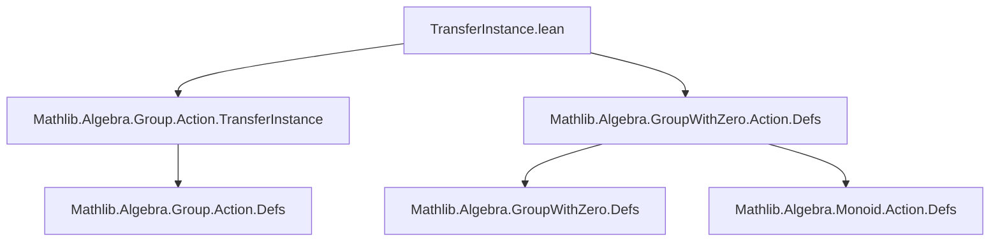
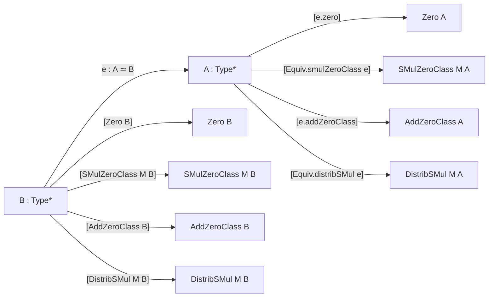
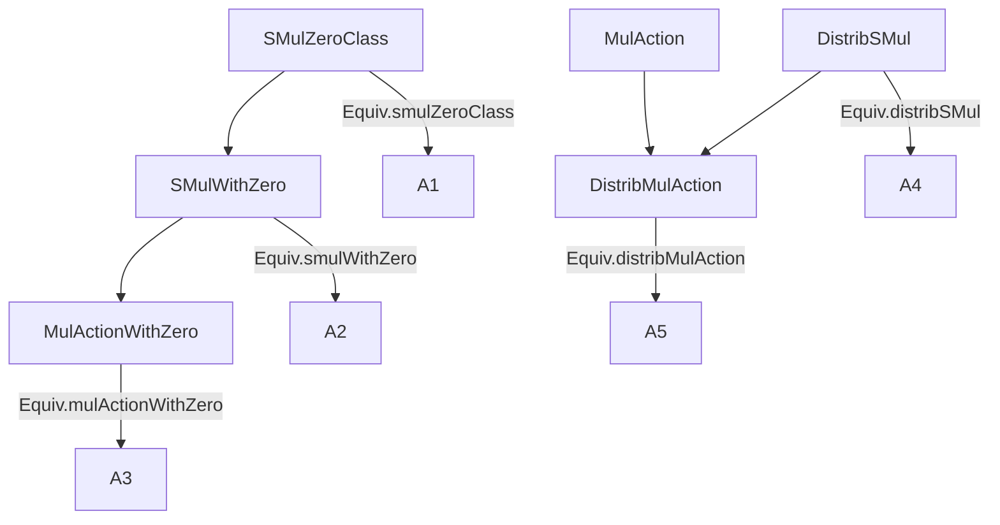

**Technical Brief: `TransferInstance.lean` (Mathlib)**  
*Domain: Algebraic Structure Transfer across Equivalences*  

---

### 1. **Key Definitions & Theorems**

| Name | Type | Purpose |
|------|------|---------|
| `Equiv.smulZeroClass` | `(e : A ≃ B) → [Zero B] → [SMulZeroClass M B] → SMulZeroClass M A` | Transfers the `SMulZeroClass` structure across an equivalence `e : A ≃ B`, using `e.zero` to induce a `Zero A`. |
| `Equiv.smulWithZero` | `(e : A ≃ B) → [Zero M₀] → [Zero B] → [SMulWithZero M₀ B] → SMulWithZero M₀ A` | Transfers `SMulWithZero` across `e`, using `e.zero` on both `A` and `B`. |
| `Equiv.mulActionWithZero` | `(e : A ≃ B) → [MonoidWithZero M₀] → [Zero B] → [MulActionWithZero M₀ B] → MulActionWithZero M₀ A` | Transfers `MulActionWithZero` by combining `smulWithZero` and `mulAction`. |
| `Equiv.distribSMul` | `(e : A ≃ B) → [AddZeroClass B] → [DistribSMul M B] → DistribSMul M A` | Transfers `DistribSMul` using `e.addZeroClass` to induce `AddZeroClass A`. |
| `Equiv.distribMulAction` | `(e : A ≃ B) → [Monoid M] → [AddMonoid B] → [DistribMulAction M B] → DistribMulAction M A` | Transfers `DistribMulAction` by combining `distribSMul` and `mulAction`. |

> **Note**: All proofs are by `simp`-based reasoning over the definitions of `smul`, `add`, `zero` induced via `e`.

---

### 2. **Naming Conventions**

- **Prefix**: `smulZeroClass`, `smulWithZero`, `mulActionWithZero`, `distribSMul`, `distribMulAction` — all follow the pattern `transfer_<structure>`.
- **Suffix**: None (all are abbreviations, not lemmas).
- **Qualifier**: `protected abbrev` — indicates they are *constructive* transfers (not just existence lemmas), and are namespaced under `Equiv`.
- **Pattern**: Each transfer uses `e.<structure>` (e.g., `e.smulZeroClass`, `e.addZeroClass`) to lift structures from `B` to `A`.

---

### 3. **Tactic Stack**

| Tactic | Frequency | Role |
|--------|-----------|------|
| `simp` | Very high | Used in all proofs to reduce definitions of `smul`, `add`, `zero` induced via `e`. |
| `exact` | High | To discharge the final goal after constructing the instance. |
| `letI` | High | To introduce induced structures (`e.zero`, `e.addZeroClass`, etc.) as local instances. |
| `by` | High | Standard for short proofs (≤ 3 lines). |

No heavy automation (`aesop`, `ring`, `linarith`) — proofs are purely definitional.

---

### 4. **Proof Logic**

- **Pattern**:  
  1. Introduce induced structures on `A` via `letI := e.<structure>` (e.g., `e.zero`, `e.addZeroClass`).  
  2. Construct the target structure using `e.<transfer>` (e.g., `e.smulZeroClass`) as a base.  
  3. Prove remaining axioms (e.g., `smul_zero`, `smul_add`) by `simp`-reducing definitions of `smul`, `add`, `zero` *induced* via `e`.  
- **No induction** — all transfers are *non-recursive*, relying on the fact that `Equiv` provides bijections and structure transport is definitional.

---

### 5. **Imports**

| Module | Role |
|--------|------|
| `Mathlib.Algebra.Group.Action.TransferInstance` | Precedent for group-action transfers (non-zero case). |
| `Mathlib.Algebra.GroupWithZero.Action.Defs` | Definitions of `SMulWithZero`, `MulActionWithZero`, etc., for zero-containing structures. |

> This file extends `TransferInstance.lean` to handle *zero-compatible* algebraic structures.

---

### 6. **Mermaid Diagrams**

#### **Dependency Graph (Module-Level)**

#### **Structure Transfer Overview**

#### **Hierarchy of Transferred Structures**

> Arrows indicate *inheritance* or *composition* of transfers (e.g., `mulActionWithZero` uses both `smulWithZero` and `mulAction`).

---

### 7. **Summary**

This module formalizes *structure transport* for algebraic objects involving zero and scalar multiplication across equivalences (`≃`). It extends prior work (`TransferInstance.lean`) by handling zero-compatible structures (`SMulWithZero`, `MulActionWithZero`, etc.), using only definitional reasoning and `simp`. The design reflects Lean’s *typeclass inference* philosophy: transport is *constructive*, *non-invasive*, and *composable*.
