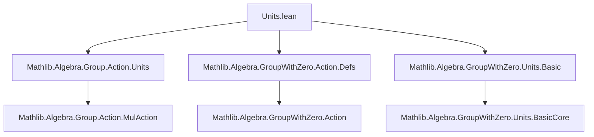
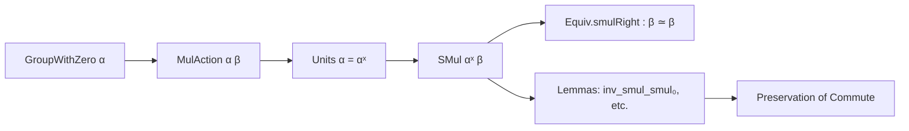

**Technical Brief: Units.lean (Lean 4 Formalization)**  
*Domain: Algebra — Multiplicative Actions with Zero by Units*

---

### 1. KEY DEFINITIONS & THEOREMS

| Name | Type / Signature | Purpose |
|------|------------------|---------|
| `Units.smul_mk0` | `smul_mk0 {g : G₀} (hg : g ≠ 0) (a : α) : mk0 g hg • a = g • a` | Justifies that the action of a nonzero element via `mk0` coincides with the original action. |
| `Units.instSMulZeroClass` | `[SMulZeroClass M α] → SMulZeroClass Mˣ α` | Extends scalar multiplication by units to preserve zero. |
| `Units.instDistribSMulUnits` | `[DistribSMul M α] → DistribSMul Mˣ α` | Lifts distributive scalar multiplication to units. |
| `Units.instDistribMulAction` | `[DistribMulAction M α] → DistribMulAction Mˣ α` | Lifts distributive multiplicative action to units. |
| `Units.instMulDistribMulAction` | `[MulDistribMulAction M α] → MulDistribMulAction Mˣ α` | Lifts multiplicative distributive action to units (uses primed name in implementation notes). |
| `Equiv.smulRight` | `a ≠ 0 → β ≃ β` | Right multiplication by a nonzero element is an equivalence (order isomorphism in context). |
| `inv_smul_smul₀`, `smul_inv_smul₀` | `a ≠ 0 ⇒ a⁻¹ • (a • x) = x`, `a • (a⁻¹ • x) = x` | Inverses act as expected on nonzero scalars. |
| `inv_smul_eq_iff₀`, `eq_inv_smul_iff₀` | `a ≠ 0 ⇒ (a⁻¹ • x = y ↔ x = a • y)` etc. | Characterize inverse scalar multiplication via equivalence. |
| `Commute.smul_right/left_iff₀` | `a ≠ 0 ⇒ Commute x (a • y) ↔ Commute x y` | Scalar multiplication by a nonzero element preserves commutativity. |
| `IsUnit.smul_eq_zero` | `IsUnit u ⇒ u • x = 0 ↔ x = 0` | Units act injectively on zero. |

---

### 2. NAMING CONVENTIONS

- **Prefixes**:
  - `smul_`: scalar multiplication lemmas.
  - `inv_smul_`, `eq_inv_smul_`: inverse scalar multiplication.
  - `Commute.smul_`: interaction with commutativity.
  - `IsUnit.`: properties of units.
- **Suffixes**:
  - `_₀`: indicates a version specialized to nonzero elements (via `mk0` or `ha : a ≠ 0`).
  - `Units.`: namespace for unit-specific constructions.
- **Instance naming**:
  - `instSMulZeroClass`, `instDistribSMulUnits`, etc.: standard Lean naming for typeclass instances.

---

### 3. TACTIC STACK

- `rfl`: used in `smul_mk0` (definitional equality).
- `simp`-based reasoning via `@[simp]` attributes on lemmas.
- Implicit use of `aesop`-style simplification via `simp`-friendly lemmas.
- `rw` with `inv_smul_smul`, `smul_inv_smul`, etc., via `simp` or manual rewriting.
- No explicit tactic declarations in the file — relies on `simp`, `rfl`, and `rw` with lemmas.

---

### 4. PROOF LOGIC

- **Structure**: Most proofs are *definitional* or *lifted* from the underlying monoid/group action:
  - `smul_mk0` is definitional (`rfl`).
  - Lemmas like `inv_smul_smul₀` reduce to their unit-counterparts via `Units.mk0`.
  - Instance proofs (`instSMulZeroClass`, etc.) are direct lifts: e.g., `smul_zero m := smul_zero (m : M)`.
- **Key reasoning pattern**:
  - Use `Units.mk0 a ha` to embed a nonzero element into the unit group.
  - Apply known lemmas for `MulAction`/`DistribMulAction` over `M`, then specialize to units.
- **No induction** or heavy case analysis — mostly algebraic rewriting and typeclass inference.

---

### 5. IMPORTS

| Module | Purpose |
|--------|---------|
| `Mathlib.Algebra.Group.Action.Units` | Core definitions for unit actions. |
| `Mathlib.Algebra.GroupWithZero.Action.Defs` | Definitions for actions in `GroupWithZero` context (e.g., `mk0`, `SMulWithZero`). |
| `Mathlib.Algebra.GroupWithZero.Units.Basic` | Basic facts about units in `GroupWithZero`. |

These imports define the foundational setting: multiplicative actions with zero, units as a group, and scalar multiplication compatibility.

---

### 6. DEPENDENCY & THEORY OVERVIEW

#### Mermaid Diagram: Module Dependencies

#### Mermaid Diagram: Theory Flow

#### Theory Scope

- Extends scalar multiplication from a monoid/group `M` to its unit group `Mˣ`.
- Applies in contexts with zero (e.g., `GroupWithZero`, `MonoidWithZero`), where nonzero elements embed into units via `mk0`.
- Enables reasoning about invertible scalars while preserving algebraic structure (zero, addition, multiplication).
- Supports equivalence of right-multiplication maps, commutativity preservation, and zero-preservation.

---

### 7. IMPLEMENTATION NOTES (from source)

- The earlier stronger instance `mulDistribMulAction'` was abandoned due to inconsistency: `MulDistribMulAction G M` + `SMulCommClass G M M` forces trivial action in cancellative settings.
- Primed names (e.g., `smul_mul'`) used internally to avoid conflicts with existing lemmas over `M`.
- `Units.mk0 a ha` is the canonical embedding of a nonzero element `a` into `Mˣ`.

---

### 8. KEY FORMULAS

- Embedding of nonzero elements into units:  
  $$
  \text{mk0}\, g\, (hg : g \ne 0) \in Mˣ
  $$

- Scalar action by units:  
  $$
  \text{Units.smul\_def}:\quad u • a = (u : M) • a
  $$

- Inverse action:  
  $$
  a^{-1} • (a • x) = x \quad \text{for } a \ne 0
  $$

- Zero preservation:  
  $$
  u • 0 = 0 \quad \text{for } u \in Mˣ
  $$

- Commutativity lift:  
  $$
  \text{Commute}(x, a • y) \iff \text{Commute}(x, y) \quad \text{for } a \ne 0
  $$

--- 

*End of Technical Brief.*
