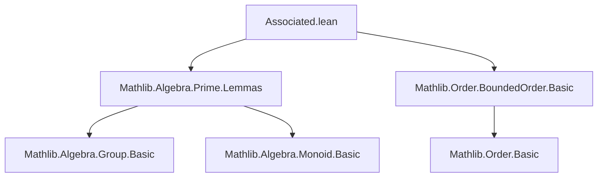
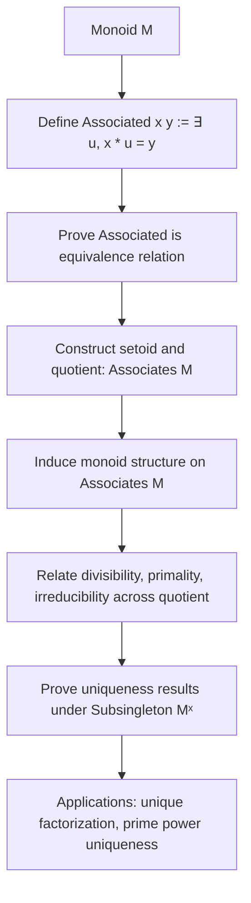
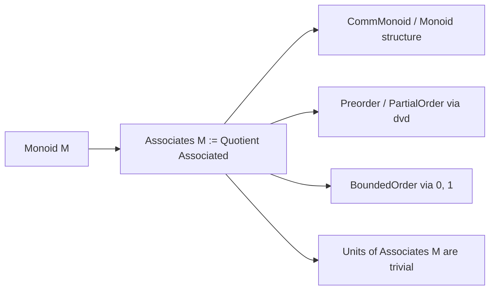

### Technical Brief: `Associated.lean`

---

#### **1. Key Definitions & Theorems**

| Name | Type / Signature | Purpose |
|------|------------------|---------|
| `Associated` | `[Monoid M] → M → M → Prop` | Defines equivalence relation: $x \sim_u y \iff \exists u \in M^\times,\ x \cdot u = y$ |
| `~ᵤ` | Notation for `Associated` | Shorthand for associatedness |
| `Associated.setoid` | `[Monoid M] → Setoid M` | Constructs the setoid for quotienting by `Associated` |
| `Associates M` | `abbrev Associates (M : Type*) [Monoid M] : Type* := Quotient (Associated.setoid M)` | Quotient monoid of $M$ modulo associate equivalence |
| `Associates.mk` | `[Monoid M] → M → Associates M` | Canonical projection map $a \mapsto [a]$ |
| `mk_eq_mk_iff_associated` | `{a b : M} → (⟦a⟧ = ⟦b⟧) ↔ a ~ᵤ b` | Characterizes equality in the quotient |
| `mk_mul_mk` | `{x y : M} → ⟦x⟧ * ⟦y⟧ = ⟦x * y⟧` | Multiplication respects associates |
| `mk_dvd_mk` | `{a b : M} → (⟦a⟧ ∣ ⟦b⟧) ↔ a ∣ b` | Divisibility lifts to quotient |
| `prime_mk` | `{p : M} → Prime ⟦p⟧ ↔ Prime p` | Primality descends to quotient |
| `irreducible_mk` | `{a : M} → Irreducible ⟦a⟧ ↔ Irreducible a` | Irreducibility descends to quotient |
| `associated_of_dvd_dvd` | `[MonoidWithZero M] [IsLeftCancelMulZero M] → a ∣ b ∧ b ∣ a → a ~ᵤ b` | Characterizes associates via mutual divisibility |
| `dvd_dvd_iff_associated` | `[MonoidWithZero M] [IsLeftCancelMulZero M] → (a ∣ b ∧ b ∣ a) ↔ a ~ᵤ b` | Equivalence of mutual divisibility and associate relation |
| `prime_mul_iff` | `[CommMonoidWithZero M] [IsCancelMulZero M] → Prime (x * y) ↔ (Prime x ∧ IsUnit y) ∨ (IsUnit x ∧ Prime y)` | Factorization of primes in product |
| `prime_pow_iff` | `[CommMonoidWithZero M] [IsCancelMulZero M] → Prime (p ^ n) ↔ Prime p ∧ n = 1` | Powers of primes are prime only when exponent is 1 |
| `eq_of_prime_pow_eq` | `[CommMonoidWithZero R] [IsCancelMulZero R] [Subsingleton Rˣ] → p₁ ^ k₁ = p₂ ^ k₂ → p₁ = p₂` | Uniqueness of prime factorization under uniqueness of units |

---

#### **2. Naming Conventions**

- **Prefixes**:
  - `associated_`: e.g., `associated_one_iff_isUnit`, `associated_zero_iff_eq_zero`
  - `isUnit_`: e.g., `isUnit_mk`, `isUnit_iff_eq_one`
  - `prime_`: e.g., `prime_mk`, `prime_dvd_prime_iff_eq`
  - `irreducible_`: e.g., `irreducible_mk`, `irreducible_iff_prime_iff`
  - `mk_`: e.g., `mk_mul_mk`, `mk_eq_mk_iff_associated`, `mk_dvd_mk`
  - `of_`: e.g., `of_mul_left`, `of_pow_associated_of_prime`
  - `dvd_`: e.g., `dvd_dvd_iff_associated`, `dvd_prime_pow`
  - `mul_`: e.g., `mul_left`, `mul_right`, `mul_mul`, `mul_mono`

- **Suffixes**:
  - `_iff`: e.g., `associated_one_iff_isUnit`, `mk_eq_mk_iff_associated`
  - `_left`, `_right`: e.g., `mul_left`, `mul_right`, `unit_mul_left`
  - `_trans`, `_symm`, `_refl`: e.g., `trans`, `symm`, `refl`
  - `_iff`: e.g., `dvd_iff_dvd_left`, `isUnit_iff_not_associated_of_dvd`

---

#### **3. Tactic Stack**

Frequently used tactics in proofs:
- `rw`, `simp`, `simp_rw`: Rewriting and simplification (especially with `mk_*`, `associated_*`, `prime_*`, `irreducible_*` lemmas)
- `obtain ⟨u, rfl⟩`: Extract witness from existential hypothesis
- `convert`, `exact`, `apply`: Direct proof construction
- `induction`: Induction on natural numbers (e.g., `pow`, `prime_pow_iff`)
- `Quotient.inductionOn`, `Quotient.inductionOn₂`, `Quotient.inductionOn₃`: Reasoning about quotient types
- `rcases`, `rintro`: Case analysis and destructuring
- `congr_arg`, `ext`: Extensionality arguments
- `mul_left_cancel₀`, `mul_right_inj'`: Cancellation in monoids with zero
- `grind`: Used in `prime_pow_iff` for small arithmetic reasoning

---

#### **4. Proof Logic**

- **Equivalence relation proofs** (`refl`, `symm`, `trans`) follow standard group-theoretic reasoning using unit inverses and multiplication.
- **Quotient constructions** rely on `Quotient.map₂` and `Quotient.inductionOn` to lift operations and properties.
- **Divisibility ↔ associate characterizations** use mutual divisibility and cancellation (e.g., `associated_of_dvd_dvd`).
- **Prime/irreducible descent/ascension** uses:
  - `prime_mk`, `irreducible_mk`: lift properties to quotient via `forall_associated`.
  - `prime_mul_iff`, `prime_pow_iff`: factorization properties rely on cancellation and associate behavior.
- **Uniqueness under `Subsingleton Mˣ`** (`associated_iff_eq`, `eq_of_prime_pow_eq`) uses that units are unique → associate relation collapses to equality.

---

#### **5. Imports**

- `Mathlib.Algebra.Prime.Lemmas`: Core lemmas about primes, irreducibles, divisibility.
- `Mathlib.Order.BoundedOrder.Basic`: For `Preorder`, `OrderBot`, `OrderTop`, `BoundedOrder`.

---

#### **6. Mermaid Diagrams**

##### **Dependency Graph (Module-Level)**

##### **Overview of Theory Flow**

##### **Quotient Structure Hierarchy**

---

#### **7. Summary**

This file formalizes the theory of *associated elements* in monoids and constructs the *associates quotient monoid*. It establishes:
- `Associated` as an equivalence relation,
- The quotient `Associates M` inherits a monoid structure,
- Divisibility, primality, and irreducibility descend to the quotient,
- Under additional assumptions (e.g., `Subsingleton Mˣ`), associate equivalence collapses to equality, enabling uniqueness of factorization results like `eq_of_prime_pow_eq`.

The structure is foundational for unique factorization domains (UFDs) and factorization theory in algebra.
