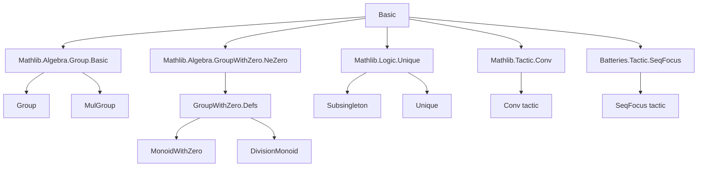
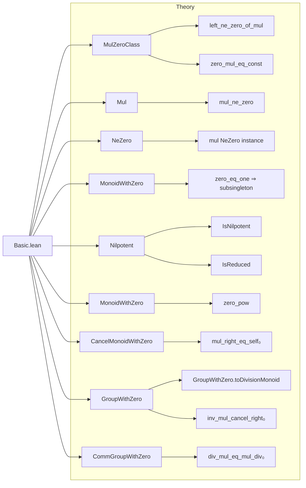

**Technical Brief: `Basic.lean` — Groups with an Adjoined Zero Element**

---

### 1. KEY DEFINITIONS & THEOREMS

| Name | Type / Signature | Purpose |
|------|------------------|---------|
| `GroupWithZero` | `Type u → Type u` (class) | A monoid with zero where nonzero elements form a group; extends `MonoidWithZero` with inverses on nonzero elements. |
| `CommGroupWithZero` | `Type u → Type u` (class) | Commutative version of `GroupWithZero`. |
| `IsNilpotent` | `R : Type* → [Zero R] [Pow R ℕ] → R → Prop` | `x` is nilpotent if `∃ n, x^n = 0`. |
| `IsReduced` | `R : Type* → [Zero R] [Pow R ℕ] → Prop` | No nonzero nilpotent elements: `∀ x, IsNilpotent x → x = 0`. |
| `uniqueOfZeroEqOne` | `(h : 0 = 1) → Unique M₀` | If `0 = 1`, then the type is a singleton (default = `0`). |
| `GroupWithZero.toDivisionMonoid` | `[GroupWithZero G₀] → DivisionMonoid G₀` | Constructs a division monoid structure from `GroupWithZero`. |
| `inv_mul_cancel_right₀` | `b ≠ 0 → a * b⁻¹ * b = a` | Right cancellation with inverse, valid even at `0`. |
| `inv_mul_cancel_left₀` | `a ≠ 0 → a⁻¹ * (a * b) = b` | Left cancellation with inverse, valid even at `0`. |
| `zero_pow_eq` | `(0 : M₀) ^ n = if n = 0 then 1 else 0` | Power of zero: `0^0 = 1`, `0^n = 0` for `n > 0`. |
| `pow_eq_zero_iff` | `n ≠ 0 → a^n = 0 ↔ a = 0` | In reduced structures, powers vanish iff base is zero. |
| `mul_right_injective` / `mul_left_injective` | `x ≠ 0 → Function.Injective (y ↦ x * y)` | Multiplication by nonzero is injective. |
| `mul_left_surjective₀` / `mul_right_surjective₀` | `a ≠ 0 → Surjective (g ↦ a * g)` | Multiplication by nonzero is surjective. |
| `div_self_mul_self'` | `a / (a * a) = a⁻¹` | Division identity valid at `0`. |

---

### 2. NAMING CONVENTIONS

- **Prefixes**:
  - `zero_`: properties involving `0` as operand (e.g., `zero_mul`, `zero_pow`).
  - `mul_`: general multiplication properties (e.g., `mul_eq_zero_of_left`, `mul_ne_zero`).
  - `inv_`: inverse-related (e.g., `inv_mul_cancel_left₀`, `inv_eq_zero`).
  - `div_`: division (e.g., `div_zero`, `div_self_mul_self`).
  - `ne_zero_`: nonzero assumptions (e.g., `ne_zero_of_eq_one`, `ne_zero_pow`).
  - `eq_zero_`: conclusions about being zero (e.g., `eq_zero_of_mul_eq_self_right`).
  - `subsingleton_`, `uniqueOfZeroEqOne`: structural uniqueness.

- **Suffixes**:
  - `_0`: indicates extension of a base lemma to include `0` (e.g., `mul_eq_left₀`, `mul_right_eq_self₀`).
  - `_iff`: biconditional statements (e.g., `pow_eq_zero_iff`, `isNilpotent_iff_eq_zero`).
  - `_eq_const`: function equality to constant function (e.g., `zero_mul_eq_const`).
  - `_eq_one₀`: zero-one equivalence in nontrivial contexts (e.g., `zero_pow_eq_one₀`).

- **`₀` suffix**: used to distinguish zero-aware variants of standard lemmas (e.g., `mul_eq_mul_left_iff` → `mul_right_eq_self₀`).

---

### 3. TACTIC STACK

Frequently used tactics in this file:

| Tactic | Usage |
|--------|-------|
| `simp` / `simp_rw` | Simplification with `@[simp]` lemmas (e.g., `zero_mul`, `inv_mul_cancel_left₀`). |
| `rw` | Rewriting using equalities (often with `←` for reverse direction). |
| `by_cases` / `classical` | Case analysis on `a = 0` or decidability (e.g., `mul_eq_zero_of_ne_zero_imp_eq_zero`). |
| `induction` | Structural induction on `ℕ` or `ℤ` (e.g., `zpow_add₀`, `zero_pow`). |
| `congr_arg` | Applying functions to both sides of equality. |
| `calc` / `conv` | Chain of equalities, especially for algebraic manipulation. |
| `aesop` / `linarith` | Not heavily used here; mostly manual algebraic reasoning. |
| `exact`, `refine`, `apply` | Direct proof construction. |
| `simpa` | Simplify and discharge goal (e.g., `simpa using inv_ne_zero h`). |
| `split_ifs` | Split `if` expressions (e.g., `zero_pow_eq`). |
| `obtain` / `cases` | Destructive case analysis (e.g., `eq_or_ne a 0`). |

---

### 4. PROOF LOGIC

**Recurring proof patterns**:

1. **Case analysis on `a = 0`**:
   - Most lemmas about inverses or division split into `a = 0` and `a ≠ 0`.
   - In `a = 0` case, use `zero_mul`, `inv_zero`, `div_zero`.
   - In `a ≠ 0` case, apply group-theoretic lemmas (`inv_mul_cancel₀`, etc.).

2. **Induction on natural/integer exponents**:
   - For `zpow_add₀`, `zero_zpow`, etc., induction on `n : ℤ` or `n : ℕ`.
   - Base case `n = 0` uses `zpow_zero`, `pow_zero`.
   - Successor case uses `pow_succ`, `zpow_add_one₀`.

3. **Reduction to known structures**:
   - `GroupWithZero.toDivisionMonoid` constructs division monoid structure by verifying axioms.
   - `isReduced_of_noZeroDivisors` shows no zero divisors ⇒ reduced.

4. **Logical equivalences via `calc` and `iff`**:
   - Many lemmas are biconditionals (`↔`), proven via `⟨fun h => ..., fun h => ...⟩` or `iff.intro`.

5. **Use of `mt` and `not_or.mpr`**:
   - Contrapositive reasoning for nonzero conclusions (e.g., `mul_ne_zero`, `left_ne_zero_of_mul`).

---

### 5. IMPORTS & DEPENDENCIES

| Import | Purpose |
|--------|---------|
| `Mathlib.Algebra.Group.Basic` | Basic group theory (used for `Group`, `inv`, etc.). |
| `Mathlib.Algebra.GroupWithZero.NeZero` | `NeZero` typeclass and basic lemmas. |
| `Mathlib.Logic.Unique` | `Unique` and `Subsingleton`. |
| `Mathlib.Tactic.Conv` | `conv` tactic for term rewriting. |
| `Batteries.Tactic.SeqFocus` | Sequential focus tactics (e.g., `seq`/`focus`). |

**Core algebraic hierarchy used**:
- `MulZeroClass`, `MulZeroOneClass`, `MonoidWithZero`, `CancelMonoidWithZero`, `GroupWithZero`, `CommGroupWithZero`.
- `NoZeroDivisors`, `IsReduced`, `IsNilpotent`.

---

### 6. MERMAID DIAGRAMS

#### Dependency Graph (Module-Level)

#### Overview of File Structure

---

### 7. SUMMARY

This file formalizes the theory of **monoids with zero where nonzero elements form a group**, a structure central to:
- Division rings (e.g., `ℝ`, `ℂ`);
- Value monoids of multiplicative valuations;
- Nonnegative reals under multiplication.

Key innovations:
- Extending inverses to `0⁻¹ = 0`;
- Proving group-theoretic identities hold *even at zero* (e.g., `a * a * a⁻¹ = a`);
- Connecting nilpotency, reducedness, and zero-divisor-freeness;
- Constructing `DivisionMonoid` from `GroupWithZero`.

The file is highly structured, with careful naming (`_0` suffixes), extensive `@[simp]` lemmas, and modular proof patterns based on case analysis at `0`.
