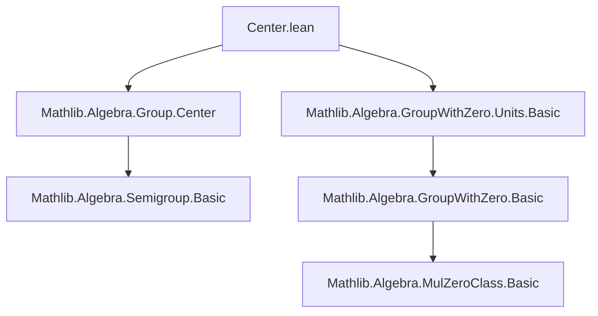
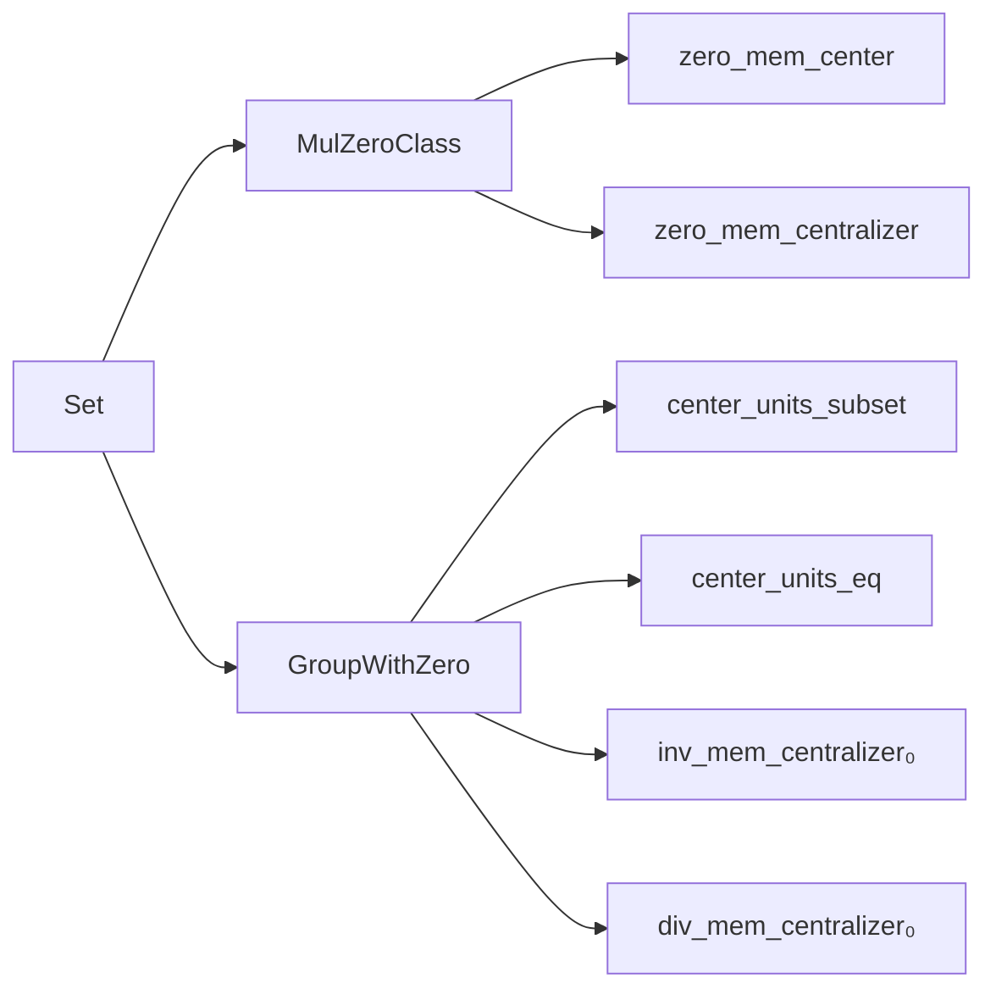
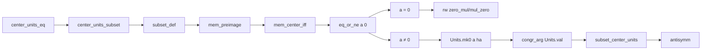

**Technical Brief: `Center.lean` (Group with Zero)**  
*Domain: Formalized Group Theory in Lean 4 (Mathlib)*  
*Author(s): Eric Wieser, Jireh Loreaux*  
*License: Apache 2.0*

---

### 1. KEY DEFINITIONS & THEOREMS

| Name | Type / Signature | Purpose |
|------|------------------|---------|
| `center` | `Semigroup α → Set α` | Elements commuting with all others: $\{x \mid \forall a,\, xa = ax\}$ |
| `centralizer` | `Set α → Set α` | Elements commuting with all elements of a subset $s$: $\{x \mid \forall s \in s,\, xs = sx\}$ |
| `center_units_subset` | `center G₀ˣ ⊆ ((↑) : G₀ˣ → G₀) ⁻¹' center G₀` | Units in the center embed into the center of the ambient group-with-zero |
| `center_units_eq` | `center G₀ˣ = ((↑) : G₀ˣ → G₀) ⁻¹' center G₀` | Equality: center of units is precisely the preimage of the center under inclusion |
| `zero_mem_center` | `(0 : M₀) ∈ center M₀` | Zero commutes with all elements and satisfies associativity trivially in a `MulZeroClass` |
| `zero_mem_centralizer` | `(0 : M₀) ∈ centralizer s` | Zero commutes with any subset $s$ (trivially) |
| `inv_mem_centralizer₀` | `a ∈ centralizer s → a⁻¹ ∈ centralizer s` | Inverses of centralizing elements also centralize (handles $a = 0$ via `inv_zero`) |
| `div_mem_centralizer₀` | `a, b ∈ centralizer s → a / b ∈ centralizer s` | Closure under division follows from closure under multiplication and inversion |

---

### 2. NAMING CONVENTIONS

- **Prefixes**:
  - `center_`: Relates to the center of a structure (e.g., `center_units_eq`)
  - `centralizer_`: Relates to centralizers (e.g., `inv_mem_centralizer₀`)
  - `zero_`: Special handling for zero in `MulZeroClass`/`GroupWithZero` (e.g., `zero_mem_center`)
- **Suffixes**:
  - `_eq`: Equality lemmas (e.g., `center_units_eq`)
  - `_subset`: Subset inclusions (e.g., `center_units_subset`)
  - `_₀`: Variants that handle zero specially (e.g., `inv_mem_centralizer₀`, `div_mem_centralizer₀`)
- **Notation**:
  - `↑` used for coercion from units (`G₀ˣ`) to the ambient type (`G₀`)
  - `⁻¹` and `/` used for inverse and division in `GroupWithZero`

---

### 3. TACTIC STACK

- `rw`: Rewriting using definitions (`commute_iff_eq`, `zero_mul`, `mul_zero`, `div_eq_mul_inv`, etc.)
- `simp`: Simplification with `simp_rw`, `simp only`, and `simp [mem_centralizer_iff]`
- `intro` / `intro rfl | ha`: Case analysis on equality with zero (`eq_or_ne a 0`)
- `exact`: Direct proof application (e.g., `exact congr_arg Units.val ...`)
- `antisymm`: Proving set equality via mutual inclusion
- `simpa`: Simplify and apply target lemma (used in `div_mem_centralizer₀`)

---

### 4. PROOF LOGIC

- **Structure**: Modular, layered reasoning:
  1. **Base case for zero**: Prove `0` lies in center/centralizer using `MulZeroClass` axioms.
  2. **Units embedding**: Show inclusion of `center G₀ˣ` into preimage of `center G₀`, then prove reverse inclusion.
     - Use `eq_or_ne a 0` to split into zero and nonzero cases.
     - For nonzero $a$, lift to unit via `Units.mk0 a ha`.
  3. **Closure properties**:
     - Inversion and division in centralizers handled by case analysis on zero.
     - Nonzero case uses group properties (`mul_inv_eq_iff_eq_mul₀`, `eq_inv_mul_iff_mul_eq₀`).
     - Zero case uses `inv_zero` and `zero_mem_centralizer`.

- **Induction**: Not used here (finite algebraic reasoning only).
- **Case analysis**: Central technique—especially on whether an element is zero.

---

### 5. IMPORTS & DEPENDENCIES

| Module | Role |
|--------|------|
| `Mathlib.Algebra.Group.Center` | Defines `center`, `centralizer`, basic properties for semigroups/groups |
| `Mathlib.Algebra.GroupWithZero.Units.Basic` | Defines `G₀ˣ`, coercion, basic unit properties in `GroupWithZero` |

**Key typeclasses used**:
- `[MulZeroClass M₀]`: Ensures `0 * a = 0` and `a * 0 = 0`
- `[GroupWithZero G₀]`: Extends `MulZeroClass` with multiplicative group on nonzero elements and `inv`, `/`

---

### 6. MERMAID DIAGRAMS

#### Dependency Graph (Module-Level)

#### Overview of File Structure

#### Logical Flow of `center_units_eq` Proof

---

### 7. THEORY CONTEXT

- **Goal**: Extend classical group-theoretic center concepts to *group-with-zero*, where zero breaks invertibility but retains multiplicative annihilation.
- **Key insight**: The inclusion map $G₀ˣ \hookrightarrow G₀$ pulls back the center of $G₀$ to the center of $G₀ˣ$.
- **Zero handling**: Special lemmas (`_₀` suffix) ensure closure properties hold even when elements are zero, using `GroupWithZero`’s `inv_zero` and `div_zero` axioms.

--- 

Let me know if you'd like a formalization of related concepts (e.g., *centralizer of a subset*, *normalizer*, or *center of a ring with zero*).
