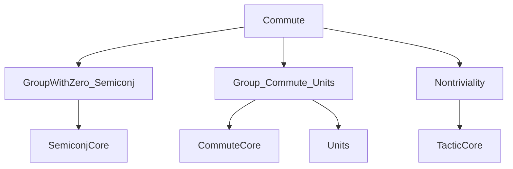
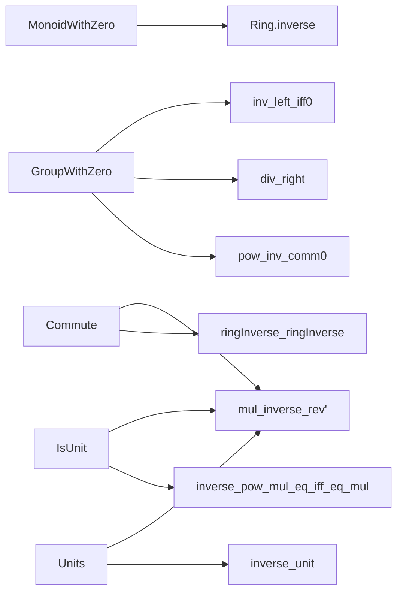

### Technical Brief: `Commute.lean`

---

#### **1. Key Definitions & Theorems**

| Name | Type / Signature | Purpose |
|------|------------------|---------|
| `Ring.inverse` | `M₀ → M₀` | Partial inverse function on a `MonoidWithZero`, defined as `inverse x = x⁻¹` if `x` is a unit, else `0`. |
| `Commute a b` | `Prop` | `a * b = b * a` (commutativity of `a` and `b`). |
| `mul_inverse_rev'` | `Commute a b → inverse (a * b) = inverse b * inverse a` | Generalized inverse of a product when the factors commute (works in `MonoidWithZero`). |
| `mul_inverse_rev` | `Ring.inverse (a * b) = inverse b * inverse a` | Special case of `mul_inverse_rev'` in `CommMonoidWithZero`, where all elements commute. |
| `inverse_pow` | `Ring.inverse r ^ n = Ring.inverse (r ^ n)` | Power commutes with `Ring.inverse`. |
| `inverse_pow_mul_eq_iff_eq_mul` | `Ring.inverse a ^ k * b = c ↔ b = a ^ k * c` | Equivalence linking left-multiplication by inverse powers and right-multiplication by powers (when `a` is a unit). |
| `Commute.ringInverse_ringInverse` | `Commute a b → Commute (Ring.inverse a) (Ring.inverse b)` | If `a` and `b` commute, then so do their (partial) inverses. |
| `zero_right`, `zero_left` | `Commute a 0`, `Commute 0 a` | Zero commutes with all elements in a `MulZeroClass`. |
| `inv_left_iff₀`, `inv_right_iff₀` | `Commute a⁻¹ b ↔ Commute a b`, `Commute a b⁻¹ ↔ Commute a b` | Inverses preserve/reflect commutativity in `GroupWithZero`. |
| `div_right`, `div_left` | `Commute a b → Commute a c → Commute a (b / c)`, etc. | Division preserves commutativity under appropriate hypotheses. |
| `pow_inv_comm₀` | `a⁻¹ ^ m * a ^ n = a ^ n * a⁻¹ ^ m` | Powers of an element and its inverse commute (in `GroupWithZero`). |

---

#### **2. Naming Conventions**

- **Prefixes**:
  - `mul_`: relates to multiplication (e.g., `mul_inverse_rev'`, `mul_left`).
  - `inverse_`: pertains to `Ring.inverse` or `inverse` (e.g., `inverse_pow`, `inverse_pow_mul_eq_iff_eq_mul`).
  - `zero_`: zero-related commutativity (e.g., `zero_right`, `zero_left`).
  - `inv_`: inverse-related (e.g., `inv_left_iff₀`, `inv_right₀`).
  - `div_`: division-related (e.g., `div_right`, `div_left`).
  - `pow_`: power-related (e.g., `pow_inv_comm₀`).

- **Suffixes**:
  - `_rev`: reversal of order (e.g., `mul_inverse_rev`, `mul_inv_rev`).
  - `_iff`: equivalence (e.g., `inv_left_iff₀`, `inverse_pow_mul_eq_iff_eq_mul`).
  - `_₀`: variant for `GroupWithZero`/`MonoidWithZero` (e.g., `inv_left_iff₀`, `pow_inv_comm₀`).
  - `'` (prime): often used for more general or auxiliary versions (e.g., `mul_inverse_rev'` vs `mul_inverse_rev`).

---

#### **3. Tactic Stack**

Frequent tactics used in proofs:

- `by_cases`: to split on whether an element is a unit (`IsUnit`).
- `rw`: rewriting using lemmas, definitions, or equivalences.
- `obtain ⟨⟨a, rfl⟩, b, rfl⟩`: destructuring existential proofs (especially about units).
- `simp_rw`: simplification + rewriting (used implicitly via `rw` + `simp`-like lemmas).
- `congr_arg`: congruence for function application.
- `symm`: symmetry of equality.
- `pow_succ'`, `pow_zero`, etc.: simplification of powers.
- `Units.val_mul`, `inverse_unit`, `mul_inv_rev`: lemmas from `Units` and inverse theory.
- `nontriviality` (via import): used to prove nontriviality goals.

---

#### **4. Proof Logic**

- **Structure of proofs**:
  - **Case analysis** on `IsUnit (a * b)` (via `by_cases`) is common for `inverse`-based lemmas.
  - When `a * b` is a unit, reduce to the unit group using `Units` machinery.
  - When not a unit, use `inverse_non_unit` and simplify using `zero_mul`/`mul_zero`.
  - For equivalence proofs (`↔`), use `.1` and `.2` to go both ways, often via `rw` + `inverse_mul_eq_iff_eq_mul`.
  - Induction is used in `inverse_pow` (on `n : ℕ`).
  - `congr_arg` + `symm` + `trans` chains are used to manipulate equalities involving inverses and commutativity.

- **Typical flow**:
  1. Split on unit/non-unit status.
  2. Use structure of units (e.g., `Units.val_mul`, `inverse_unit`) or zero behavior.
  3. Apply known lemmas (`mul_inv_rev`, `inverse_mul_eq_iff_eq_mul`).
  4. Simplify using `pow` lemmas or `Commute` properties.

---

#### **5. Imports**

- `Mathlib.Algebra.GroupWithZero.Semiconj`: provides `SemiconjBy` and related lemmas (e.g., `zero_right`, `inv_right_iff₀`).
- `Mathlib.Algebra.Group.Commute.Units`: provides `Commute` lemmas for units (e.g., `isUnit_mul_iff`, `mul_inv_rev`).
- `Mathlib.Tactic.Nontriviality`: tactic support for nontriviality goals.

---

#### **8. Dependency & Theory Overview**

##### **Mermaid Diagram: Module Dependencies**

##### **Mermaid Diagram: Theory Flow**

##### **Overview**

This file formalizes foundational properties of **commuting elements** and their **(partial) inverses** in algebraic structures with zero: specifically `MonoidWithZero` and `GroupWithZero`. It extends earlier results on `SemiconjBy` and `Commute` to handle inverses and division, and carefully manages the behavior of `Ring.inverse` (a total function defined as `x⁻¹` if `x` is a unit, else `0`). Key themes include:

- Interplay between commutativity and inversion.
- Handling of zero divisors and non-units via case analysis.
- Power and division compatibility with commutativity.

The results are foundational for later work in analysis (e.g., formalizing functional calculus, spectral theory) where invertibility and commutation are critical.

--- 

Let me know if you'd like a formalized dependency graph (e.g., `.dot` format) or a summary of how this file fits into the broader `Mathlib` algebra hierarchy.
