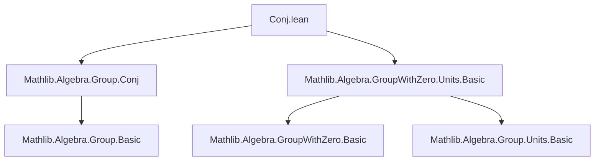

**Technical Brief: `Conj.lean` (GroupWithZero Conjugacy)**

---

### 1. **Key Definitions & Theorems**

| Name | Type / Signature | Purpose |
|------|------------------|---------|
| `IsConj` | `IsConj (a b : α) : Prop` | Standard conjugacy relation: $ \exists c,\ c a c^{-1} = b $. In `GroupWithZero`, adapted to handle zero. |
| `isConj_iff₀` | `IsConj a b ↔ ∃ c : α, c ≠ 0 ∧ c * a * c⁻¹ = b` | Characterizes conjugacy in a `GroupWithZero`: only nonzero conjugators matter, since $c = 0$ makes $c a c^{-1}$ undefined. |
| `conj_pow₀` | `(a⁻¹ * d * a) ^ s = a⁻¹ * d ^ s * a` (for `a ≠ 0`, `s : ℕ`) | Shows that conjugation by a nonzero element commutes with natural-number powers. Derived via units embedding. |

---

### 2. **Naming Conventions**

- **Prefixes**:
  - `isConj_`: predicates related to the `IsConj` relation.
  - `conj_`: properties of conjugation maps (e.g., `conj_pow₀`).
- **Suffixes**:
  - `_iff₀`: equivalence involving a nonzero condition (`≠ 0`) in `GroupWithZero`.
  - `_₀`: lemmas specific to `GroupWithZero`, often handling zero carefully (e.g., `conj_pow₀` vs. `Units.conj_pow'`).

---

### 3. **Tactic Stack**

- `rw`: rewriting using equivalences (`isConj_iff₀`, `Units.exists_iff_ne_zero`).
- `congr!`: congruence closure with lambda abstraction simplification.
- `exact`: final proof step using a constructed witness or lemma.
- `let`: local definition for embedding nonzero `a` into the unit group `αˣ`.

No heavy automation (e.g., `aesop`, `ring`, `simp`) is used—proofs are mostly direct and structural.

---

### 4. **Proof Logic**

- **`isConj_iff₀`**:
  1. Unfold `IsConj` definition (which uses `SemiconjBy`).
  2. Apply `Units.exists_iff_ne_zero` to re-express existence over units as existence over nonzero elements.
  3. Use `congr!` + `mul_inv_eq_iff_eq_mul₀` to simplify the unit condition into the explicit equation $c a c^{-1} = b$ with $c ≠ 0$.

- **`conj_pow₀`**:
  1. Construct unit `u = ⟨a, a⁻¹, ha⁻¹, ha⟩` from nonzero `a`.
  2. Apply `Units.conj_pow'`, a known lemma for units, to lift the power-commutation property.

Both proofs rely on embedding nonzero elements into the unit group and leveraging existing `Units.*` lemmas.

---

### 5. **Imports & Dependencies**

- `Mathlib.Algebra.Group.Conj`: defines `IsConj`, `SemiconjBy`, basic conjugacy theory.
- `Mathlib.Algebra.GroupWithZero.Units.Basic`: provides:
  - `Units.ofMulHom`, `⟨a, a⁻¹, ...⟩` constructor,
  - `Units.exists_iff_ne_zero`,
  - `Units.conj_pow'`.

These imports define the algebraic context: groups with zero (e.g., division rings, fields, nonzero-divisors), where inverses exist only for nonzero elements.

---

### 6. **Mermaid Diagrams**

#### **Dependency Graph (Module-Level)**



#### **Overview of Theoretical Flow**

```mermaid
flowchart LR
  subgraph Theory
    G[GroupWithZero α] --> H[Units αˣ]
    G --> I[IsConj a b]
    H --> J[ConjBy u : x ↦ u * x * u⁻¹]
    I --> K[∃ c ≠ 0, c a c⁻¹ = b]
    J --> L[Power Commutes: conj^s(u)(d) = u d^s u⁻¹]
  end
  subgraph Implementation
    isConj_iff₀ --> K
    conj_pow₀ --> L
  end
```

---

### 7. **Notes**

- The `assert_not_exists` comments indicate incomplete work: `Multiset Ring` and `DenselyOrdered` are not yet formalized in this module.
- The `_₀` suffix convention signals that lemmas are *zero-aware*—they avoid division-by-zero by requiring `a ≠ 0` explicitly.
- This file is foundational for later work on conjugacy classes, centralizers, or group actions in `GroupWithZero` contexts (e.g., in division rings or fields).

--- 

Let me know if you'd like the next-level theory (e.g., conjugacy classes, orbit-stabilizer in `GroupWithZero`, or applications to linear algebra).
