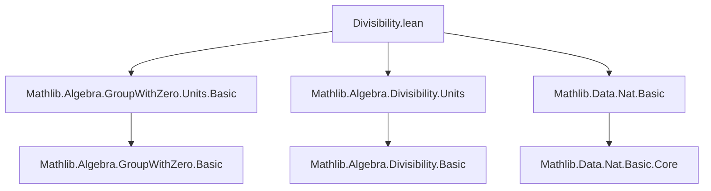
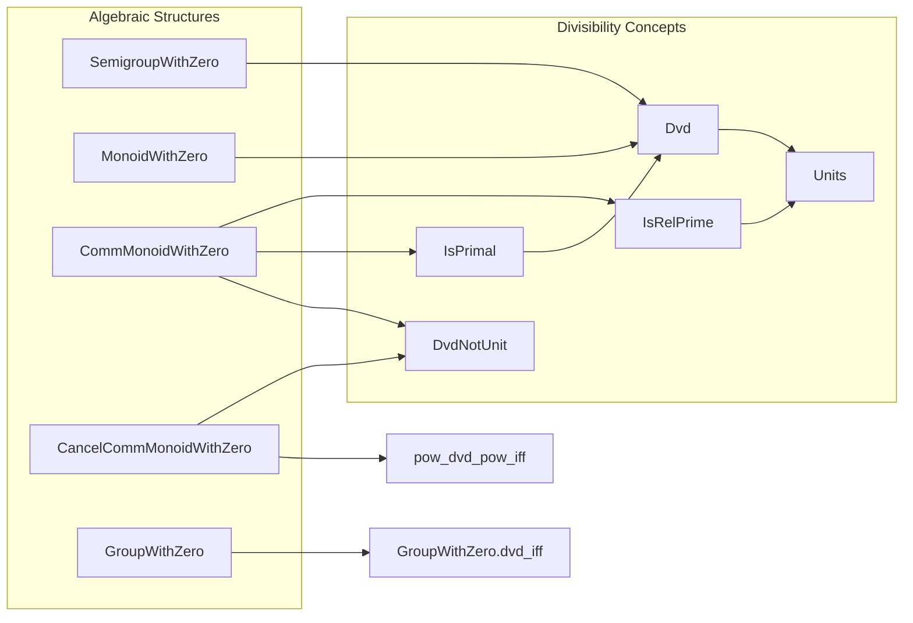

**Technical Brief: Divisibility in Groups with Zero (Lean 4)**  
*Based on `Divisibility.lean` from Mathlib*

---

### 1. KEY DEFINITIONS & THEOREMS

| Name | Type / Signature | Purpose |
|------|------------------|---------|
| `DvdNotUnit a b` | `Prop` | Expresses *strict divisibility*: $a \mid b$ and $b/a$ is **not** a unit. Formally: $a \ne 0 \land \exists x,\ \neg \text{IsUnit}(x) \land b = a \cdot x$. |
| `eq_zero_of_zero_dvd` | `0 ∣ a → a = 0` | In a `SemigroupWithZero`, if $0$ divides $a$, then $a = 0$. |
| `zero_dvd_iff` | `0 ∣ a ↔ a = 0` | Characterizes divisibility by zero. |
| `mul_dvd_mul_iff_left` | `[IsLeftCancelMulZero] ⇒ (a ≠ 0) ⇒ (a * b ∣ a * c ↔ b ∣ c)` | Cancellation law for left multiplication in cancellative monoids with zero. |
| `mul_dvd_mul_iff_right` | `[IsCancelMulZero] ⇒ (c ≠ 0) ⇒ (a * c ∣ b * c ↔ a ∣ b)` | Cancellation law for right multiplication in *commutative* cancellative monoids with zero. |
| `isRelPrime_zero_left` | `IsRelPrime 0 x ↔ IsUnit x` | Zero is relatively prime to $x$ iff $x$ is a unit. |
| `isRelPrime_zero_right` | `IsRelPrime x 0 ↔ IsUnit x` | Symmetric version of above. |
| `not_isRelPrime_zero_zero` | `[Nontrivial] ⇒ ¬IsRelPrime 0 0` | Zero is not relatively prime to itself in nontrivial structures. |
| `isRelPrime_of_no_nonunits_factors` | `(¬(x = 0 ∧ y = 0)) ⇒ (∀ z, ¬IsUnit z → z ≠ 0 → z ∣ x → ¬z ∣ y) ⇒ IsRelPrime x y` | A criterion for relative primality: no nonunit nonzero divisor of $x$ divides $y$. |
| `dvd_and_not_dvd_iff` | `[CommMonoidWithZero] [IsCancelMulZero] ⇒ (x ∣ y ∧ ¬y ∣ x ↔ DvdNotUnit x y)` | Connects strict divisibility with non-symmetric divisibility. |
| `dvd_antisymm` | `[Subsingleton αˣ] ⇒ a ∣ b → b ∣ a → a = b` | Antisymmetry of divisibility when units form a subsingleton (e.g., in `ℕ`). |
| `eq_of_forall_dvd` | `(∀ c, a ∣ c ↔ b ∣ c) → a = b` | Uniqueness of elements up to divisibility. |
| `pow_dvd_pow_iff` | `[IsCancelMulZero] ⇒ (a ≠ 0) ⇒ (¬IsUnit a) ⇒ (a ^ n ∣ a ^ m ↔ n ≤ m)` | Powers of a nonunit nonzero element: divisibility corresponds to exponent inequality. |
| `GroupWithZero.dvd_iff` | `[GroupWithZero] ⇒ m ∣ n ↔ (m = 0 → n = 0)` | In a group with zero, divisibility collapses: $m \mid n$ iff $m = 0$ implies $n = 0$. |

---

### 2. NAMING CONVENTIONS

- **Prefixes**:
  - `isRelPrime_`: properties of relative primality (`isRelPrime_zero_left`, `isRelPrime_zero_right`, etc.)
  - `dvd_`: basic divisibility facts (`dvd_zero`, `dvd_antisymm`, `dvd_and_not_dvd_iff`)
  - `zero_`: behavior of zero in divisibility (`zero_dvd_iff`, `eq_zero_of_zero_dvd`)
  - `mul_`: interaction of multiplication with divisibility (`mul_dvd_mul_iff_left`, `mul_dvd_mul_iff_right`)
  - `pow_`: powers and divisibility (`pow_dvd_pow_iff`)
  - `isPrimal_`: primal elements (used in `IsPrimal` lemmas)

- **Suffixes**:
  - `_left`, `_right`: indicate which side of multiplication is involved.
  - `_iff`: equivalence statements.
  - `_zero`: special case when zero is involved.

---

### 3. TACTIC STACK

Frequently used tactics in proofs:

| Tactic | Usage |
|--------|-------|
| `rw` | Rewriting definitions (e.g., `dvd`, `IsUnit`, `zero_dvd_iff`) |
| `simp` | Simplifying using `@[simp]` lemmas (e.g., `zero_mul`, `mul_one`) |
| `rcases` / `obtain` | Destructing existential or conjunction hypotheses |
| `exact` / `assumption` | Closing goals directly |
| `intro` / `rintro` | Introducing hypotheses |
| `convert` / `congr` | Congruence reasoning (e.g., `exists_congr`) |
| `by_cases` / `by_contra` | Case analysis or contradiction |
| `conv` | Convolutional rewriting (e.g., `lhs rw [...]`) |
| `rfl` | Reflexivity for definitional equality |
| `left` / `right` | For disjunctions |
| `exact?` / `aesop` | Not heavily used here — proofs are mostly manual or `simp`-driven |

---

### 4. PROOF LOGIC

- **Inductive/constructive style**: Most proofs are direct constructions (e.g., `Dvd.intro`, `Dvd.elim`).
- **Case analysis on zero**: Many proofs split on whether an element is zero (`eq_or_ne`, `eq_or_ne_zero`).
- **Cancellation reasoning**: In cancellative structures, proofs reduce to manipulating equations using `mul_left_inj'`, `mul_right_inj'`.
- **Unit analysis**: Many arguments hinge on `IsUnit` characterizations (e.g., `isUnit_iff_dvd_one`, `isUnit_of_dvd_one`).
- **Subsingleton reasoning**: When units form a subsingleton, antisymmetry of divisibility follows from uniqueness of inverses up to unit equality.

---

### 5. IMPORTS & DEPENDENCIES

| Module | Purpose |
|--------|---------|
| `Mathlib.Algebra.GroupWithZero.Units.Basic` | Units in groups with zero, basic properties |
| `Mathlib.Algebra.Divisibility.Units` | Interplay between divisibility and units |
| `Mathlib.Data.Nat.Basic` | Natural numbers (used for exponents in `pow_dvd_pow_iff`) |

**Core algebraic structures used**:
- `SemigroupWithZero`, `MonoidWithZero`, `CommMonoidWithZero`
- `IsLeftCancelMulZero`, `IsCancelMulZero`
- `GroupWithZero`
- `IsRelPrime`, `IsPrimal`, `DvdNotUnit`
- `Subsingleton αˣ`

---

### 6. MERMAID DIAGRAMS

#### Dependency Graph (Top-Level)

#### Overview of Theory Scope

---

### 7. SUMMARY

This module formalizes **divisibility theory** in algebraic structures with zero, especially focusing on:
- Behavior of zero in divisibility (`zero_dvd_iff`, `eq_zero_of_zero_dvd`)
- Cancellation laws (`mul_dvd_mul_iff_left/right`)
- Strict divisibility (`DvdNotUnit`)
- Relative primality (`IsRelPrime`)
- Primal elements (`IsPrimal`)
- Power divisibility (`pow_dvd_pow_iff`)
- Collapse of divisibility in groups with zero (`GroupWithZero.dvd_iff`)

It serves as a foundational layer for more advanced number-theoretic and algebraic developments in Mathlib, especially in unique factorization domains, valuation theory, and ideal theory.

--- 

Let me know if you'd like a formalized dependency graph for `IsPrimal`, `IsRelPrime`, or `DvdNotUnit` in more detail.
