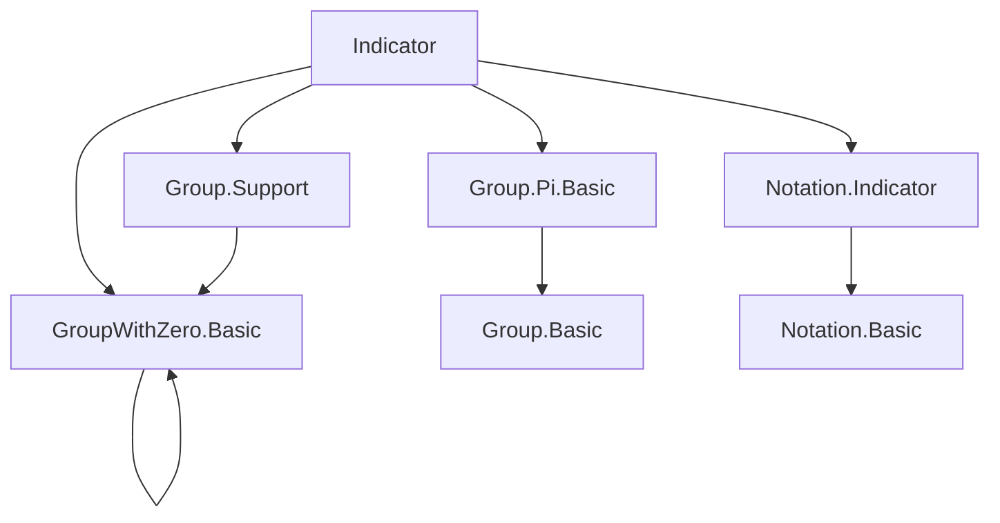

**Technical Brief: `Indicator.lean` Module**

---

### 1. **Key Definitions & Theorems**

| Name | Type / Signature | Purpose |
|------|------------------|---------|
| `indicator` | `Set ι → (ι → M₀) → ι → M₀` | Characteristic-like function: returns `f i` if `i ∈ s`, else `0`. Defined via `if h : i ∈ s then f i else 0`. |
| `support` | `(ι → M₀) → Set ι` | Set of points where a function is nonzero: `support f = { i | f i ≠ 0 }`. |
| `mulSupport` | `(ι → R) → Set ι` | For additive monoids with zero: `mulSupport f = support (fun x ↦ 1 + f x)` (used in contexts like `AddLeftCancelMonoid`). |
| `indicator_mul` | `indicator s (f * g) = indicator s f * indicator s g` | Pointwise multiplication commutes with indicator. |
| `indicator_mul_left` / `indicator_mul_right` | `indicator s (f * g) i = indicator s f i * g i` / `f i * indicator s g i` | Partial multiplication with indicator. |
| `inter_indicator_mul` | `(s ∩ t).indicator (f * g) = s.indicator f * t.indicator g` | Indicator over intersection behaves multiplicatively across sets. |
| `indicator_eq_one_iff_mem` | `indicator s 1 i = 1 ↔ i ∈ s` | Characterizes membership via indicator of constant-1 function. |
| `indicator_one_inj` | `indicator s 1 = indicator t 1 → s = t` | Injectivity of `s ↦ indicator s 1`. |
| `support_mul` (under `NoZeroDivisors`) | `support (f * g) = support f ∩ support g` | Support of product is intersection of supports. |
| `support_pow` (with `n ≠ 0`) | `support (f ^ n) = support f` | Power doesn’t change support in no-zero-divisors setting. |
| `support_inv` | `support (f⁻¹) = support f` | Inverse in group with zero preserves support. |
| `support_div` | `support (f / g) = support f ∩ support g` | Division support is intersection (since `f / g = f * g⁻¹`). |
| `mulSupport_one_add` / `mulSupport_one_sub` | `mulSupport (1 + f) = support f`, `mulSupport (1 - f) = support f` | Relates additive support to multiplicative `mulSupport` under cancellation/group assumptions. |

---

### 2. **Naming Conventions**

- **Prefixes**:
  - `indicator_`: properties of `Set.indicator`.
  - `support_`: properties of `Function.support`.
  - `mulSupport_`: properties of `Function.mulSupport`.
- **Suffixes**:
  - `_left` / `_right`: indicate which argument is preserved in partial multiplication.
  - `_const`: constant argument (e.g., `indicator_mul_const`).
  - `_of_ne_zero_*`: hypotheses about everywhere-nonzero functions.
  - `'` (prime): primed version often rewrites using notation (e.g., `support_mul'` uses `*` notation).
- **Logical patterns**:
  - `eq_zero_iff_notMem`, `eq_one_iff_mem`: biconditional characterizations.
  - `inj`: injectivity lemmas.

---

### 3. **Tactic Stack**

Frequent tactics used:

| Tactic | Role |
|--------|------|
| `funext` | Extensionality for functions. |
| `simp only [indicator]` | Simplify using definition of `indicator`. |
| `split_ifs` | Handle `if ... then ... else ...` cases. |
| `rw [...]` | Rewrite using equalities (e.g., `mul_zero`, `zero_mul`). |
| `simp_rw [...]` | Simplify + rewrite in one step (e.g., with `mem_prod_eq`). |
| `tauto` / `aesop` | Tactic for propositional logic / automated reasoning (used in `inter_indicator_mul`). |
| `congr` | Congruence closure (e.g., in `inter_indicator_one`). |
| `ext` | Set/function extensionality. |
| `classical` | Enable classical logic for `simp` (e.g., to eliminate `¬¬P`). |
| `rw [div_eq_mul_inv]` | Algebraic rewriting using group axioms. |

---

### 4. **Proof Logic**

- **Structure**: Most proofs follow a *pointwise* strategy:
  1. Extend to function equality via `funext`.
  2. Simplify using `indicator` definition (`split_ifs`).
  3. Handle membership/non-membership cases:
     - If `i ∈ s`: use `rfl` or algebraic simplification.
     - If `i ∉ s`: use `zero_mul` / `mul_zero`.
- **Inductive/Algebraic reasoning** appears in:
  - `support_mul`: uses `NoZeroDivisors` to reduce `f x * g x ≠ 0 ↔ f x ≠ 0 ∧ g x ≠ 0`.
  - `support_pow`: uses `pow_eq_zero_iff`.
  - `support_inv`: uses `inv_eq_zero ↔ f x = 0`.
- **Set-theoretic reasoning**:
  - `ext` + `mem_prod_eq` for product sets.
  - `indicator_indicator` law (`indicator s (indicator t f) = indicator (s ∩ t) f`) used implicitly.

---

### 5. **Imports**

| Import | Purpose |
|--------|---------|
| `Mathlib.Algebra.Group.Pi.Basic` | Product of groups, pointwise operations. |
| `Mathlib.Algebra.Group.Support` | Support theory for group-valued functions. |
| `Mathlib.Algebra.GroupWithZero.Basic` | Theory of monoids/groups with zero (e.g., `MulZeroClass`, `MonoidWithZero`, `GroupWithZero`). |
| `Mathlib.Algebra.Notation.Indicator` | Notation and basic lemmas for `indicator`. |

---

### 6. **Mermaid Diagrams**

#### **Dependency Graph (Module-Level)**



#### **Overview of Theory Flow**

```mermaid
flowchart LR
  A[Indicator Function] --> B[Algebraic Properties]
  A --> C[Support Theory]
  B --> B1[Indicator × Multiplication]
  B --> B2[Indicator ∩ Intersection]
  C --> C1[Support of Product]
  C --> C2[Support of Power/Inverse/Division]
  C --> C3[MulSupport & Additive Shifts]

  A --> D[Set-Theoretic Reasoning]
  D --> D1[Extensionality (ext)]
  D --> D2[Product Sets (mem_prod_eq)]

  B & C & D --> E[Applications in Analysis/Measure Theory]
```

---

### 7. **Domain Scope**

- **Core domain**: Algebraic structures with zero (especially *groups with zero* and *monoids with zero*).
- **Key applications**:
  - Formalization of *simple functions* in integration theory.
  - Support analysis for functions in `ι → G₀`, e.g., in probability or measure theory.
  - Manipulation of *finite support* functions (e.g., in group algebras).
- **Notable assumptions**:
  - `MulZeroClass`, `MonoidWithZero`, `GroupWithZero`, `NoZeroDivisors`, `Nontrivial`.
  - `AddLeft/RightCancelMonoid`, `AddGroup` for `mulSupport` variants.

--- 

This module serves as a foundational toolkit for reasoning about *localized* (via `indicator`) and *nonzero* (via `support`) behavior of functions in algebraic contexts with zero.
