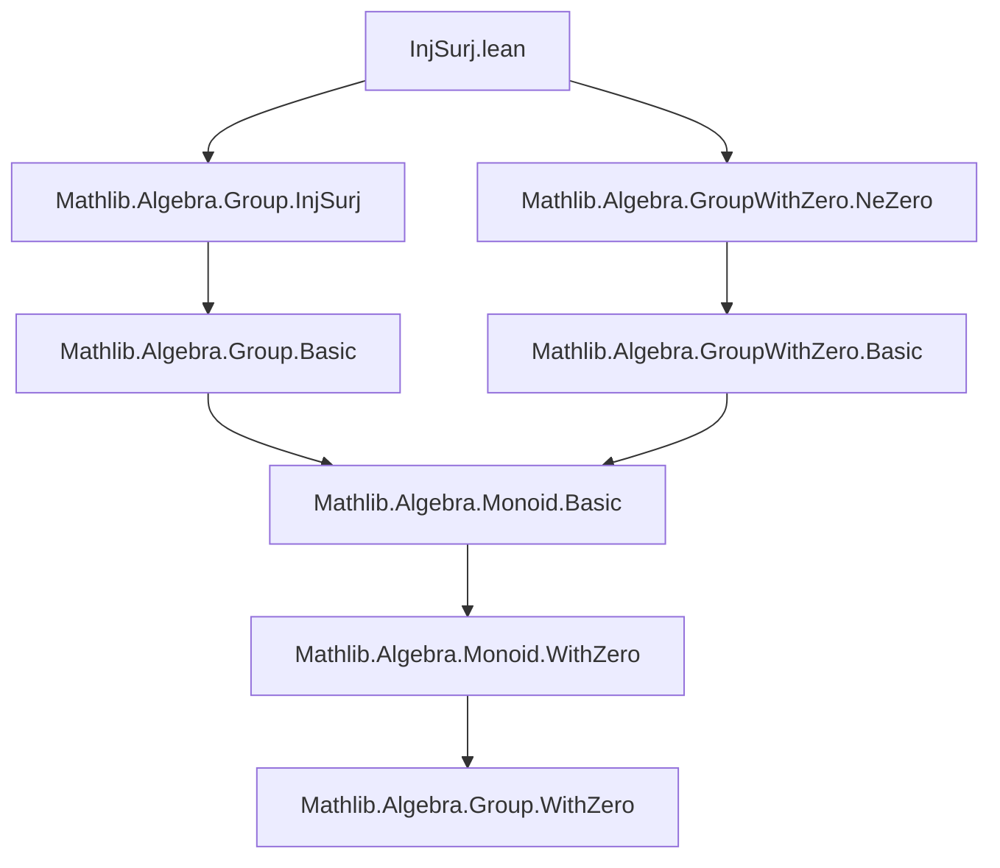
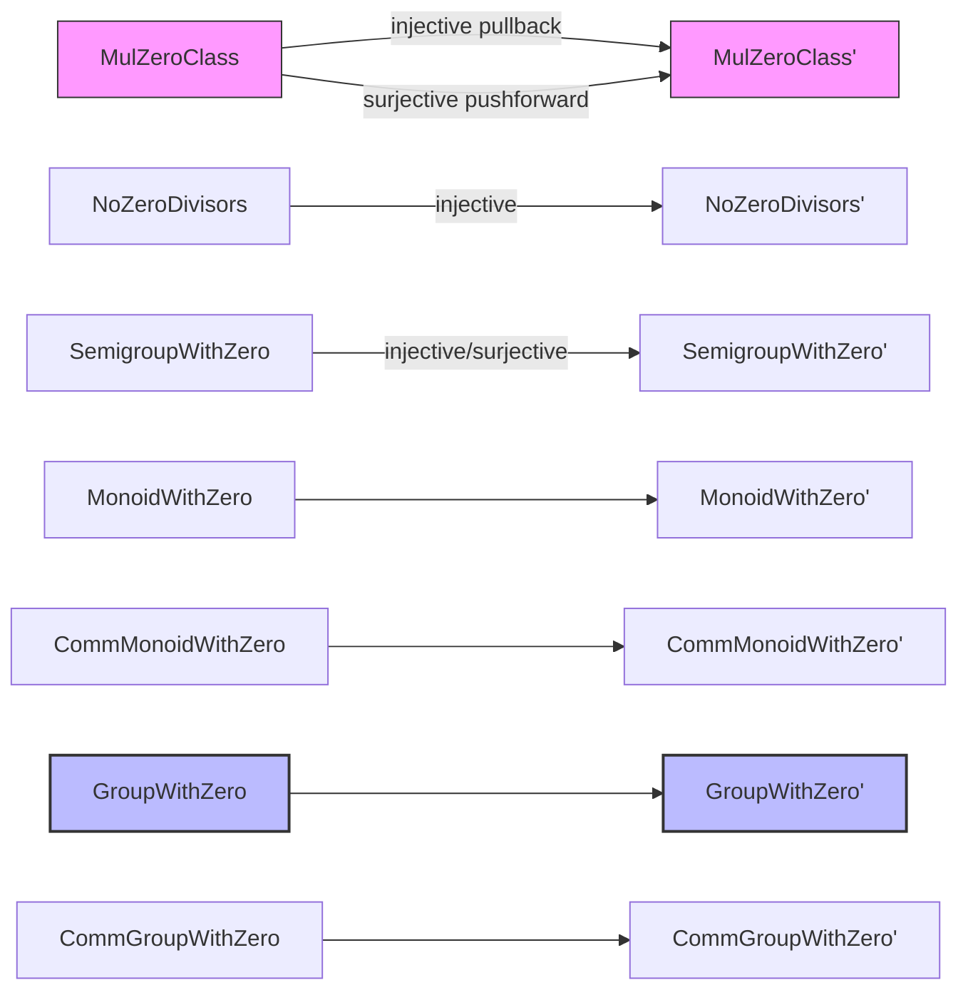
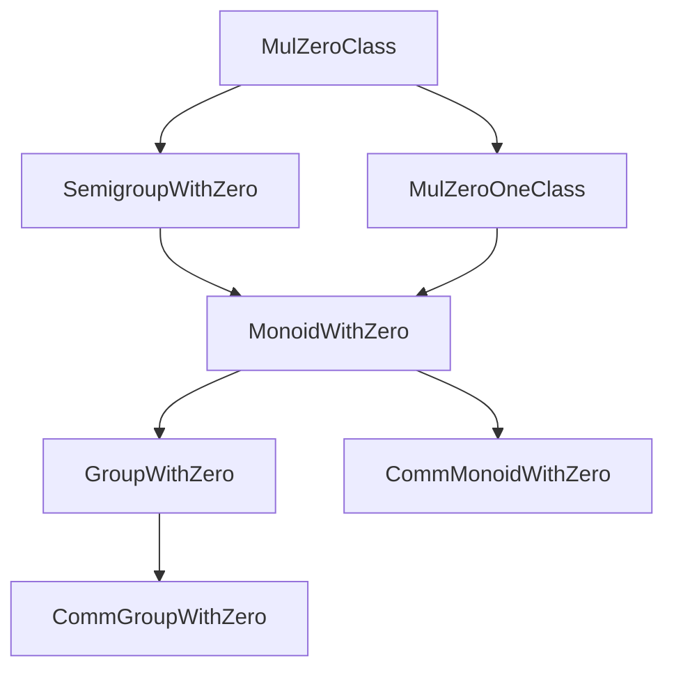

### Technical Brief: `InjSurj.lean`

---

#### **1. Key Definitions & Theorems**

| Name | Type | Purpose |
|------|------|---------|
| `Function.Injective.mulZeroClass` | `[Mul M₀'] [Zero M₀'] → (f : M₀' → M₀) → Injective f → f 0 = 0 → (∀ a b, f (a * b) = f a * f b) → MulZeroClass M₀'` | Pulls back a `MulZeroClass` structure along an injective map preserving 0 and multiplication. |
| `Function.Surjective.mulZeroClass` | `[Mul M₀'] [Zero M₀'] → (f : M₀ → M₀') → Surjective f → f 0 = 0 → (∀ a b, f (a * b) = f a * f b) → MulZeroClass M₀'` | Pushes forward a `MulZeroClass` structure along a surjective map preserving 0 and multiplication. |
| `Function.Injective.noZeroDivisors` | `[NoZeroDivisors M₀'] → NoZeroDivisors M₀` | Pulls back the `NoZeroDivisors` property along an injective homomorphism. |
| `Function.Injective.isLeftCancelMulZero` | `[IsLeftCancelMulZero M₀'] → IsLeftCancelMulZero M₀` | Pulls back left cancellation of multiplication with zero. |
| `Function.Injective.isRightCancelMulZero` | `[IsRightCancelMulZero M₀'] → IsRightCancelMulZero M₀` | Pulls back right cancellation of multiplication with zero. |
| `Function.Injective.isCancelMulZero` | `[IsCancelMulZero M₀'] → IsCancelMulZero M₀` | Combines left and right cancellation pullbacks. |
| `Function.Injective.mulZeroOneClass` | `[Mul M₀'] [Zero M₀'] [One M₀'] → ... → MulZeroOneClass M₀'` | Pulls back `MulZeroOneClass` (0, 1, multiplication) along injective maps. |
| `Function.Surjective.mulZeroOneClass` | `[Mul M₀'] [Zero M₀'] [One M₀'] → ... → MulZeroOneClass M₀'` | Pushes forward `MulZeroOneClass` along surjective maps. |
| `Function.Injective.semigroupWithZero` / `Surjective.semigroupWithZero` | `[SemigroupWithZero M₀] → ... → SemigroupWithZero M₀'` | Pull/push `SemigroupWithZero` structures. |
| `Function.Injective.monoidWithZero` / `Surjective.monoidWithZero` | `[MonoidWithZero M₀] → ... → MonoidWithZero M₀'` | Pull/push `MonoidWithZero` structures (including `pow`). |
| `Function.Injective.commMonoidWithZero` / `Surjective.commMonoidWithZero` | `[CommMonoidWithZero M₀] → ... → CommMonoidWithZero M₀'` | Pull/push commutative monoids with zero. |
| `Function.Injective.groupWithZero` / `Surjective.groupWithZero` | `[GroupWithZero G₀] → ... → GroupWithZero G₀'` | Pull/push `GroupWithZero` structures (including `inv`, `div`, `zpow`). |
| `Function.Injective.commGroupWithZero` / `Surjective.commGroupWithZero` | `[CommGroupWithZero G₀] → ... → CommGroupWithZero G₀'` | Pull/push commutative groups with zero. |

---

#### **2. Naming Conventions**

- **Prefixes**:
  - `Function.Injective.` / `Function.Surjective.` — indicates direction of transport (pullback vs pushforward).
  - `is_` — for properties like `isLeftCancelMulZero`, `isRightCancelMulZero`, `isCancelMulZero`.
- **Suffixes**:
  - `Class` — for typeclass instances (`MulZeroClass`, `MulZeroOneClass`, etc.).
  - `zero` — indicates interaction with zero element (e.g., `mulZeroClass`, `semigroupWithZero`).
  - `Comm` — for commutative variants (`CommMonoidWithZero`, `CommGroupWithZero`).
- **Verbs**:
  - `mul`, `zero`, `one`, `inv`, `div`, `npow`, `zpow` — denote operations preserved by the map.

---

#### **3. Tactic Stack**

- **Core tactics**:
  - `rw` — rewriting using hypotheses like `mul`, `zero`, `one`.
  - `simp only [...]` — simplification with explicit lemmas (e.g., `zero_mul`, `mul_zero`).
  - `congr_arg f` — applying function `f` to both sides of an equation.
  - `hf` / `hf.forall.2` — using injectivity/surjectivity to lift or descend properties.
  - `rwa` — `rw` + `assumption`.
  - `mt` — modus tollens for contrapositive reasoning.
  - `exact`, `assumption`, `intro`, `cases` — standard proof scripting.

- **Notable patterns**:
  - `hf <| by rw [...]` — using injectivity to conclude equality after simplification.
  - `hf.forall.2 fun x => ...` — using surjectivity to prove universal statements on codomain.

---

#### **4. Proof Logic**

- **General pattern**:
  1. **Assume** `f` is injective/surjective and preserves structure (0, 1, `*`, `inv`, `div`, `pow`).
  2. **Pullback (injective)**:
     - Prove axioms of target structure on domain by applying `f`, using preservation, then applying injectivity to descend back.
     - E.g., to prove `zero_mul a = a`, compute `f (zero_mul a) = 0 * f a = f a`, then apply `hf`.
  3. **Pushforward (surjective)**:
     - Prove axioms on codomain by lifting arbitrary element via surjectivity, proving on lift, then descending.
     - E.g., to prove `mul_zero a' = a'`, pick `a` with `f a = a'`, then `f (mul_zero a) = f a * 0 = f a`, so `mul_zero a = a` by `hf`, then apply `hf.forall.2`.
  4. **Special cases**:
     - For `GroupWithZero`, extra care with `inv_zero`, `mul_inv_cancel`, and `exists_pair_ne` (nontriviality).
     - For `CommGroupWithZero`, combine group structure with commutativity.

- **Induction**: Not used here — proofs are mostly algebraic manipulations.

---

#### **5. Imports**

- `Mathlib.Algebra.Group.InjSurj` — main module (this file).
- `Mathlib.Algebra.GroupWithZero.NeZero` — for `ne_zero` lemmas (e.g., `0 ≠ 1` in nontrivial groups with zero).

---

#### **6. Mermaid Diagrams**

##### **Dependency Graph (Module-Level)**

##### **Overview of Theory Flow**

##### **Structure Hierarchy (Simplified)**

---

#### **7. Domain-Specific AI Agent Insights**

- **Focus**: Transporting algebraic structures along injective/surjective maps.
- **Common Goal**: Prove that a structure on `M₀` induces one on `M₀'` via `f`.
- **Key Heuristics**:
  - If `f` is injective: *prove on codomain, then use injectivity*.
  - If `f` is surjective: *lift element to domain, prove there, then descend*.
  - Always verify preservation of all operations (0, 1, `*`, `inv`, `div`, `pow`).
- **Pattern Matching**: Look for `hf`, `zero`, `mul`, `one`, `inv`, `div`, `npow`, `zpow` hypotheses.

--- 

Let me know if you'd like a tactic suggestion database or a formalized checklist for verifying such transport lemmas.
