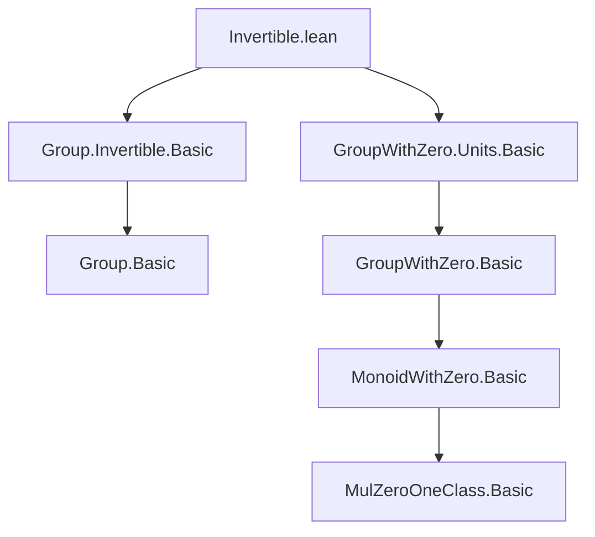
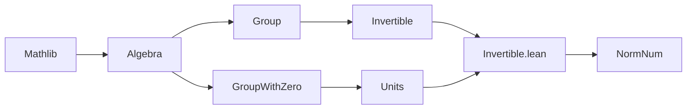

**Technical Brief: `Invertible.lean`**

---

### 1. **Key Definitions & Theorems**

| Name | Type / Signature | Purpose |
|------|------------------|---------|
| `Invertible.ne_zero` | `∀ {α} [MulZeroOneClass α] [Nontrivial α] (a : α) [Invertible a], a ≠ 0` | Proves that any invertible element in a nontrivial `MulZeroOneClass` is nonzero. |
| `Invertible.toNeZero` | `∀ {α} [MulZeroOneClass α] [Nontrivial α] (a : α) [Invertible a], NeZero a` | Instance converting invertibility to `NeZero`. |
| `Ring.inverse_invertible` | `∀ {α} [MonoidWithZero α] (x : α) [Invertible x], Ring.inverse x = ⅟x` | Connects `Ring.inverse` (from `Ring` theory) with `⅟x` (invertible inverse). |
| `invertibleOfNonzero` | `∀ {α} [GroupWithZero α] {a : α}, a ≠ 0 → Invertible a` | Constructs invertibility from nonzero in a `GroupWithZero`. |
| `invOf_eq_inv` | `∀ {α} [GroupWithZero α] (a : α) [Invertible a], ⅟a = a⁻¹` | Equates `⅟a` (invertible inverse) with group-theoretic inverse `a⁻¹`. |
| `inv_mul_cancel_of_invertible`, `mul_inv_cancel_of_invertible` | `a⁻¹ * a = 1`, `a * a⁻¹ = 1` | Standard inverse cancellation laws, specialized to invertible elements. |
| `invertibleInv` | `∀ {α} [GroupWithZero α] {a : α} [Invertible a], Invertible a⁻¹` | Instance: inverse of an invertible element is invertible. |
| `div_mul_cancel_of_invertible`, `mul_div_cancel_of_invertible`, `div_self_of_invertible` | `a / b * b = a`, `a * b / b = a`, `a / a = 1` | Division cancellation laws, enabled by invertibility of denominator. |
| `invertibleDiv` | `∀ {α} [GroupWithZero α] {a b : α} [Invertible a] [Invertible b], Invertible (a / b)` | Quotient of invertibles is invertible. |
| `invOf_div` | `∀ {α} [GroupWithZero α] {a b : α} [Invertible a] [Invertible b] [Invertible (a / b)], ⅟(a / b) = b / a` | Explicit formula for inverse of a quotient. |

---

### 2. **Naming Conventions**

- **Prefixes**:
  - `invertible*`: constructs or uses `Invertible` instances (`invertibleOfNonzero`, `invertibleDiv`, `invertibleInv`).
  - `invOf*`: refers to `⅟a` (the canonical inverse provided by `Invertible a`) — e.g., `invOf_eq_inv`, `invOf_div`.
  - `*cancel_of_invertible`: cancellation lemmas enabled by invertibility (`inv_mul_cancel_of_invertible`, `div_mul_cancel_of_invertible`, etc.).
  - `*of_invertible`: lemmas whose hypotheses include `[Invertible a]`.

- **Suffixes**:
  - `_0` variants (e.g., `inv_mul_cancel₀`) indicate usage of `GroupWithZero`-specific cancellation laws (zero-aware).

---

### 3. **Tactic Stack**

- `simp`: Dominant tactic, especially with `*`-simplified lemmas (`[simp]` attributes on most theorems).
- `by simp`: Used repeatedly in instance proofs (`invertibleInv`, `invertibleDiv`, `invOf_div`).
- `calc`: Used in `Invertible.ne_zero` for chain of equalities.
- `ring`: Not present — this file avoids ring-specific automation.
- `aesop`: Not used — minimal tactic usage, consistent with low-level algebra library goals.

---

### 4. **Proof Logic**

- **Structure**: Mostly direct, case-free proofs leveraging:
  - `simp` with `Invertible.ne_zero` to justify nonzero assumptions.
  - `invOf_eq_right_inv` / `mul_inv_cancel₀` / `inv_mul_cancel₀` to reduce to group axioms.
  - `calc` for equality chains where intermediate steps matter (e.g., `Invertible.ne_zero`).
- **No induction** or case analysis on hypotheses — relies on algebraic properties of `GroupWithZero`.
- Instance proofs (`invertibleInv`, `invertibleDiv`) use `by simp` to verify inverse laws.

---

### 5. **Imports**

| Import | Role |
|--------|------|
| `Mathlib.Algebra.Group.Invertible.Basic` | Core `Invertible` typeclass and basic lemmas. |
| `Mathlib.Algebra.GroupWithZero.Units.Basic` | `Units` and `GroupWithZero`-related infrastructure (e.g., `Ring.inverse`). |

> **Note**: Minimal imports — designed for use in `NormNum`, so avoids heavy dependencies.

---

### 6. **Mermaid Diagrams**

#### **Dependency Graph (File-Level)**



#### **Overview of Theoretical Scope**

```mermaid
flowchart LR
  A[GroupWithZero α] --> B[Invertible a]
  B --> C[a ≠ 0]
  B --> D[⅟a = a⁻¹]
  B --> E[a⁻¹ * a = 1]
  B --> F[a / b invertible]
  C --> G[NeZero a]
  D --> H[Ring.inverse x = ⅟x]
  F --> I[a / b / (a / b) = 1]
```

#### **Module Hierarchy Context**



---

### 7. **Design Intent**

- **Minimalism**: Avoids `Ring`, `Field`, or `DivisionRing` imports to keep `NormNum` lightweight.
- **Bridging**: Connects `Invertible` (typeclass-based) with `GroupWithZero`-theoretic inverses (`a⁻¹`) and `Ring.inverse`.
- **Automation-friendly**: Most lemmas are `@[simp]`, enabling `simp`-based normalization in tactics like `NormNum`.

--- 

**End of Brief**
