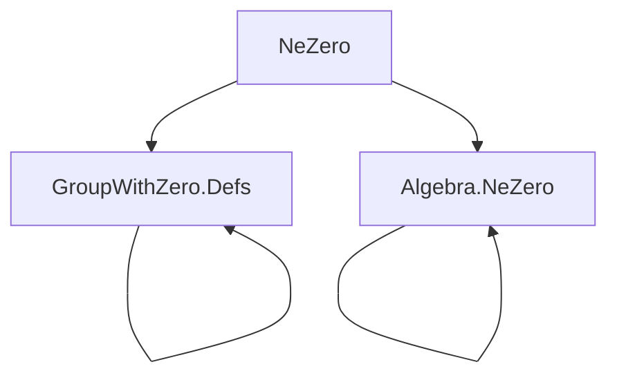
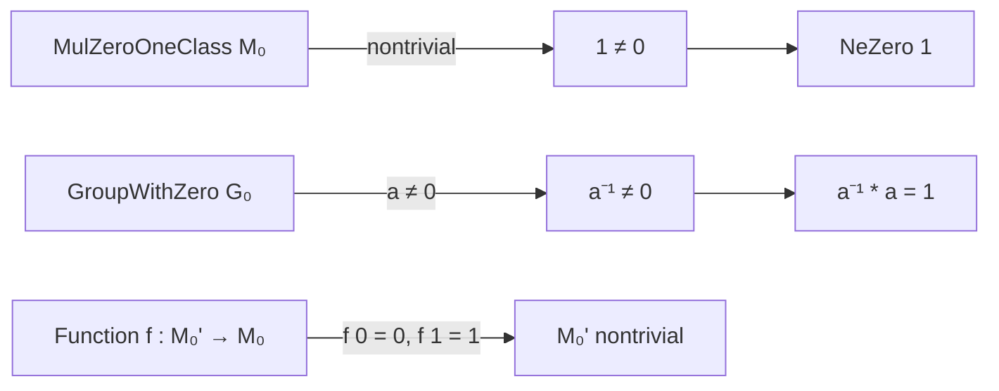

**Technical Brief: `NeZero.lean` (NeZero module)**  
*Source: `NeZero.lean`, Lean 4, Mathlib-style formalization*

---

### 1. **Key Definitions & Theorems**

| Name | Type / Signature | Purpose |
|------|------------------|---------|
| `NeZero.one` | `instance : NeZero (1 : M₀)` | Proves $1 \ne 0$ in any nontrivial `MulZeroOneClass`. |
| `domain_nontrivial` | `theorem domain_nontrivial (f : M₀' → M₀) (zero : f 0 = 0) (one : f 1 = 1) : Nontrivial M₀'` | Pulls back nontriviality along a function preserving $0$ and $1$. |
| `inv_ne_zero` | `theorem inv_ne_zero (h : a ≠ 0) : a⁻¹ ≠ 0` | In a `GroupWithZero`, nonzero elements have nonzero inverses. |
| `inv_mul_cancel₀` | `@[simp high] theorem inv_mul_cancel₀ (h : a ≠ 0) : a⁻¹ * a = 1` | Simplifies $a^{-1} \cdot a = 1$ under the assumption $a \ne 0$, with high simplifier priority. |

---

### 2. **Naming Conventions**

- **Prefixes**:
  - `inv_`: for inverse-related lemmas (`inv_ne_zero`, `inv_mul_cancel₀`).
  - `domain_`: for pullback constructions (`domain_nontrivial`).
- **Suffixes**:
  - `_ne_zero`: indicates a proof that a term is nonzero.
  - `_nontrivial`: indicates a proof or construction yielding a `Nontrivial` instance.
- **`_₀` suffix**: used in `inv_mul_cancel₀` to denote a version of a law that assumes nonzero input (analogous to `₀`-subscripted versions in additive notation like `add_right_cancel₀`).

---

### 3. **Tactic Stack**

- `intro`, `rcases`, `apply`, `calc`, `rw`, `simp`, `exact`, `congr_arg`, `mul_zero`, `zero_mul`, `one_mul`, `inv_ne_zero`, `mul_inv_cancel₀`, `inv_mul_cancel₀`, `simpa`.

Most proofs use:
- `calc` for chain-of-equalities reasoning.
- `simp` with lemmas like `one_mul`, `zero_mul`, `inv_ne_zero`, `mul_inv_cancel₀`.
- `congr_arg` for injectivity arguments (e.g., in `domain_nontrivial`).

---

### 4. **Proof Logic**

- **For `NeZero.one`**:
  - Assume $1 = 0$.
  - Use nontriviality: pick $x \ne y$.
  - Derive $x = y$ via $x = 1x = 0x = 0y = 1y = y$, contradiction.
- **For `domain_nontrivial`**:
  - Show $0 \ne 1$ in $M₀'$ by contrapositive: if $f(0) = f(1)$ then $0 = 1$ in $M₀$, contradicting `zero_ne_one`.
- **For `inv_ne_zero`**:
  - Contrapositive: assume $a^{-1} = 0$, then $1 = a \cdot a^{-1} = a \cdot 0 = 0$, contradiction.
- **For `inv_mul_cancel₀`**:
  - Use `calc` with `simp` to insert and cancel extra inverses, leveraging `inv_ne_zero h` to justify simplifications.

---

### 5. **Imports & Dependencies**

- **Core imports**:
  ```lean
  Mathlib.Algebra.GroupWithZero.Defs
  Mathlib.Algebra.NeZero
  ```
- **Key typeclasses used**:
  - `MulZeroOneClass`, `Nontrivial`, `Zero`, `One`, `GroupWithZero`
- **Purpose**: Minimal dependency module to support `GroupWithZero` hierarchy and basic tactics (e.g., `ne_of_apply_ne`, `ne_zero_of_mul_ne_zero_left`, etc.).

---

### 6. **Mermaid Diagrams**

#### **Dependency Graph (Module Level)**



#### **Theoretical Overview (File Scope)**



#### **Logical Flow Summary**

- Start from `MulZeroOneClass` + `Nontrivial` ⇒ prove $1 \ne 0$.
- Use this to support `GroupWithZero` lemmas about inverses.
- Provide a general pullback principle for nontriviality.

---

### 7. **Notes**

- The file is intentionally minimal to avoid circular dependencies in the algebraic hierarchy.
- `@[simp high]` on `inv_mul_cancel₀` ensures it fires before more general lemmas like `IsUnit.inv_mul_cancel`.
- The proof of `NeZero.one` is a standard trick in algebra: use $x = 1x = 0x = 0 = 0y = 1y = y$ to contradict $x \ne y$.

--- 

*End of technical brief.*
