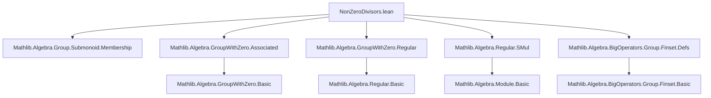

**Technical Brief: `NonZeroDivisors.lean`**

---

### 1. **Key Definitions & Theorems**

| Name | Type / Signature | Purpose |
|------|------------------|---------|
| `nonZeroDivisorsLeft M₀` | `Submonoid M₀` | Submonoid of elements with trivial *left* kernel (i.e., left non-zero-divisors). |
| `nonZeroDivisorsRight M₀` | `Submonoid M₀` | Submonoid of elements with trivial *right* kernel (i.e., right non-zero-divisors). |
| `nonZeroDivisors M₀` | `Submonoid M₀` | Intersection of left and right non-zero-divisors; the standard submonoid of non-zero-divisors. |
| `nonZeroSMulDivisors M₀ M` | `Submonoid M₀` | Elements acting *regularly* on an `M₀`-module `M` (i.e., `r • m = 0 ⇒ m = 0`). |
| `M₀⁰` | Notation for `nonZeroDivisors M₀` | Shorthand in scope `nonZeroDivisors`. |
| `M₀⁰[M]` | Notation for `nonZeroSMulDivisors M₀ M` | Shorthand in scope `nonZeroSMulDivisors`. |
| `nonZeroDivisorsEquivUnits` | `G₀⁰ ≃* G₀ˣ` | Canonical monoid isomorphism between non-zero-divisors and units in a `GroupWithZero`. |
| `unitsNonZeroDivisorsEquiv` | `M₀⁰ˣ ≃* M₀ˣ` | Units of the non-zero-divisors submonoid ≅ units of the ambient monoid. |
| `associatesNonZeroDivisorsEquiv` | `(Associates M₀)⁰ ≃* Associates M₀⁰` | Isomorphism between non-zero-divisors of associates and associates of non-zero-divisors (commutative case). |
| `mem_nonZeroDivisors_iff` | `r ∈ M₀⁰ ↔ (∀ x, r * x = 0 → x = 0) ∧ ∀ x, x * r = 0 → x = 0` | Membership criterion for `nonZeroDivisors`. |
| `mem_nonZeroDivisors_iff_ne_zero` | `[NoZeroDivisors M₀] [Nontrivial M₀] ⇒ x ∈ M₀⁰ ↔ x ≠ 0` | In domains, non-zero-divisors = nonzero elements. |
| `mul_mem_nonZeroDivisors` | `x, y ∈ M₀⁰ ⇒ x * y ∈ M₀⁰` | Closure under multiplication. |
| `IsUnit.mem_nonZeroDivisors` | `IsUnit x ⇒ x ∈ M₀⁰` | Units are always non-zero-divisors. |
| `map_mem_nonZeroDivisors` | `[NoZeroDivisors M₀'] [ZeroHomClass F M₀ M₀'] Injective f ⇒ x ∈ M₀⁰ ⇒ f x ∈ M₀'⁰` | Injective zero-homomorphisms preserve non-zero-divisors. |

---

### 2. **Naming Conventions**

- **Prefixes**:
  - `nonZeroDivisorsLeft`, `nonZeroDivisorsRight`: distinguish left/right versions.
  - `nonZeroSMulDivisors`: emphasizes action-based regularity.
  - `isUnit_`, `IsLeftRegular`, `IsRightRegular`, `IsRegular`, `IsSMulRegular`: regularity properties.
- **Suffixes**:
  - `_left`, `_right`: directional variants.
  - `_eq_zero_iff`: characterizations of when multiplication yields zero.
  - `_iff`: equivalence lemmas (↔).
- **Notation**:
  - `M₀⁰`: standard notation for non-zero-divisors.
  - `M₀⁰[M]`: action-specific non-zero-smul-divisors.

---

### 3. **Tactic Stack**

Frequent tactics used:
- `simp` / `simp only` / `simp_rw`: simplification with lemmas like `mul_eq_zero`, `one_mem'`, `mem_..._iff`.
- `ext`: extensionality for submonoids and functions.
- `intro`, `intro h`, `intro x h`: standard intro-style reasoning.
- `contrapose!`: contrapositive reasoning with negated goals.
- `exact`, `refine`, `apply`: direct proof construction.
- `rw`, `rwa`: rewriting using equivalences and assumptions.
- `cases`, `induction`: structural induction (e.g., on `Finset` in `prod_mem_...`).
- `aesop`: used implicitly via `+contextual` in `simp +contextual`.
- `norm_cast`: for coercions (e.g., `↑a * x = 0` ↔ `a * x = 0`).
- `simpa`: simplification with assumptions.

---

### 4. **Proof Logic**

- **Structure**:
  - Most proofs follow a *definition → membership criterion → closure properties → special cases* pattern.
  - Submonoid definitions are given explicitly via `carrier`, `one_mem'`, `mul_mem'`.
  - Membership lemmas (`mem_..._iff`) are proven by ` rfl` (definitionally equal).
  - Non-membership lemmas (`notMem_..._iff`) reduce to nonemptiness of certain sets.
- **Common proof patterns**:
  - **Induction on structure**: e.g., `Finset.prod_induction` for products.
  - **Equational reasoning with `mul_assoc`, `mul_comm`**: to rearrange products.
  - **Contrapositive + `eq_zero_or_eq_zero_of_mul_eq_zero`**: in `NoZeroDivisors` contexts.
  - **Use of `Submonoid` API**: `mul_mem`, `one_mem`, `le_comap_of_map_le`, etc.
  - **Leveraging `Subtype` and `Submonoid.map/comap`**: for homomorphic images/preimages.

---

### 5. **Imports**

Primary dependencies (define the logical scope):
- `Mathlib.Algebra.Group.Submonoid.Membership`
- `Mathlib.Algebra.GroupWithZero.Associated`
- `Mathlib.Algebra.GroupWithZero.Regular`
- `Mathlib.Algebra.Regular.SMul`
- `Mathlib.Algebra.BigOperators.Group.Finset.Defs`

These indicate the file sits at the intersection of:
- Submonoid theory,
- Regularity (left/right/SMul),
- Zero-divisor analysis,
- Action theory (modules, actions),
- Finite product calculus.

---

### 6. **Mermaid Diagrams**

#### **Dependency Graph (Module-Level)**



#### **Conceptual Overview (Theory Flow)**

```mermaid
flowchart LR
  MonoidWithZero[M₀] -->|defines| Submonoid[Submonoid M₀]
  Submonoid --> nonZeroDivisorsLeft[nonZeroDivisorsLeft]
  Submonoid --> nonZeroDivisorsRight[nonZeroDivisorsRight]
  nonZeroDivisorsLeft & nonZeroDivisorsRight --> nonZeroDivisors[nonZeroDivisors = ⊓]

  M₀ -->|action on M| MulAction[MulAction M₀ M]
  MulAction --> nonZeroSMulDivisors[nonZeroSMulDivisors M₀ M]

  GroupWithZero[G₀] -->|special case| nonZeroDivisorsEquivUnits[G₀⁰ ≃* G₀ˣ]

  CommMonoidWithZero -->|commutativity| nonZeroDivisorsLeft_eq_right[Left = Right]
  CommMonoidWithZero -->|structure| associatesNonZeroDivisorsEquiv[(Associates M₀)⁰ ≃* Associates M₀⁰]

  NoZeroDivisors -->|implies| mem_nonZeroDivisors_iff_ne_zero[x ∈ M₀⁰ ↔ x ≠ 0]
```

---

### 7. **Domain-Specific AI Agent Notes**

- **Core domain**: Abstract algebra (monoids with zero, modules, regularity).
- **Key reasoning modes**:
  - *Membership reasoning* in submonoids defined by universal implications.
  - *Equational reasoning* with zero-multiplication properties.
  - *Transfer via homomorphisms* (injective maps preserve regularity).
- **Critical lemmas for automation**:
  - `mem_nonZeroDivisors_iff`, `mem_nonZeroDivisors_iff_ne_zero`, `mul_mem_nonZeroDivisors`.
  - `IsUnit.mem_nonZeroDivisors`, `IsRegular.mem_nonZeroDivisors`.
  - `map_mem_nonZeroDivisors`, `mem_nonZeroDivisors_of_injective`.
- **Common proof obligations**:
  - Show `∀ x, r * x = 0 → x = 0` (or right version).
  - Prove closure under multiplication.
  - Eliminate zero-divisors via `eq_zero_or_eq_zero_of_mul_eq_zero`.

--- 

Let me know if you'd like a formalized tactic automation strategy or a proof assistant integration sketch.
