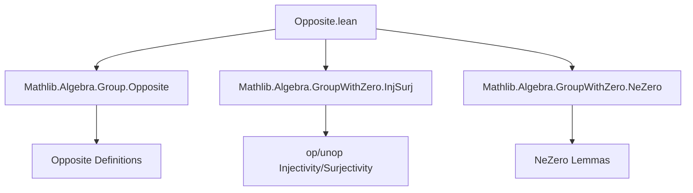
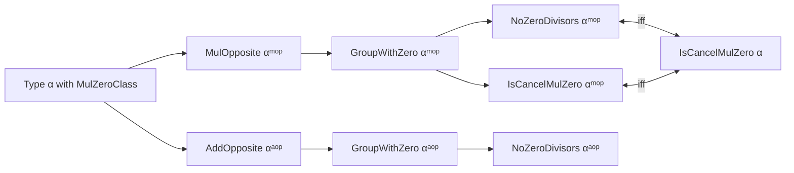

**Technical Brief: Opposite Structures for Groups with Zero in Lean 4**

---

### 1. **Key Definitions & Theorems**

| Name | Type / Signature | Purpose |
|------|------------------|---------|
| `instMulZeroClass` | `[MulZeroClass α] → MulZeroClass αᵐᵒᵖ` | Lifts `MulZeroClass` to the opposite monoid `αᵐᵒᵖ` |
| `instMulZeroOneClass` | `[MulZeroOneClass α] → MulZeroOneClass αᵐᵒᵖ` | Extends to `MulZeroOneClass` (i.e., monoid with zero) |
| `instSemigroupWithZero` | `[SemigroupWithZero α] → SemigroupWithZero αᵐᵒᵖ` | Opposite of a semigroup with zero |
| `instMonoidWithZero` | `[MonoidWithZero α] → MonoidWithZero αᵐᵒᵖ` | Opposite of a monoid with zero |
| `instGroupWithZero` | `[GroupWithZero α] → GroupWithZero αᵐᵒᵖ` | Opposite of a group with zero; includes inverse and zero behavior |
| `instNoZeroDivisors` | `[NoZeroDivisors α] → NoZeroDivisors αᵐᵒᵖ` | Opposite preserves the no-zero-divisors property |
| `instIsLeftCancelMulZero` / `instIsRightCancelMulZero` | `[IsLeftCancelMulZero α] → IsRightCancelMulZero αᵐᵒᵖ` (and vice versa) | Opposite swaps left/right cancellation w.r.t. zero |
| `isLeftCancelMulZero_iff` | `IsLeftCancelMulZero αᵐᵒᵖ ↔ IsRightCancelMulZero α` | Equivalence of left cancellation in opposite ↔ right cancellation in original |
| `isRightCancelMulZero_iff` | `IsRightCancelMulZero αᵐᵒᵖ ↔ IsLeftCancelMulZero α` | Dual of above |
| `isCancelMulZero_iff` | `IsCancelMulZero αᵐᵒᵖ ↔ IsCancelMulZero α` | Full cancellation preserved under opposition |

*Analogous instances and theorems exist for `AddOpposite` (`αᵃᵒᵖ`), where multiplication is interpreted additively.*

---

### 2. **Naming Conventions**

- **Prefixes**:
  - `inst_`: for typeclass instances (e.g., `instGroupWithZero`)
  - `is_`: for properties (e.g., `isLeftCancelMulZero`)
- **Suffixes**:
  - `_iff`: for biconditional theorems (`↔`)
  - `_op`: implicit in `MulOpposite`/`AddOpposite` namespaces
- **Notation**:
  - `αᵐᵒᵖ`: multiplicative opposite
  - `αᵃᵒᵖ`: additive opposite
  - `op`, `unop`: canonical maps between `α` and its opposite

---

### 3. **Tactic Stack**

- `unop_injective`: used repeatedly to reduce goals over `αᵐᵒᵖ`/`αᵃᵒᵖ` to `α`
- `op_injective`: used to lift equalities from `αᵐᵒᵖ`/`αᵃᵒᵖ` to `α`
- `congr_arg unop`: to apply `unop` to both sides of an equality
- `Or.casesOn`, `Or.imp`, `Or.inl`, `Or.inr`: for case analysis on disjunctions
- `inferInstance`: to fill in missing instances automatically
- `fun _ ↦ rfl`: used in tactic mode proofs to show trivial implications

No heavy automation like `aesop`, `ring`, or `simp` is used—proofs are mostly direct and rely on injectivity of `op`/`unop`.

---

### 4. **Proof Logic**

- **Structure**: All proofs follow a uniform pattern:
  1. Use `unop_injective` to reduce a goal in `αᵐᵒᵖ` (or `αᵃᵒᵖ`) to a goal in `α`.
  2. Apply the corresponding property (e.g., `mul_zero`, `inv_mul_cancel₀`, `eq_zero_or_eq_zero_of_mul_eq_zero`) in `α`.
  3. Reconstruct the result in the opposite using `unop_injective`.
- **Cancellation properties**: The key insight is that opposition *reverses* the direction of multiplication, hence:
  - Left cancellation in `α` ↔ Right cancellation in `αᵐᵒᵖ`
  - This is formalized via `isLeftCancelMulZero_iff` and `isRightCancelMulZero_iff`
- **Group with zero**: The `mul_inv_cancel` axiom is verified using `inv_mul_cancel₀` and injectivity of `unop`.

---

### 5. **Imports**

- `Mathlib.Algebra.Group.Opposite`: Core definitions of `MulOpposite`, `AddOpposite`, `op`, `unop`
- `Mathlib.Algebra.GroupWithZero.InjSurj`: Injectivity/surjectivity lemmas for `op`/`unop`
- `Mathlib.Algebra.GroupWithZero.NeZero`: Tools for reasoning about nonzero elements (used implicitly via `ne_iff`)

These imports define the foundational infrastructure for opposite structures and zero-aware group theory.

---

### 8. **Mermaid Diagrams**

#### **Dependency Graph (Module-Level)**

#### **Overview of Theory Flow**

- **Key Insight**: Opposite construction is an *involution* (up to equivalence), reversing multiplication order and thus swapping left/right properties.
- **Zero compatibility**: All structures preserve zero behavior via `zero_mul`, `mul_zero`, and `inv_zero`.

--- 

Let me know if you'd like a formalized dependency graph for `GroupWithZero` or a comparison with `Opposite` in other algebraic contexts (e.g., rings, semirings).
