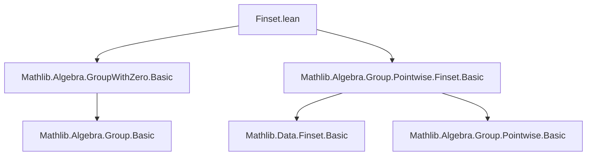
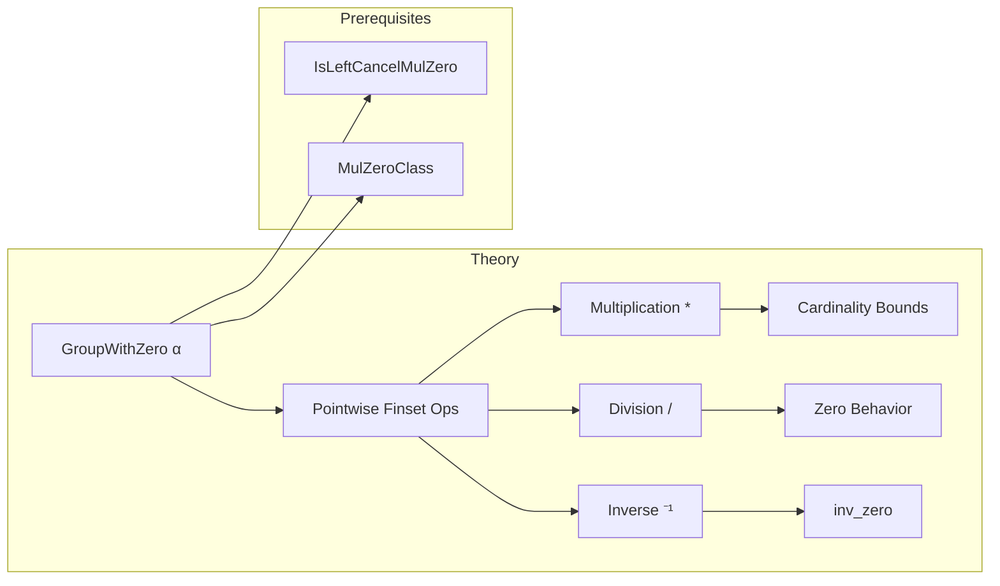

**Technical Brief: `Finset.lean` (Pointwise Operations in `GroupWithZero`)**

---

### 1. **Key Definitions & Theorems**

| Name | Type / Signature | Purpose |
|------|------------------|---------|
| `card_le_card_mul_left₀` | `[IsLeftCancelMulZero α] → a ∈ s → a ≠ 0 → #t ≤ #(s * t)` | Lower bound on cardinality of left-multiplication by a nonzero element in `s`. |
| `card_le_card_mul_right₀` | `[IsRightCancelMulZero α] → a ∈ t → a ≠ 0 → #s ≤ #(s * t)` | Lower bound on cardinality of right-multiplication by a nonzero element in `t`. |
| `card_le_card_mul_self₀` | `[IsLeftCancelMulZero α] → #s ≤ #(s * s)` | Cardinality non-decrease under self-multiplication in left-cancellative zero-multiplication setting. |
| `mul_zero_subset` | `s * 0 ⊆ 0` | Product with zero finset is contained in zero. |
| `zero_mul_subset` | `0 * s ⊆ 0` | Product with zero finset on left is contained in zero. |
| `Nonempty.mul_zero` | `s.Nonempty → s * 0 = 0` | If `s` is nonempty, multiplying by zero gives exactly zero. |
| `Nonempty.zero_mul` | `s.Nonempty → 0 * s = 0` | Symmetric to above for left multiplication. |
| `div_zero_subset` | `s / 0 ⊆ 0` | Division by zero finset yields subset of zero. |
| `zero_div_subset` | `0 / s ⊆ 0` | Zero divided by any finset yields subset of zero. |
| `Nonempty.div_zero` | `s.Nonempty → s / 0 = 0` | Nonempty `s` implies `s / 0 = 0`. |
| `Nonempty.zero_div` | `s.Nonempty → 0 / s = 0` | Nonempty `s` implies `0 / s = 0`. |
| `inv_zero` | `(0 : Finset α)⁻¹ = 0` | Inverse of zero finset is zero (in `GroupWithZero`). |

---

### 2. **Naming Conventions**

- **Prefixes**:
  - `card_le_card_mul_*`: Cardinality inequalities for multiplication.
  - `*_zero_*`: Behavior with respect to zero finset (`0`).
  - `Nonempty.*`: Results requiring nonemptiness of the finset.
- **Suffixes**:
  - `₀`: Indicates usage of `IsLeft/RightCancelMulZero` or `GroupWithZero` structure (e.g., `mul_left_injective₀`).
  - `subset`: Subset inclusion lemmas.
  - No suffix for equality lemmas when nonemptiness is required.

---

### 3. **Tactic Stack**

- **Core tactics**:
  - `simp` (with `mem_mul`, `mem_div`, `subset_iff`, `mem_erase`, `ne_eq`)
  - `rw` (e.g., `erase_eq_empty_iff`)
  - `obtain ⟨a, ha⟩` / `obtain rfl | rfl` (case analysis on equality or existence)
  - `ext` (extensionality for finset equality)
  - `antisymm` (proving equality via mutual subset inclusion)
  - `simpa` (simplify using a hypothesis)
- **Pattern**:
  - Use `simp` to reduce to membership conditions.
  - Use `antisymm` + `simpa` to upgrade subset to equality when nonemptiness gives reverse inclusion.

---

### 4. **Proof Logic**

- **Structure**:
  - **Case analysis** on emptiness of `s` (via `(s.erase 0).eq_empty_or_nonempty`).
  - For nonempty cases: extract witness `a ∈ s`, `a ≠ 0`, then apply injectivity lemmas (`mul_right_injective₀`, `mul_left_injective₀`) to lift to cardinality bounds.
  - For zero-related lemmas: reduce via `simp` to membership characterizations (`mem_mul`, `mem_div`), then use `antisymm` to prove equality when nonemptiness supplies the reverse inclusion.
- **Induction**: Not used directly; reasoning is mostly case-based and relies on algebraic properties of `GroupWithZero`.

---

### 5. **Imports**

| Import | Role |
|--------|------|
| `Mathlib.Algebra.GroupWithZero.Basic` | Provides `GroupWithZero` typeclass and basic properties (e.g., `inv`, `/`, `0`, `*`). |
| `Mathlib.Algebra.Group.Pointwise.Finset.Basic` | Defines pointwise operations on finsets: `*`, `/`, `⁻¹`, and membership lemmas (`mem_mul`, `mem_div`). |

---

### 6. **Mermaid Diagrams**

#### **Dependency Graph (Module-Level)**

#### **Overview of Theoretical Scope**

---

### 7. **Key Observations**

- The file formalizes **zero-aware behavior** of finset arithmetic in `GroupWithZero`, where `0 * s = 0` only holds when `s` is nonempty.
- The `₀` suffix convention distinguishes zero-aware variants of standard lemmas (e.g., `mul_left_injective` vs `mul_left_injective₀`).
- The comment `/-! Note that Finset is not a MulZeroClass because 0 * ∅ ≠ 0. -/` highlights a subtle distinction: finsets do not inherit `MulZeroClass` due to empty-set edge cases.

--- 

Let me know if you'd like the Lean code annotated with proof strategy notes or a formalization roadmap for extending this theory.
