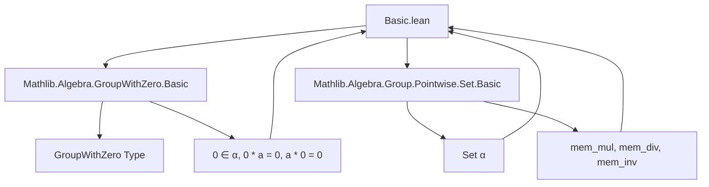
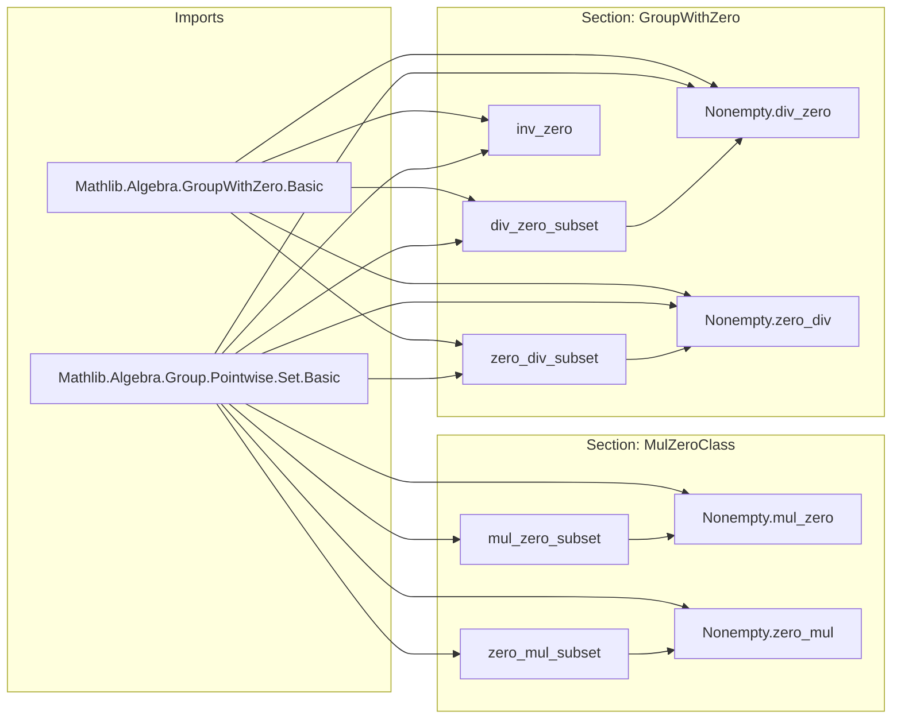

**Technical Brief: `Basic.lean` — Pointwise Set Operations in `GroupWithZero`**

---

### 1. **Key Definitions & Theorems**

| Name | Type / Signature | Purpose |
|------|------------------|---------|
| `mul_zero_subset` | `s * 0 ⊆ (0 : Set α)` | Shows that multiplying any set by `{0}` yields a subset of `{0}`. |
| `zero_mul_subset` | `0 * s ⊆ 0` | Dual of `mul_zero_subset`; left multiplication by `{0}` stays in `{0}`. |
| `Nonempty.mul_zero` | `s.Nonempty → s * 0 = 0` | If `s` is nonempty, then `s * {0} = {0}` (equality via antisymmetry). |
| `Nonempty.zero_mul` | `s.Nonempty → 0 * s = 0` | Dual of `Nonempty.mul_zero`. |
| `div_zero_subset` | `s / 0 ⊆ 0` | Division by `{0}` yields subset of `{0}` (in `GroupWithZero`). |
| `zero_div_subset` | `0 / s ⊆ 0` | `{0}` divided by any set is subset of `{0}`. |
| `Nonempty.div_zero` | `s.Nonempty → s / 0 = 0` | Nonempty `s` implies `s / {0} = {0}`. |
| `Nonempty.zero_div` | `s.Nonempty → 0 / s = 0` | `{0}` divided by nonempty `s` equals `{0}`. |
| `Set.inv_zero` | `(0 : Set α)⁻¹ = 0` | Inverse of the zero set is itself (in `GroupWithZero`). |

> **Note**: `0` denotes the singleton set `{0}` in this context (via coercion from `α` to `Set α`).

---

### 2. **Naming Conventions**

- **Prefixes**:
  - `mul_`, `zero_`, `div_`, `inv_`: indicate the operation involved.
  - `subset`: suffix for inclusion lemmas (`⊆`).
  - `Nonempty.` prefix for lemmas requiring nonemptiness to upgrade inclusion to equality.

- **Structure**:
  - `op_arg_subset` → inclusion of result into canonical zero set.
  - `Nonempty.op_arg` → equality when argument is nonempty.

- **No `is_` or `dist_` prefixes** — this file focuses on *computational* properties, not classification.

---

### 3. **Tactic Stack**

| Tactic | Frequency | Role |
|--------|-----------|------|
| `simp` | Very high | Simplifies membership in `mul`, `div`, `inv`, and singleton `0`. |
| `ext` | Medium | Used in `inv_zero` to prove set extensionality. |
| `antisymm` | Medium | Converts `⊆` to `=` using two-sided inclusion. |
| `simpa` | Medium | Refines `simp` with target equality (e.g., `simpa [mem_mul] using hs`). |
| `by` | High | Standard for short proofs. |

> *No heavy automation (e.g., `aesop`, `ring`, `linarith`) — proofs are elementary set-theoretic reasoning.*

---

### 4. **Proof Logic**

- **Pattern**:
  1. Prove inclusion (`⊆`) using `simp` + definition of pointwise operation (`mem_mul`, `mem_div`, etc.).
  2. If `s.Nonempty`, use `antisymm`:
     - Left side: inclusion already proven.
     - Right side: `simpa [mem_*] using hs` shows `0 ⊆ s * 0` (or similar), via witness `0 ∈ s`.
  3. For `inv_zero`: extensionality + `simp` over membership in inverse set.

- **Induction**: Not used — all proofs are direct set-theoretic.

- **Case analysis**: Implicit via `Nonempty` elimination (e.g., `hs : s.Nonempty` gives `∃ x, x ∈ s`).

---

### 5. **Imports & Dependencies**

| Import | Role |
|--------|------|
| `Mathlib.Algebra.GroupWithZero.Basic` | Provides `GroupWithZero` typeclass (monoid with zero, invertible nonzero elements, `0 * a = 0`, etc.). |
| `Mathlib.Algebra.Group.Pointwise.Set.Basic` | Defines pointwise operations on sets: `s * t`, `s / t`, `s⁻¹`, `0`, etc. |

> **No `OrderedMonoid`, `Ring`, or `MulAction`** — `assert_not_exists` enforces these are *not* assumed.

---

### 6. **Mermaid Diagrams**

#### **Dependency Graph**

#### **Overview of File Structure**

---

### 7. **Domain Summary**

- **Mathematical Context**: Algebraic structures with zero (e.g., rings, fields, monoids with zero), where multiplication by zero collapses sets to `{0}`.
- **Use Case**: Foundational lemmas for measure theory, topology, or algebra where pointwise operations on sets (e.g., sumsets, quotients) interact with zero.
- **Key Insight**: In `GroupWithZero`, division by zero and zero division behave trivially on sets — unless the set is nonempty, in which case equality holds.

--- 

✅ *Formalization is minimal, precise, and aligned with Lean’s `Mathlib` conventions.*
