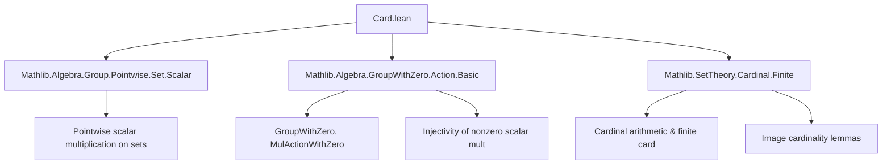

**Technical Brief: `Card.lean` — Cardinality Invariance under Pointwise Group-with-Zero Action**

---

### 1. Key Definitions & Theorems

| Name | Type / Signature | Purpose |
|------|------------------|---------|
| `GroupWithZero` | Type → Type | A type with a multiplicative monoid structure, zero element, and invertibility of nonzero elements (except zero itself). |
| `MulActionWithZero` | Type → Type → Type | A multiplicative action of a `GroupWithZero` on a type with zero, preserving zero. |
| `Set.smul_set₀` (implicit) | `a • s` | Pointwise scalar multiplication of a set `s : Set M₀` by `a : G₀`, defined as `{ a • x | x ∈ s }`. |
| `Cardinal.mk_smul_set₀` | `(ha : a ≠ 0) (s : Set M₀) → #↥(a • s) = #s` | Proves that the cardinality of the image of `s` under nonzero scalar multiplication is equal to that of `s`. |
| `natCard_smul_set₀` | `(ha : a ≠ 0) (s : Set M₀) → Nat.card ↥(a • s) = Nat.card s` | Same as above but for finite cardinality (`Nat.card`). |

> Note: `↥(a • s)` denotes the subtype coercion of the set `a • s` (i.e., its underlying type).

---

### 2. Naming Conventions

- **Prefixes**:
  - `mk_` / `natCard_`: Relates to cardinality (`#` vs `Nat.card`).
  - `smul_set₀`: Indicates pointwise scalar multiplication of a set under a `GroupWithZero` action.
- **Suffixes**:
  - `_₀`: Denotes usage of `GroupWithZero`/`MulActionWithZero` (i.e., actions that may involve zero, but lemmas require `a ≠ 0`).
- **Variable naming**:
  - `G₀`, `M₀`: Standard for types with zero (e.g., `GroupWithZero`, `Zero`, `MulActionWithZero`).
  - `s`: Standard for sets.
  - `a`: Scalar from `G₀`.

---

### 3. Tactic Stack

- `aesop`: Not used here (no automation needed).
- `simp_rw`: Not used.
- **Core tactics**:
  - `exact`: Used implicitly via `:=`.
  - `apply`: Via `Cardinal.mk_image_eq_of_injOn` and `Nat.card_image_of_injective`.
  - `rw`/`refl`: Not explicit, but underlying lemmas rely on definitional equality of images.
- **Key lemmas invoked**:
  - `Cardinal.mk_image_eq_of_injOn`
  - `Nat.card_image_of_injective`
  - `MulAction.injective₀` (provides injectivity of `a • ·` when `a ≠ 0`)

---

### 4. Proof Logic

- **Strategy**: Reduce to injectivity of scalar multiplication.
  1. Assume `a ≠ 0`.
  2. Use `MulAction.injective₀ ha` to get that `a • ·` is injective on `M₀`.
  3. Apply general set-theoretic facts:
     - Injective functions preserve cardinality of images (`mk_image_eq_of_injOn`).
     - For finite sets, injective functions preserve `Nat.card` (`nat_card_image_of_injective`).
- **No induction or case analysis** needed — purely functional/set-theoretic reasoning.

---

### 5. Imports

| Import | Role |
|--------|------|
| `Mathlib.Algebra.Group.Pointwise.Set.Scalar` | Defines `•` action on sets (`smul_set`), pointwise operations. |
| `Mathlib.Algebra.GroupWithZero.Action.Basic` | Defines `GroupWithZero`, `MulActionWithZero`, and basic properties like `injective₀`. |
| `Mathlib.SetTheory.Cardinal.Finite` | Provides `Cardinal.mk`, `Nat.card`, and lemmas like `mk_image_eq_of_injOn`, `nat_card_image_of_injective`. |

> These imports define the algebraic and set-theoretic infrastructure needed to reason about cardinality under group actions.

---

### 6. Mermaid Diagrams

#### Dependency Graph (Module-Level)



#### Overview of Theoretical Flow

```mermaid
flowchart LR
  G₀[GroupWithZero G₀] -->|action| M₀[MulActionWithZero G₀ M₀]
  a[a : G₀] -->|ha : a ≠ 0| inj[MulAction.injective₀ ha]
  inj -->|injective| img[Image a • s]
  img -->|mk_image_eq_of_injOn| card_eq[#(a • s) = #s]
  img -->|nat_card_image_of_injective| nat_card_eq[Nat.card (a • s) = Nat.card s]
```

---

### Summary

This module formalizes the elementary but crucial fact that **nonzero scalar multiplication by a `GroupWithZero` preserves the cardinality of subsets of a `MulActionWithZero`-module**. It leverages standard set-theoretic lemmas about injective maps and cardinality, and is foundational for later results involving finite sets, orbit-stabilizer, or measure-theoretic cardinality arguments in algebraic contexts.
