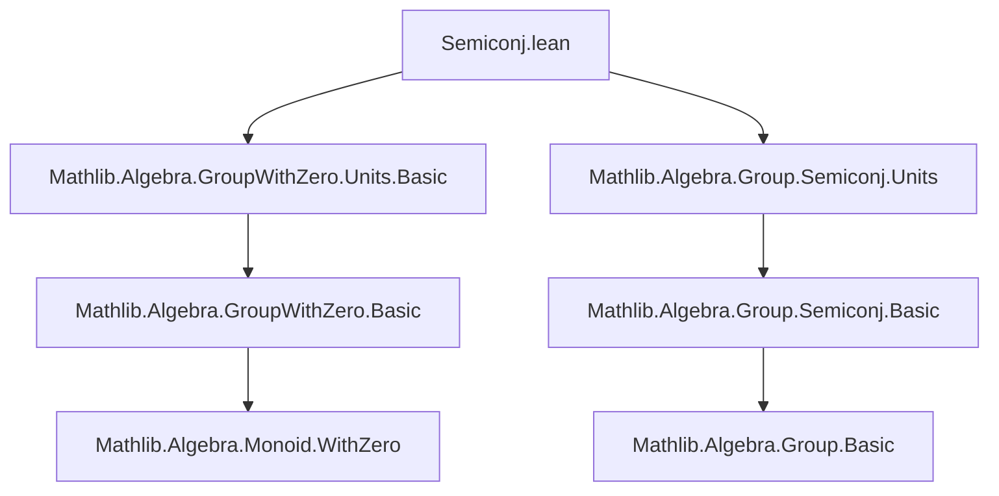
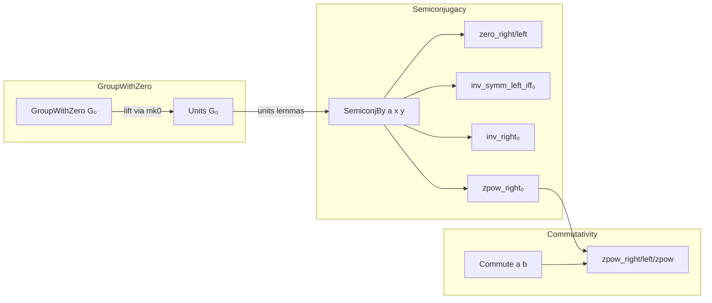
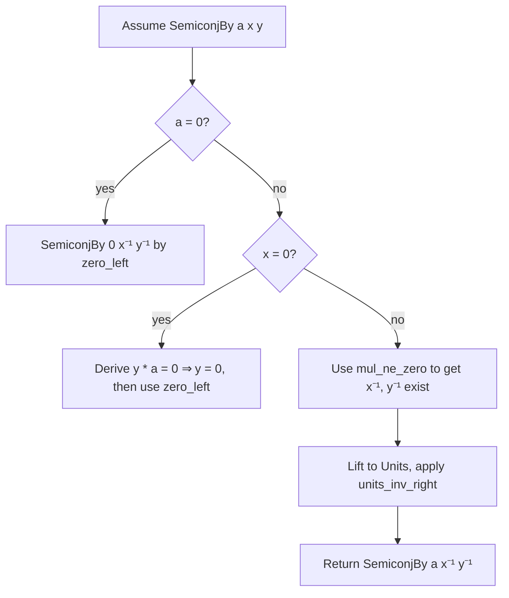

### Technical Brief: `Semiconj.lean` (Mathlib — GroupWithZero Semiconjugacy)

---

#### **1. Key Definitions & Theorems**

| Name | Type / Signature | Purpose |
|------|------------------|---------|
| `SemiconjBy` | `SemiconjBy (a x y : G₀) : Prop` | Defines *semiconjugacy*: $a \cdot x = y \cdot a$. |
| `SemiconjBy.zero_right` | `[MulZeroClass G₀] → SemiconjBy a 0 0` | $a$ semiconjugates $0$ to $0$. |
| `SemiconjBy.zero_left` | `[MulZeroClass G₀] → SemiconjBy 0 x y` | $0$ semiconjugates any $x, y$. |
| `SemiconjBy.inv_symm_left_iff₀` | `[GroupWithZero G₀] → SemiconjBy a⁻¹ x y ↔ SemiconjBy a y x` | Inverse swaps semiconjugacy direction (handles $a = 0$). |
| `SemiconjBy.inv_right₀` | `[GroupWithZero G₀] → SemiconjBy a x y → SemiconjBy a x⁻¹ y⁻¹` | Inverses preserve semiconjugacy (nonzero case). |
| `SemiconjBy.inv_right_iff₀` | `[GroupWithZero G₀] → SemiconjBy a x⁻¹ y⁻¹ ↔ SemiconjBy a x y` | Equivalence for inverse semiconjugacy. |
| `SemiconjBy.div_right` | `[GroupWithZero G₀] → SemiconjBy a x y → SemiconjBy a x' y' → SemiconjBy a (x / x') (y / y')` | Quotients preserve semiconjugacy. |
| `SemiconjBy.zpow_right₀` | `[GroupWithZero G₀] → SemiconjBy a x y → ∀ m : ℤ, SemiconjBy a (x ^ m) (y ^ m)` | Integer powers preserve semiconjugacy. |
| `Commute.zpow_right₀` | `[GroupWithZero G₀] → Commute a b → ∀ m : ℤ, Commute a (b ^ m)` | Integer powers of commuting elements commute. |
| `Commute.zpow_left₀` | `[GroupWithZero G₀] → Commute a b → m : ℤ → Commute (a ^ m) b` | Left integer powers preserve commutativity. |
| `Commute.zpow_zpow₀` | `[GroupWithZero G₀] → Commute a b → m n : ℤ → Commute (a ^ m) (b ^ n)` | Double integer powers preserve commutativity. |
| `Commute.zpow_self₀`, `Commute.self_zpow₀`, `Commute.zpow_zpow_self₀` | Various forms of self-commuting powers | Special cases of above for powers of a single element. |

> **Note**: All theorems are extended to handle zero in `GroupWithZero`, using case analysis (`by_cases ha : a = 0`) and `Units.mk0` to reduce to the unit group where inverses exist.

---

#### **2. Naming Conventions**

- **Prefixes**:
  - `zero_`: Handles the zero element explicitly (e.g., `zero_right`, `zero_left`).
  - `inv_`: Deals with inverses (e.g., `inv_symm_left`, `inv_right`).
  - `zpow_`: Integer powers (e.g., `zpow_right₀`, `zpow_zpow₀`).
- **Suffixes**:
  - `_iff₀`: Biconditional version handling zero (e.g., `inv_symm_left_iff₀`, `inv_right_iff₀`).
  - `_₀`: General pattern for zero-aware variants of standard lemmas (e.g., `zpow_right₀`, `div_right`).
- **Structure**:
  - `SemiconjBy.*` and `Commute.*` namespaces.
  - `₀` suffix signals extension to `GroupWithZero` (vs. `Group`, where zero is absent).

---

#### **3. Tactic Stack**

| Tactic | Usage Frequency | Purpose |
|--------|-----------------|---------|
| `simp only [...]` | High | Simplify using `SemiconjBy` definition and `mul_zero`, `zero_mul`. |
| `by_cases ... = 0` | High | Split on whether elements are zero (critical in `GroupWithZero`). |
| `subst` | Medium | Substitute equal elements (e.g., `x = 0`). |
| `rw [...] at h` | Medium | Rewrite hypotheses using equalities. |
| `exact ...` | Medium | Apply previously proven lemmas (e.g., `h.inv_right₀`). |
| ` Classical.by_cases` | Medium | Use classical logic for case splits (e.g., on $a = 0$). |
| `have := ...` | Medium | Introduce intermediate facts (e.g., `mul_ne_zero`). |
| `simp [h.resolve_right ...]` | Low | Resolve contradictions or eliminate zero assumptions. |

---

#### **4. Proof Logic**

- **Induction / Case Analysis**:
  - Proofs often split on whether elements are zero (`by_cases ha : a = 0`, `hx : x = 0`).
  - For nonzero elements, lift to `Units G₀` via `Units.mk0` and apply known lemmas for groups.
- **Reduction to Units**:
  - Key technique: `@units_inv_symm_left_iff _ _ (Units.mk0 a ha) _ _`.
  - Allows reuse of group-theoretic lemmas (e.g., `units_inv_symm_left_iff`) in `GroupWithZero`.
- **Structure Preservation**:
  - Lemmas for `div`, `zpow`, and `mul` follow from base cases (`inv`, `pow`) and closure properties.
- **Symmetry & Equivalence**:
  - Biconditionals (`_iff₀`) are proven via mutual implication, often using symmetry (`symm`) and `inv_symm_left_iff₀`.

---

#### **5. Imports & Dependencies**

| Import | Role |
|--------|------|
| `Mathlib.Algebra.GroupWithZero.Units.Basic` | Provides `Units.mk0`, coercion from `Units G₀` to `G₀`, and basic unit properties. |
| `Mathlib.Algebra.Group.Semiconj.Units` | Contains group-theoretic semiconjugacy lemmas (e.g., `units_inv_symm_left_iff`) used as templates. |

> **Scope**: This module extends semiconjugacy and commutativity lemmas from groups (`Group`) to *groups with zero* (`GroupWithZero`), where zero is a multiplicative zero element (i.e., $0 \cdot x = 0$).

---

#### **6. Mermaid Diagrams**

##### **Dependency Graph (Module-Level)**

##### **Overview of Theoretical Flow**

##### **Proof Strategy Flow (Example: `inv_right₀`)**

---

#### **7. Summary**

This module formalizes *semiconjugacy* and *commutativity* in the presence of a multiplicative zero, extending standard group-theoretic results to `GroupWithZero`. It leverages case analysis on zero, embedding nonzero elements into the unit group, and reuses existing group lemmas via `Units.mk0`. The naming convention (`_₀`, `inv_`, `zpow_`) clearly signals zero-aware extensions, and the proof strategy is systematic: reduce to units, handle zero separately, and combine via `simp` and `rw`.
