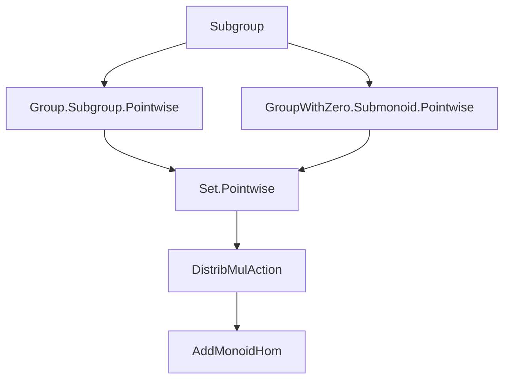

### Technical Brief: `Subgroup.lean` — Subgroup Action Theory in `Mathlib`

---

#### **1. Key Definitions & Theorems**

| Name | Type / Signature | Purpose |
|------|------------------|---------|
| `Subgroup.pointwise_smul_def` | `a • S = S.map (DistribMulAction.toAddMonoidEnd _ A a)` | Defines the pointwise action of a monoid element on an additive subgroup via the induced additive monoid endomorphism. |
| `AddSubgroup.pointwiseMulAction` | `MulAction M (AddSubgroup A)` | Constructs a `MulAction` of `M` on `AddSubgroup A` by mapping each element via the induced additive monoid homomorphism. |
| `coe_pointwise_smul` | `↑(a • S) = a • (S : Set A)` | Shows coercion of the pointwise-smulled subgroup equals the set-theoretic scalar multiplication of the underlying set. |
| `smul_mem_pointwise_smul_iff₀` | `a ≠ 0 → (a • x ∈ a • S ↔ x ∈ S)` | Characterizes membership in a scaled subgroup under nonzero scalar in `GroupWithZero`. |
| `mem_pointwise_smul_iff_inv_smul_mem₀` | `a ≠ 0 → (x ∈ a • S ↔ a⁻¹ • x ∈ S)` | Relates membership in a scaled subgroup to membership after inverse scaling. |
| `pointwise_smul_le_pointwise_smul_iff₀` | `a ≠ 0 → (a • S ≤ a • T ↔ S ≤ T)` | Monotonicity of pointwise scalar multiplication on subgroups under nonzero scalars. |
| `pointwise_smul_le_iff₀` / `le_pointwise_smul_iff₀` | `a ≠ 0 → (a • S ≤ T ↔ S ≤ a⁻¹ • T)` and dually | Adjunction-like behavior of scalar multiplication and inverse scaling on subgroup ordering. |
| `pointwise_isCentralScalar` | `IsCentralScalar M (AddSubgroup A)` | If `M` acts centrally on `A`, then the induced action on `AddSubgroup A` is also central. |

---

#### **2. Naming Conventions**

- **Prefixes**:
  - `pointwise_`: Indicates action defined pointwise on underlying sets (e.g., `pointwise_smul_def`, `pointwise_isCentralScalar`).
  - `smul_mem_`: Membership criteria for scalar multiplication.
  - `mem_..._iff_`: Logical equivalences for membership in transformed subgroups.
  - `le_..._iff_`: Order-theoretic characterizations (`≤` on subgroups).
- **Suffixes**:
  - `_iff`: Logical equivalence lemmas.
  - `_iff₀`: Variant for `GroupWithZero`, requiring `a ≠ 0`.
  - `_def`: Definition lemmas (often `rfl`).
  - `_toAddSubmonoid`: Relates subgroup and additive submonoid versions.

---

#### **3. Tactic Stack**

- **Core tactics**:
  - `rfl`: Used in definition lemmas (`pointwise_smul_def`, `coe_pointwise_smul`, etc.).
  - `congr_arg`: To lift homomorphism equalities to subgroup equalities.
  - `map_one`, `map_mul`, `map_map`: For reasoning about homomorphic images.
  - `AddMonoidHom.ext`: To prove equality of additive monoid homomorphisms.
  - `subset_smul_set_iff₀`, `smul_set_subset_smul_set_iff₀`, etc.: Imported lemmas from `Pointwise` theory.

- **No heavy automation** (e.g., `aesop`, `linarith`) is used — proofs are mostly direct and rely on algebraic properties and imports.

---

#### **4. Proof Logic**

- **Structure**:
  - Most proofs are *definitionally trivial* (`rfl`) or reduce to known lemmas about set scalar multiplication (`Set.smul_mem_smul_set_iff`, etc.).
  - For `GroupWithZero` variants, proofs require a *nonzero hypothesis* (`ha : a ≠ 0`) to ensure invertibility of `a`.
  - For `pointwiseMulAction`, proofs verify the `MulAction` axioms (`one_smul`, `mul_smul`) using properties of `DistribMulAction.toAddMonoidEnd` and `map_*` lemmas.
  - `pointwise_isCentralScalar` uses `AddMonoidHom.ext` and `op_smul_eq_smul` to lift centrality.

- **Typical proof pattern**:
  ```lean
  lemma ... := 
    congr_arg (fun f => S.map f) <proof of homomorphism equality>
  ```
  or
  ```lean
  rw [Set.mem_smul_set]
  ```

---

#### **5. Imports**

| Import | Role |
|--------|------|
| `Mathlib.Algebra.Group.Subgroup.Pointwise` | Provides set-theoretic scalar multiplication lemmas for subgroups. |
| `Mathlib.Algebra.GroupWithZero.Submonoid.Pointwise` | Provides analogous lemmas for `GroupWithZero` and submonoids. |

These imports supply foundational lemmas like `smul_mem_smul_set_iff₀`, `subset_smul_set_iff₀`, etc., which are reused and specialized to subgroups/additive subgroups.

---

#### **6. Module Scope & Theory Overview**

This file formalizes the **pointwise action of a monoid/group (with zero) on additive subgroups/subgroups**, ensuring this action respects subgroup structure and interacts well with inclusion, membership, and inverses.

It bridges:
- **Set-theoretic scalar multiplication** (`Set.smul`)
- **Homomorphic image action** (`S.map (a • -)`)
- **Order-theoretic properties** (`≤` on subgroups)

It is foundational for later work involving group actions on lattices of subgroups, normalizers, centralizers, and invariant subgroups.

---

#### **7. Mermaid Diagrams**

##### **Dependency Graph (File-Level)**



##### **Conceptual Overview (Module-Level)**

```mermaid
flowchart LR
  A[DistribMulAction M A] --> B[AddSubgroup A]
  A --> C[Subgroup G]
  B --> D[PointwiseMulAction M (AddSubgroup A)]
  C --> E[PointwiseMulAction G (Subgroup G)]
  D --> F[IsCentralScalar M (AddSubgroup A)]
  E --> G[GroupWithZero variants]
  G --> H[Nonzero invertibility lemmas]
```

---

#### **8. Summary**

This module formalizes the **algebraic compatibility** between scalar multiplication and subgroup structure, especially in the presence of zero (via `GroupWithZero`). It ensures that scalar multiplication by invertible elements (or nonzero elements in `GroupWithZero`) preserves subgroup properties and interacts predictably with inclusion and membership. The design is modular, leveraging existing `Pointwise` infrastructure while specializing to subgroups and additive subgroups.

This is a foundational piece for higher-level structures like *G-invariant subgroups*, *normalizers*, and *centralizers* in `Mathlib`.
