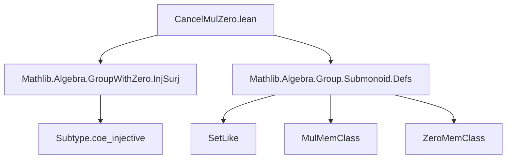
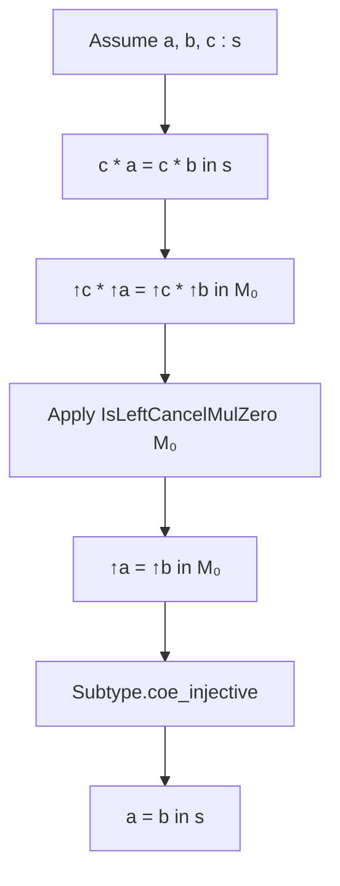

**Technical Brief: `CancelMulZero.lean`**

---

### 1. **Key Definitions & Theorems**

| Name | Type / Signature | Purpose |
|------|------------------|---------|
| `isLeftCancelMulZero` | `instance [IsLeftCancelMulZero M₀] : IsLeftCancelMulZero s` | Shows that a submagma-with-zero `s` of a left cancellative magma-with-zero `M₀` inherits left cancellation. |
| `isRightCancelMulZero` | `instance [IsRightCancelMulZero M₀] : IsRightCancelMulZero s` | Shows that `s` inherits right cancellation from `M₀`. |
| `isCancelMulZero` | `instance [IsCancelMulZero M₀] : IsCancelMulZero s where` | Shows that `s` inherits full (two-sided) cancellation from `M₀`. (Proof body omitted in snippet.) |

All three are *typeclass instances* that lift cancellation properties from the ambient structure `M₀` to a submagma-with-zero `s : S`, using the `SetLike`/`MulMemClass`/`ZeroMemClass` interface.

---

### 2. **Naming Conventions**

- **Prefixes**:
  - `is*`: Indicates a *property* or *class* (e.g., `isLeftCancelMulZero`, `isRightCancelMulZero`, `isCancelMulZero`).
- **Suffixes**:
  - `MulZero`: Denotes structures with both multiplication and zero (e.g., `MulZeroMemClass`, `IsLeftCancelMulZero`).
- **Class names**:
  - `MulZeroMemClass`: A module-level namespace for classes related to subobjects of `MulZero`-structured types.
  - `MulMemClass`, `ZeroMemClass`: Subclasses of `SetLike` ensuring closure under multiplication and containing zero, respectively.

---

### 3. **Tactic Stack**

- `Subtype.coe_injective`: Used to lift injectivity of the coercion `↑ : s → M₀`.
- `isLeftCancelMulZero.isRightCancelMulZero.isCancelMulZero`: Chain of instances via `Subtype.coe_injective.*` tactics.
- Implicit use of:
  - `rfl`: For definitional equalities (e.g., `fun _ _ => rfl`).
  - `Subtype.val`: The coercion from subtype to ambient type.
- Likely tactics in the omitted `isCancelMulZero` body: `aesop`, `simp`, or `constructor` (standard for product-type class proofs).

---

### 4. **Proof Logic**

- **Core idea**: Use injectivity of the coercion map `↑ : s → M₀` to reflect cancellation laws from `M₀` to `s`.
- **Pattern**:
  1. Assume `a, b : s`.
  2. Suppose `c * a = c * b` in `s` (i.e., `↑c * ↑a = ↑c * ↑b` in `M₀`).
  3. Apply left cancellation in `M₀` (via `[IsLeftCancelMulZero M₀]`) to get `↑a = ↑b`.
  4. Use injectivity of coercion (`Subtype.coe_injective`) to conclude `a = b`.
- The same logic applies symmetrically for right/cancellation.

---

### 5. **Imports**

| Import | Role |
|--------|------|
| `Mathlib.Algebra.GroupWithZero.InjSurj` | Provides `Subtype.coe_injective.*` lemmas for lifting cancellation via injective maps. |
| `Mathlib.Algebra.Group.Submonoid.Defs` | Defines `SetLike`, `MulMemClass`, `ZeroMemClass`, and related typeclasses for substructures. |

> Note: The import names suggest this is part of a broader effort to formalize algebraic substructures with zero in the `GroupWithZero` hierarchy.

---

### 8. **Mermaid Diagrams**

#### **Dependency Graph (Module Level)**



#### **Theoretical Overview (Structure Inheritance)**

```mermaid
graph LR
  M₀[Magma-with-zero M₀] -->|submagma-with-zero s ⊆ M₀| S[s : S]
  M₀ -->|IsLeftCancelMulZero| LC[M₀ satisfies left cancellation]
  S -->|instance| LC_S[s inherits left cancellation]
  LC -->|via Subtype.coe_injective| LC_S
```

#### **Proof Strategy Flow**



--- 

This file formalizes a standard *inheritance principle*: algebraic properties defined by universal equations (like cancellation) descend to subobjects when the inclusion is injective — a recurring theme in Lean’s algebraic library.
