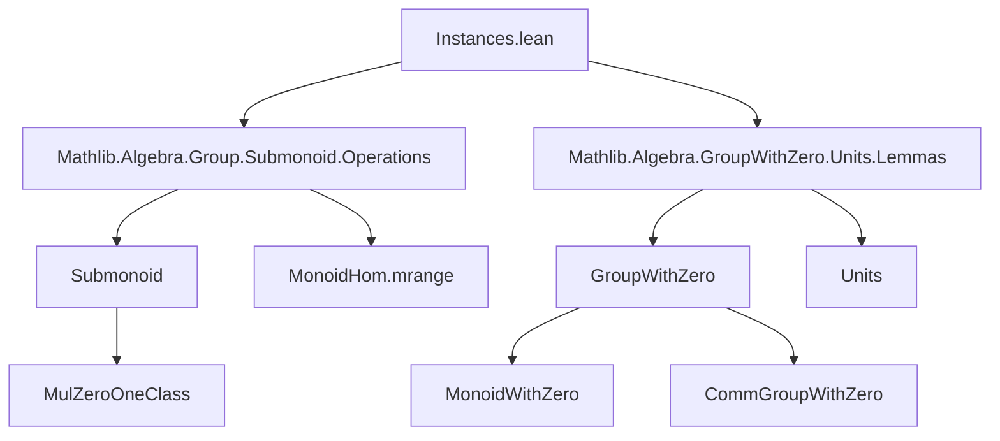
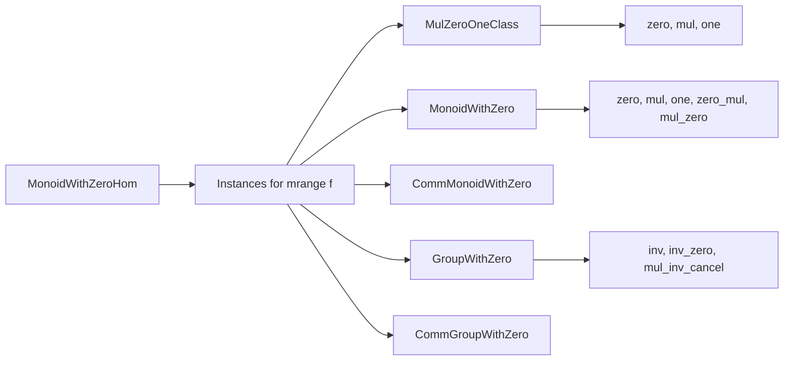

**Technical Brief: `Instances.lean` – Instances for the Range Submonoid of a Monoid with Zero Homomorphism**

---

### 1. **Key Definitions & Theorems**

| Name | Type / Signature | Purpose |
|------|------------------|---------|
| `MonoidHom.mrange f` | `Submonoid H` (for `f : G →*₀ H`) | The *multiplicative range* submonoid of `f`, i.e., the image of `f` as a submonoid of `H`. |
| `instance MulZeroOneClass (mrange f)` | `MulZeroOneClass (MonoidHom.mrange f)` | Equips the range submonoid with a `MulZeroOneClass` structure induced by `f`. |
| `lemma val_mrange_zero` | `((0 : MonoidHom.mrange f) : H) = 0` | Confirms that the zero element of the range submonoid maps to `0` in `H`. |
| `instance MonoidWithZero (mrange f)` | `MonoidWithZero (MonoidHom.mrange f)` | Lifts `MonoidWithZero` structure to the range when codomain has it. |
| `instance CommMonoidWithZero (mrange f)` | `CommMonoidWithZero (MonoidHom.mrange f)` | Lifts *commutative* `MonoidWithZero` structure. |
| `instance GroupWithZero (mrange f)` | `GroupWithZero (MonoidHom.mrange f)` | Gives the range a `GroupWithZero` structure when domain and codomain are `GroupWithZero`. |
| `instance CommGroupWithZero (mrange f)` | `CommGroupWithZero (MonoidHom.mrange f)` | Lifts *commutative* `GroupWithZero` structure. |

> **Note**: All instances are *canonical* — they are derived from the homomorphism `f` and the algebraic structure on `H` (and sometimes `G`).

---

### 2. **Naming Conventions**

- **Prefixes**:
  - `mrange_`: Refers to the *multiplicative range* submonoid (`MonoidHom.mrange`).
  - `val_`: Used for projection lemmas from subtype elements to the ambient type (e.g., `val_mrange_zero`).
- **Suffixes**:
  - `_zero`: Indicates interaction with the zero element (e.g., `zero_mul`, `mul_zero`, `inv_zero`).
  - `_mul`, `_inv`, `_zero_mul`, etc.: Standard algebraic operation lemmas.

---

### 3. **Tactic Stack**

The proofs use a minimal but effective tactic set:

| Tactic | Usage |
|--------|-------|
| `simp` | Simplifying goals using `@[simp]` lemmas (e.g., `zero_mul`, `map_one`, `inv_zero`). |
| `rfl` | Proving definitional equalities (e.g., `val_mrange_zero`). |
| `Subtype.ext` | Proving equality of subtype elements by equality of their underlying values. |
| `obtain ⟨y, hy⟩` | Extracting existence witnesses from `x.prop` (in `GroupWithZero` instance). |
| `use` | Constructing existential proofs (e.g., for `inv` definition). |
| `simpa using` | Finishing with a simplification step using a hypothesis. |
| `rw [← hy]` | Rewriting using a hypothesis in reverse. |

No heavy automation (e.g., `aesop`, `linarith`) is used — proofs are mostly *algebraic rewriting* and *subtype reasoning*.

---

### 4. **Proof Logic**

The logical flow across instances follows a pattern:

1. **Define operations** (e.g., `inv`, `zero`) on the subtype using witnesses from the range.
2. **Verify axioms** by:
   - Projecting to `H` via `val` (using `Subtype.ext` to reduce to `H`-level properties),
   - Applying known lemmas (`zero_mul`, `mul_zero`, `inv_zero`, `mul_inv_cancel₀`, etc.),
   - Using `simp` to discharge definitional equalities.

For the `GroupWithZero` instance:
- `inv` is defined by lifting inverses of preimages (using `y⁻¹` for `⟨y, hy⟩`).
- `exists_pair_ne` ensures nontriviality (requires `f 0` and `f 1` to be distinct in the range).
- `inv_zero` and `mul_inv_cancel` are proven by projecting and applying `GroupWithZero` lemmas in `H`.

---

### 5. **Imports**

| Import | Role |
|--------|------|
| `Mathlib.Algebra.Group.Submonoid.Operations` | Provides `MonoidHom.mrange`, submonoid operations, and basic lemmas. |
| `Mathlib.Algebra.GroupWithZero.Units.Lemmas` | Supplies lemmas about `GroupWithZero`, especially `inv_zero`, `mul_inv_cancel₀`, etc. |

> **Note**: No `Ring` or `Field` imports — the file is strictly about *monoids with zero* and *groups with zero*.

---

### 6. **Mermaid Diagrams**

#### **Dependency Graph (Module-Level)**

#### **Overview of File Structure**

---

### 7. **Summary**

This file constructs canonical algebraic structures on the *range submonoid* of a monoid-with-zero homomorphism `f : G →*₀ H`. It shows that if `H` has a `MulZeroOneClass`, `MonoidWithZero`, or `GroupWithZero` structure, then so does `MonoidHom.mrange f`, with all operations inherited from `H`. The proofs are direct and rely on subtype reasoning and standard algebraic lemmas.

No new axioms or constructions are introduced — the file is a *structural propagation* lemma suite, typical of Lean’s “algebraic hierarchy” design.
