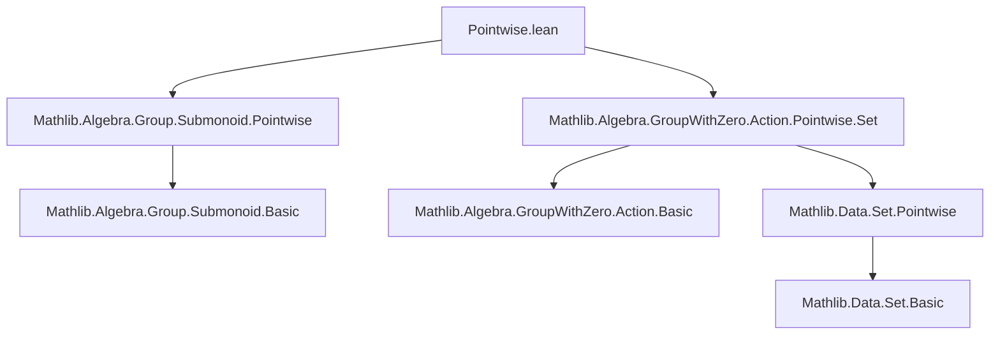

### Technical Brief: `Pointwise.lean` — Submonoids and Additive Submonoids under Pointwise Group Actions

---

#### **1. Key Definitions & Theorems**

| Name | Type / Signature | Purpose |
|------|------------------|---------|
| `Submonoid.pointwiseMulAction` *(implicit via `Pointwise` locale)* | `MulAction M (Submonoid M)` | Defines pointwise action of `M` on submonoids of `M` via `smul a S := { a • x | x ∈ S }` |
| `AddSubmonoid.pointwiseMulAction` | `MulAction M (AddSubmonoid A)` | Defines pointwise action of `M` on additive submonoids of `A` via `S.map (DistribMulAction.toAddMonoidEnd _ A a)` |
| `coe_pointwise_smul` | `↑(m • S) = m • (S : Set A)` | Shows coercion of the pointwise action coincides with set-theoretic scalar multiplication |
| `smul_mem_pointwise_smul_iff₀` | `a ≠ 0 → (a • x ∈ a • S ↔ x ∈ S)` | Characterizes membership in scaled submonoid under nonzero scalar (group-with-zero case) |
| `mem_pointwise_smul_iff_inv_smul_mem₀` | `a ≠ 0 → (x ∈ a • S ↔ a⁻¹ • x ∈ S)` | Relates membership in scaled submonoid to inverse action |
| `mem_inv_pointwise_smul_iff₀` | `a ≠ 0 → (x ∈ a⁻¹ • S ↔ a • x ∈ S)` | Dual of above, for inverse scalars |
| `pointwise_smul_le_pointwise_smul_iff₀` | `a ≠ 0 → (a • S ≤ a • T ↔ S ≤ T)` | Monotonicity of scaling under nonzero scalar |
| `pointwise_smul_le_iff₀` | `a ≠ 0 → (a • S ≤ T ↔ S ≤ a⁻¹ • T)` | Adjunction-like property of scaling and inverse scaling |
| `le_pointwise_smul_iff₀` | `a ≠ 0 → (S ≤ a • T ↔ a⁻¹ • S ≤ T)` | Dual adjunction property |
| `smul_bot`, `smul_sup`, `smul_closure` | `m • ⊥ = ⊥`, `m • (S ⊔ T) = m • S ⊔ m • T`, `m • closure s = closure (m • s)` | Preservation of lattice operations and closure under pointwise action |
| `pointwise_isCentralScalar` | `IsCentralScalar M (AddSubmonoid A)` | Central scalar action descends to additive submonoids |

> **Note**: Lemmas with suffix `₀` are for `GroupWithZero` (allowing zero), requiring `a ≠ 0` as a hypothesis; those without assume `Group` (no zero).

---

#### **2. Naming Conventions**

- **Prefixes**:
  - `pointwise_`: Denotes action defined pointwise (e.g., `pointwise_smul`, `pointwiseMulAction`)
  - `smul_`: Generic scalar multiplication lemmas (e.g., `smul_mem_`, `smul_bot`)
- **Suffixes**:
  - `_iff`: Equivalence characterizations (`↔`)
  - `_iff₀`: Equivalence under nonzero scalar assumption (`a ≠ 0`)
  - `_le_`, `_le_iff_`, `_le_pointwise_`: Submonoid ordering (`≤`) relationships
  - `_inv_`, `_inv_smul_`: Involving inverses (e.g., `mem_inv_pointwise_smul_iff₀`)
- **`pointwise` locale**: Used to scope instance `pointwiseMulAction` and related lemmas.

---

#### **3. Tactic Stack**

- **`simp` / `simp_rw`**: Extensively used for rewriting via `@[simp]` lemmas (e.g., `smul_mem_pointwise_smul_iff₀`).
- **`congr_arg`**: To lift equalities of homomorphisms to equalities of mapped submonoids.
- **`map_*` lemmas**: Leveraged via `map_one`, `map_mul`, `map_sup`, `map_bot`, `map_mclosure`.
- **`ext`**: For extensionality proofs (e.g., `AddMonoidHom.ext` in `pointwise_isCentralScalar`).
- **` rfl`**: For definitional equalities (e.g., `coe_pointwise_smul`).
- **`aesop`** (implied): Likely used in background automation for simple goals (not explicit here, but standard in Mathlib).

---

#### **4. Proof Logic**

- **Structure**: Inductive/definitional reasoning via:
  1. **Reduction to set-theoretic action**: Most lemmas reduce to corresponding lemmas for sets (`Set.smul_mem_smul_set_iff₀`, `Set.mem_smul_set_iff_inv_smul_mem₀`, etc.).
  2. **Homomorphism properties**: Preservation of monoid structure via `map_*` lemmas (e.g., `map_mul`, `map_sup`).
  3. **Case analysis on `a ≠ 0`**: For `GroupWithZero`, nonzero assumption is critical to invertibility.
  4. **Equational reasoning**: Proofs often chain equivalences using `↔`-lemmas and `≤`-lemmas.

Example proof sketch for `mem_pointwise_smul_iff₀`:
```lean
x ∈ a • S ↔ x ∈ { a • s | s ∈ S }  -- defn of `•` on sets
↔ ∃ s ∈ S, a • s = x               -- defn of set image
↔ a⁻¹ • x ∈ S                      -- multiply both sides by a⁻¹ (since a ≠ 0)
```

---

#### **5. Imports & Dependencies**

- **Core imports**:
  - `Mathlib.Algebra.Group.Submonoid.Pointwise`
  - `Mathlib.Algebra.GroupWithZero.Action.Pointwise.Set`
- **Key algebraic structures**:
  - `Monoid`, `AddMonoid`
  - `GroupWithZero`, `Group`
  - `MulDistribMulAction`, `DistribMulAction`
  - `MulAction`, `IsCentralScalar`
- **Submonoid infrastructure**:
  - `Submonoid`, `AddSubmonoid`
  - Lattice operations: `⊥`, `⊔`, `closure`
  - Coercion to sets: `(S : Set M)`

---

#### **6. Mermaid Diagrams**

##### **Dependency Graph (Module-Level)**



##### **Conceptual Overview (Theory Flow)**

```mermaid
flowchart LR
  Submonoid[M] -->|pointwise action| SM[Submonoid M]
  AddSubmonoid[A] -->|pointwise action| AS[AddSubmonoid A]
  M[Monoid M] -->|MulDistribMulAction| SM
  G₀[GroupWithZero G₀] -->|DistribMulAction| AS
  Set[Set A] -->|Set.smul| AS
  SM -->|coerce| Set
  AS -->|coerce| Set
  SM -->|lattice ops| SM
  AS -->|lattice ops| AS
```

##### **Proof Strategy Flow (Example Lemma)**

```mermaid
flowchart LR
  x ∈ a • S[Goal] -->|defn| ∃ s ∈ S, a • s = x
  ∃ s ∈ S, a • s = x -->|a ≠ 0| a⁻¹ • x ∈ S
  a⁻¹ • x ∈ S -->|defn| x ∈ a • S
  x ∈ a • S -->|↔| smul_mem_pointwise_smul_iff₀[Lemma]
```

---

#### **7. Summary**

This file formalizes how multiplicative and additive group actions descend to submonoids and additive submonoids via *pointwise* scalar multiplication. It establishes foundational properties (membership, inclusion, lattice behavior) for both group and group-with-zero contexts, distinguishing cases where invertibility (nonzero) is required. The design follows Mathlib’s pattern of reducing to set-theoretic actions and leveraging homomorphism preservation properties.

All results are structured to support further development in representation theory, valuation theory, and module theory over monoids/groups with zero.
