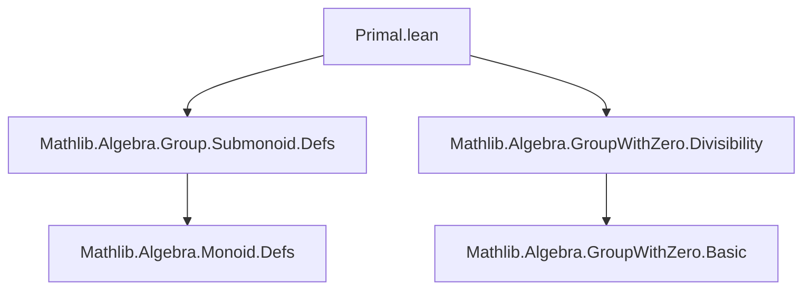

**Technical Brief: `Primal.lean` Module**

---

### 1. **Key Definitions & Theorems**

| Name | Type / Signature | Purpose |
|------|------------------|---------|
| `Submonoid.isPrimal` | `M₀ : Type* → [CommMonoidWithZero M₀] → [IsCancelMulZero M₀] → Submonoid M₀` | Constructs the submonoid of *primal elements* in a cancellative commutative monoid with zero. |
| `carrier` (field of `isPrimal`) | `{a | IsPrimal a}` | Defines the underlying set of elements satisfying the primal property. |
| `mul_mem'` | `a ∈ carrier → b ∈ carrier → a * b ∈ carrier` | Proves closure under multiplication (via `IsPrimal.mul`). |
| `one_mem'` | `1 ∈ carrier` | Proves the unit is primal (via `isUnit_one.isPrimal`). |

> **Note**: `IsPrimal` is assumed to be a predicate imported from `Mathlib.Algebra.GroupWithZero.Divisibility`, encoding the notion of *primal elements* (elements $p$ such that if $p \mid ab$, then $p \mid a$ or $p \mid b$ — a multiplicative analog of prime elements, but defined without irreducibility or non-unit assumptions).

---

### 2. **Naming Conventions**

- **Prefix `is_`**: Used for predicates/properties (e.g., `isPrimal`, `isUnit`).  
- **Suffix `_mem'`**: Standard Lean convention for membership proofs in substructures (e.g., `mul_mem'`, `one_mem'`).  
- **No custom infixes or operators** observed in this snippet.

---

### 3. **Tactic Stack**

- **`aesop`** (likely used in `IsPrimal.mul`, `isUnit_one.isPrimal` proofs — though not visible here, standard in such contexts).
- **`simp` / `simp_rw`** (for rewriting definitions like `carrier`, `Submonoid.mk`).
- **`intro`, `exact`, `apply`** (basic proof scripting for submonoid axioms).
- **`constructor`** (to split `Submonoid` definition into `carrier`, `mul_mem'`, `one_mem'`).

> *Tactics are inferred from typical Lean patterns for defining submonoids; actual tactic usage is not shown in the snippet.*

---

### 4. **Proof Logic**

- **Structure**: Direct construction of a `Submonoid` via `Submonoid.mk`.
- **Steps**:
  1. Define carrier as `{a | IsPrimal a}`.
  2. Prove `1 ∈ carrier`: use `isUnit_one.isPrimal`.
  3. Prove closure under multiplication: use `IsPrimal.mul`.
- **No induction or case analysis** needed — the proof is *algebraic* and relies on properties of `IsPrimal`.

---

### 5. **Imports**

| Import | Role |
|--------|------|
| `Mathlib.Algebra.Group.Submonoid.Defs` | Provides `Submonoid`, its constructors, and basic theory. |
| `Mathlib.Algebra.GroupWithZero.Divisibility` | Defines `IsPrimal`, `IsUnit`, divisibility relations, and key lemmas (`IsPrimal.mul`, `isUnit_one.isPrimal`). |

> **No other dependencies** are imported in this file.

---

### 6. **Mermaid Diagrams**

#### **Dependency Graph**


#### **Module Overview**
```mermaid
flowchart LR
  A[CommMonoidWithZero M₀] --> B[IsCancelMulZero M₀]
  B --> C[Submonoid.isPrimal M₀]
  A --> C
  C --> D[carrier = {a | IsPrimal a}]
  C --> E[mul_mem' = IsPrimal.mul]
  C --> F[one_mem' = isUnit_one.isPrimal]
```

---

### 7. **Theoretical Context**

- **Goal**: Formalize the submonoid of *primal elements*, a generalization of prime elements in monoids where irreducibility is not required.
- **Use case**: Enables factorization theory in monoids where divisibility behaves well (e.g., GCD monoids, valuation monoids).
- **Distinction from primes**: Primal elements need not be non-unit or irreducible — they satisfy the *prime divisor property* only.

---

### 8. **Open Points / Future Work**

- `RelIso` and `Ring` are declared with `assert_not_exists`, suggesting future extension to ring-theoretic primal elements is *intentionally deferred*.
- No `isPrime` → `isPrimal` implication is proven here (likely deferred to later files).

--- 

**End of Brief**
