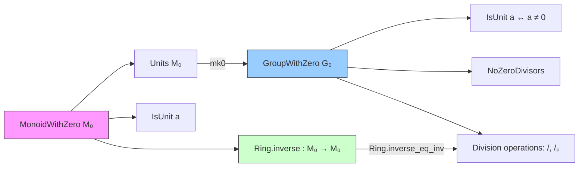

### Technical Brief: `Basic.lean` — Units and Inverses in Monoids/Groups with Zero

---

#### **1. Key Definitions & Theorems**

| Name | Type / Signature | Purpose |
|------|------------------|---------|
| `Units.ne_zero` | `[Nontrivial M₀] → (u : M₀ˣ) → (u : M₀) ≠ 0` | Units are nonzero in a nontrivial monoid with zero. |
| `Units.mul_left_eq_zero` | `(u : M₀ˣ) → (a : M₀) → a * u = 0 ↔ a = 0` | Left-multiplication by a unit preserves zero/nonzero. |
| `Units.mul_right_eq_zero` | `(u : M₀ˣ) → (a : M₀) → u * a = 0 ↔ a = 0` | Right-multiplication by a unit preserves zero/nonzero. |
| `IsUnit.ne_zero` | `[Nontrivial M₀] → IsUnit a → a ≠ 0` | Units (as elements) are nonzero. |
| `isUnit_zero_iff` | `IsUnit (0 : M₀) ↔ 0 = 1` | Characterizes when zero is a unit (only in trivial monoid). |
| `Ring.inverse` | `M₀ → M₀` | Global inverse function: `x⁻¹` if `x` is a unit, else `0`. |
| `Ring.inverse_unit` | `inverse (u : M₀ˣ) = u⁻¹` | Confirms `inverse` agrees with unit inverse on units. |
| `Ring.inverse_non_unit` | `¬IsUnit x → inverse x = 0` | Confirms `inverse` sends non-units to `0`. |
| `Ring.inverse_mul_cancel` / `inverse_mul_cancel` | `IsUnit x ⇒ x * inverse x = 1` / `inverse x * x = 1` | Inverses behave as expected on units. |
| `Units.mk0` | `a ≠ 0 → G₀ˣ` | Embeds nonzero elements of a `GroupWithZero` into units. |
| `Units.mk0_mul` | `Units.mk0 (x * y) = Units.mk0 x * Units.mk0 y` | `mk0` preserves multiplication (requires `x*y ≠ 0`). |
| `isUnit_iff_ne_zero` | `IsUnit a ↔ a ≠ 0` | In `GroupWithZero`, being a unit is equivalent to being nonzero. |
| `GroupWithZero.noZeroDivisors` | Instance | `GroupWithZero` has no zero divisors (proven via `mk0`). |
| `Ring.inverse_eq_inv` | `inverse a = a⁻¹` | In `GroupWithZero`, `inverse` coincides with the group inverse. |
| `groupWithZeroOfIsUnitOrEqZero` | `(∀ a, IsUnit a ∨ a = 0) → GroupWithZero M` | Constructs a `GroupWithZero` structure when every element is either a unit or zero. |

---

#### **2. Naming Conventions**

- **Prefixes**:
  - `isUnit_`: Relating to the predicate `IsUnit`.
  - `mul_`, `inv_`, `div_`: Multiplication, inverse, division operations.
  - `mk0`: Embedding nonzero → unit.
  - `inverse_`: Properties of the global `inverse` function.
  - `ne_zero`: Nonzero-related facts.
  - `eq_zero_or_`, `eq_zero_iff_`: Zero-characterizing equivalences.

- **Suffixes**:
  - `_iff`: Logical equivalence (↔).
  - `_zero`: Variant of a lemma where zero-case is handled explicitly (e.g., `div_eq_zero_iff`).
  - `_₀`: Marked for `GroupWithZero`/`CommGroupWithZero` contexts (e.g., `mul_inv_cancel₀`).
  - `_right`, `_left`: Direction of multiplication (e.g., `mul_left_eq_zero`).

- **Notable pattern**: `₀` suffix often indicates a version of a lemma that works in `GroupWithZero` and handles zero explicitly (e.g., `div_eq_zero_iff` vs `div_eq_zero_iff₀`).

---

#### **3. Tactic Stack**

Frequently used tactics:
- `simp` / `simp_rw`: Simplification with lemmas like `isUnit_iff_ne_zero`, `Units.mk0_val`, `div_eq_mul_inv`.
- `rw`: Rewriting using equivalences (`↔`) and definitions.
- `rcases` / `obtain`: Destructuring existential or disjunctions (e.g., `eq_or_ne`, `em`).
- `ext`: Extensionality for proving equality of units.
- `contrapose!`: Turning implications around, often with `not_` lemmas.
- `nontriviality`: Automatically deriving `Nontrivial` assumptions.
- `aesop`: For routine first-order reasoning (e.g., `mul_ne_zero_iff`).
- `rwa`, `rintro`, `convert`: Advanced rewriting and unification.

---

#### **4. Proof Logic**

- **Induction**: Used in `pow_sub₀`, `zpow_ne_zero`, etc., over natural/integer exponents.
- **Case analysis**: `eq_or_ne a 0`, `subsingleton_or_nontrivial`, `em` (excluded middle) are common.
- **Equivalence chaining**: Many proofs use `iff`-style reasoning (`conv`, `rw [h1, h2]`), especially for division laws.
- **Unit lifting**: Proofs often reduce to the unit case via `IsUnit` elimination (`let ⟨u, hu⟩ := ha`), then apply unit lemmas.
- **Zero handling**: Explicit `rfl` or `simp` for zero cases; `nontriviality` to avoid degenerate cases.

---

#### **5. Imports**

| Module | Purpose |
|--------|---------|
| `Mathlib.Algebra.Group.Units.Basic` | Unit group structure and basic lemmas. |
| `Mathlib.Algebra.GroupWithZero.Basic` | `GroupWithZero` and `MonoidWithZero` theory. |
| `Mathlib.Data.Nat.Basic` | Natural numbers (used for exponents, `pow`, `zpow`). |
| `Mathlib.Lean.Meta.CongrTheorems` | Congruence theorems for `congr_arg`, `congr_fun`. |
| `Mathlib.Tactic.Contrapose`, `Spread`, `Convert`, `Nontriviality` | Supporting tactics for proof engineering. |

---

#### **8. Mermaid Diagrams**

##### **Dependency Graph (Module-Level)**

```mermaid
graph TD
  Basic --> Group.Units.Basic
  Basic --> GroupWithZero.Basic
  Basic --> Nat.Basic
  Basic --> Lean.Meta.CongrTheorems
  Basic --> Tactic.Contrapose
  Basic --> Tactic.Spread
  Basic --> Tactic.Convert
  Basic --> Tactic.Nontriviality

  Group.Units.Basic --> GroupWithZero.Basic
  GroupWithZero.Basic --> Nat.Basic  %% for exponents
```

##### **Conceptual Overview of Theory**



##### **Key Equivalences & Constructions**

```mermaid
graph LR
  A[IsUnit a] <-->|isUnit_iff_ne_zero| B[a ≠ 0]
  C[Ring.inverse a] =|inverse_eq_inv| D[a⁻¹]
  E[a / b] =|div_eq_mul_inv| F[a * b⁻¹]
  G[Units.mk0 a (a≠0)] -->|val_mk0| H[a]
  I[∀ a, IsUnit a ∨ a = 0] -->|groupWithZeroOfIsUnitOrEqZero| J[GroupWithZero structure]
```

---

### Summary

This file formalizes foundational algebra around units and inverses in monoids and groups with zero. It introduces a *global* inverse function (`Ring.inverse`) for use in analysis/calculus, and leverages `GroupWithZero` to unify division arithmetic with unit theory. The proofs rely heavily on case analysis (zero vs nonzero), equivalence rewriting, and embedding nonzero elements into units via `mk0`. The naming and structure follow Lean’s algebraic library conventions, with `₀` suffixes marking `GroupWithZero`-specific variants.
