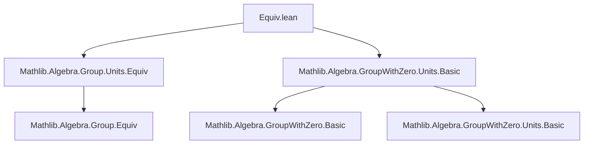

**Technical Brief: `Equiv.lean` — Multiplication and Division by Nonzero Elements in `GroupWithZero`**

---

### 1. **Key Definitions & Theorems**

| Name | Type / Signature | Purpose |
|------|------------------|---------|
| `unitsEquivNeZero` | `G₀ˣ ≃ {a : G₀ // a ≠ 0}` | Establishes an equivalence between the unit group `G₀ˣ` and the subtype of nonzero elements in `G₀`. |
| `mulLeft₀` | `a ≠ 0 → Perm G₀` | Left multiplication by a nonzero element `a` is a permutation (i.e., a bijection). |
| `mulRight₀` | `a ≠ 0 → Perm G₀` | Right multiplication by a nonzero element `a` is a permutation. |
| `divRight₀` | `a ≠ 0 → Perm G₀` | Right division by a nonzero element `a` is a permutation. |
| `divLeft₀` | `[CommGroupWithZero G₀] → a ≠ 0 → Perm G₀` | Left division by a nonzero element `a` is a permutation (uses commutativity). |
| `mulLeft_bijective₀` | `a ≠ 0 → Function.Bijective (a * ·)` | Formalizes bijectivity of left multiplication. |
| `mulRight_bijective₀` | `a ≠ 0 → Function.Bijective (· * a)` | Formalizes bijectivity of right multiplication. |

> **Note**: All permutation definitions are backed by proofs of bijectivity (via `Equiv.bijective`) or explicit inverse constructions.

---

### 2. **Naming Conventions**

- **Prefixes**:
  - `mulLeft₀`, `mulRight₀`, `divLeft₀`, `divRight₀`: indicate operation type and side (`₀` suffix denotes usage in `GroupWithZero`, distinguishing from `Group`-only versions).
  - `unitsEquivNeZero`: `units` + `Equiv` + `NeZero` — highlights domain (`units`) and codomain (`ne zero`).
- **Suffixes**:
  - `_₀`: used consistently to denote constructions valid in `GroupWithZero` (where zero is adjoined but not invertible).
- **`[simps]` / `[simps! ...]` attributes**:
  - `mulLeft₀`, `mulRight₀`, `divRight₀`, `divLeft₀` use `simps` variants to control simplifier behavior (e.g., `-fullyApplied`, `+simpRhs`).

---

### 3. **Tactic Stack**

- **Core tactics**:
  - `simp` — heavily used in inverse proofs (`left_inv`, `right_inv`), especially with `ha : a ≠ 0`.
  - `by simp [ha]` — standard pattern for verifying inverse properties.
- **No heavy automation** (e.g., `aesop`, `ring`, `linarith`) — proofs are mostly structural and rely on algebraic properties of `GroupWithZero`.
- **`ext`** is *not* used — equivalence proofs are via `simps`-compatible constructors.

---

### 4. **Proof Logic**

- **Structure**:
  1. **Construct equivalence or permutation**:
     - For `unitsEquivNeZero`: define forward/backward maps and use `Units.mk0`.
     - For permutations (`mulLeft₀`, `divRight₀`, etc.): define `toFun`, `invFun`, and prove `left_inv`/`right_inv`.
  2. **Verify inverses**:
     - Use `simp` with `ha : a ≠ 0` and definitions of `Units.mk0`, `div`, `mul`.
  3. **Derive bijectivity**:
     - For `mulLeft_bijective₀`, `mulRight_bijective₀`: lift via `Equiv.bijective`.
- **No induction or case analysis** — all proofs are direct algebraic verifications.

---

### 5. **Imports & Dependencies**

| Import | Role |
|--------|------|
| `Mathlib.Algebra.Group.Units.Equiv` | Provides `Equiv.mulLeft`, `Equiv.mulRight`, and related equivalences for groups (used as basis for `GroupWithZero` variants). |
| `Mathlib.Algebra.GroupWithZero.Units.Basic` | Defines `Units.mk0`, `G₀ˣ`, and basic properties of units in `GroupWithZero`. |

> **Key abstraction**: `Units.mk0 a ha` embeds a nonzero element `a : G₀` into the unit group `G₀ˣ`, enabling reuse of group-theoretic permutation constructions.

---

### 6. **Mermaid Diagrams**

#### **Dependency Graph (Module-Level)**



#### **Conceptual Overview (Theory Flow)**

```mermaid
flowchart LR
  subgraph GroupWithZero
    G0[GroupWithZero G₀]
    U0[G₀ˣ: unit group]
    NZ[Subtype {a // a ≠ 0}]
  end

  G0 -->|unitsEquivNeZero| U0 <-> NZ

  U0 -->|mulLeft| Perm[G₀]
  U0 -->|mulRight| Perm[G₀]

  G0 -->|mulLeft₀, mulRight₀| Perm[G₀]
  G0 -->|divRight₀| Perm[G₀]
  CommGroupWithZero -->|divLeft₀| Perm[G₀]

  style G0 fill:#f9f,stroke:#333
  style U0 fill:#bbf,stroke:#333
  style NZ fill:#bfb,stroke:#333
```

#### **Proof Structure (for `divRight₀`)**

```mermaid
flowchart LR
  A[a : G₀, ha : a ≠ 0] --> B[Define toFun := · / a]
  A --> C[Define invFun := · * a]
  B & C --> D[Prove left_inv: (x / a) * a = x]
  B & C --> E[Prove right_inv: (x * a) / a = x]
  D & E --> F[Construct Perm G₀]
  F --> G[Apply simps to get definitional equalities]
```

---

### 7. **Domain-Specific Insights**

- **Zero handling**: The `GroupWithZero` setting requires explicit nonzero assumptions (`a ≠ 0`) to ensure invertibility.
- **Commutativity matters**: `divLeft₀` requires `CommGroupWithZero`, as left division `a / x` is not generally a permutation in noncommutative settings.
- **Reusability pattern**: Leverages `Units.mk0` to reduce `GroupWithZero` constructions to `Group`-level `Equiv` machinery.

--- 

This module formalizes foundational permutation properties of arithmetic operations in `GroupWithZero`, enabling later use in analysis (e.g., measure theory, topology) where bijectivity of scaling maps is essential.
