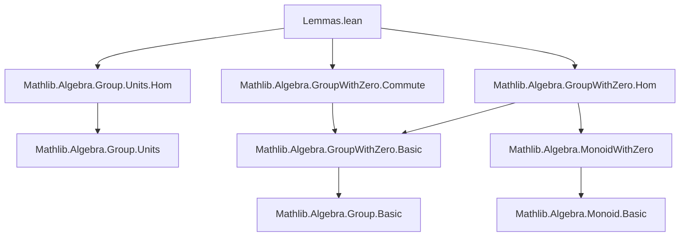
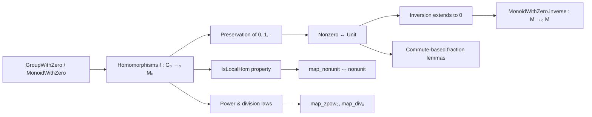

**Technical Brief: `Lemmas.lean` — Formalization of Units and Homomorphisms in `GroupWithZero` and `MonoidWithZero`**

---

### 1. **Key Definitions & Theorems**

| Name | Type / Signature | Purpose |
|------|------------------|---------|
| `isLocalHom_of_exists_map_ne_one` | `{f : F} → (∃ x, f x ≠ 1) → IsLocalHom f` | Proves a homomorphism is *local* if it maps some element to a non-unit (≠ 1). Used to show all nontrivial `MonoidWithZeroHom`s are local. |
| `MonoidWithZero.inverse` | `CommMonoidWithZero M → M →₀ M` | Extends inversion (on units) to a `MonoidWithZeroHom` by sending non-units (including 0) to 0. |
| `invMonoidWithZeroHom` | `CommGroupWithZero G₀ → G₀ →₀ G₀` | The inversion map as a `MonoidWithZeroHom` in the commutative group-with-zero case. |
| `map_ne_zero` | `f a ≠ 0 ↔ a ≠ 0` | Characterizes injectivity of `f` at nonzero elements: `f` preserves nonzereness. |
| `map_eq_zero` | `f a = 0 ↔ a = 0` | Dual of `map_ne_zero`; follows by `not_iff_not`. |
| `eq_on_inv₀` | `f a = g a → f a⁻¹ = g a⁻¹` | If two homs agree at `a`, they agree at `a⁻¹`. Handles both unit and zero cases. |
| `map_inv₀` | `f a⁻¹ = (f a)⁻¹` | A `MonoidWithZeroHom` between `GroupWithZero`s commutes with inversion. |
| `map_div₀` | `f (a / b) = f a / f b` | Follows from `map_inv₀` and `map_mul`. |
| `map_zpow₀` | `f (x ^ n) = f x ^ n` for `n : ℤ` | Extends exponentiation preservation to integer powers via `map_inv₀`. |
| `Commute.div_eq_div_iff`, `mul_inv_eq_mul_inv_iff`, `inv_mul_eq_inv_mul_iff` | `a / b = c / d ↔ a * d = c * b`, etc. | Analogues of standard field identities in `GroupWithZero`, assuming commutativity of denominators and nonvanishing. |

---

### 2. **Naming Conventions**

- **Prefixes**:
  - `map_`: homomorphism action (e.g., `map_inv₀`, `map_div₀`, `map_zpow₀`)
  - `eq_on_`: agreement of functions on arguments (e.g., `eq_on_inv₀`)
  - `is_`: property of a function (e.g., `isLocalHom_of_exists_map_ne_one`)
- **Suffixes**:
  - `_₀`: indicates compatibility with zero (e.g., `map_inv₀`, `map_div₀`, `map_zpow₀`)
  - `_iff`: equivalence (↔) statements (e.g., `div_eq_div_iff`)
- **`MonoidWithZero.` namespace**: used for global constructions like `MonoidWithZero.inverse`.

---

### 3. **Tactic Stack**

Frequent tactics used in proofs:
- `rcases` / `cases`: to split on `eq_or_ne a 0`
- `simp`: especially with `map_zero`, `map_one`, `inv_zero`, `mul_inv_cancel₀`
- `rw`: rewriting using lemmas like `map_mul`, `inv_mul_cancel₀`, `map_one`
- `exact`, `refine`, `apply`: for constructing proofs via known lemmas
- `lift ... to G₀ˣ using ...`: to promote a nonzero element to a unit
- `by_cases h : a = 0`: case analysis on zero/nonzero
- `mul_right_cancel`, `inv_mul_cancel₀`, `mul_inv_cancel₀`: cancellation in groups with zero

No heavy automation (e.g., `aesop`, `ring`, `linarith`) appears—proofs are mostly direct and structural.

---

### 4. **Proof Logic**

- **Case analysis on `a = 0`** is the dominant pattern:
  - For unit cases (`a ≠ 0`), lift to `G₀ˣ` and use unit properties.
  - For zero cases, use `map_zero`, `inv_zero`, etc.
- **Leverage `isUnit_iff_ne_zero`** to switch between algebraic and set-theoretic characterizations.
- **Functoriality via `FunLike` + `HomClass`**: proofs often go through generic homomorphism classes (`MonoidWithZeroHomClass`, `MonoidHomClass`), ensuring generality.
- **Structure preservation**: proofs for `map_inv₀`, `map_div₀`, `map_zpow₀` follow from:
  - `map_mul` + `map_one` + `map_inv₀` (for `map_div₀`, `map_zpow₀`)
  - or direct verification using cancellation laws.

---

### 5. **Imports**

| Import | Role |
|--------|------|
| `Mathlib.Algebra.Group.Units.Hom` | Homomorphisms between unit groups |
| `Mathlib.Algebra.GroupWithZero.Commute` | Commutativity lemmas in `GroupWithZero` |
| `Mathlib.Algebra.GroupWithZero.Hom` | Basic homomorphism theory for `GroupWithZero`/`MonoidWithZero` |

These imports define the foundational algebraic structures and basic homomorphism behavior.

---

### 6. **Mermaid Diagrams**

#### **Dependency Graph (Module-Level)**

#### **Overview of Theory Flow**

---

### 7. **Domain Summary**

This file formalizes foundational properties of homomorphisms between *groups with zero* (`GroupWithZero`) and *monoids with zero* (`MonoidWithZero`), especially focusing on:

- **Local behavior**: when a homomorphism is *local* (maps nonunits to nonunits).
- **Zero compatibility**: how homomorphisms interact with `0`, `1`, and inversion.
- **Fraction-like arithmetic**: analogues of field identities (`a/b = c/d ↔ ad = bc`) in non-field settings, assuming commutativity of denominators.

It serves as a supporting module for more advanced algebraic developments (e.g., local rings, valuation theory), where control over units and zero-divisors is essential.

--- 

Let me know if you'd like a formal dependency graph (e.g., Lean `leanpkg` tree), or a proof sketch of a specific lemma.
