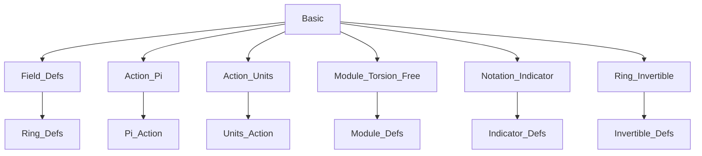
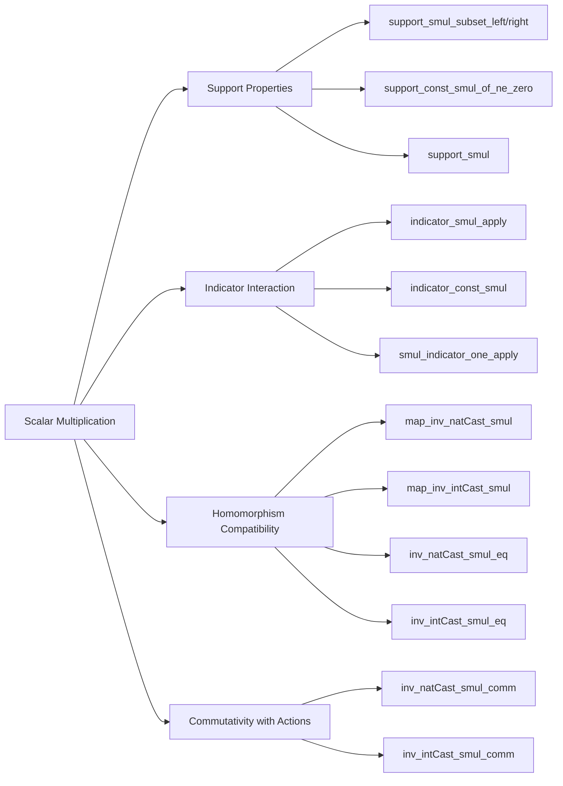

### Technical Brief: `Basic.lean` Module Analysis

---

#### **1. Key Definitions & Theorems**

| Name | Type / Signature | Purpose |
|------|------------------|---------|
| `Units.neg_smul` | `[Ring R] [AddCommGroup M] [Module R M] → (u : Rˣ) (x : M) → -u • x = -(u • x)` | Shows that negation commutes with unit scalar multiplication. |
| `invOf_two_smul_add_invOf_two_smul` | `[Semiring R] [AddCommMonoid M] [Module R M] [Invertible (2 : R)] → (⅟2 : R) • x + (⅟2 : R) • x = x` | Encodes the identity $ \frac{1}{2}x + \frac{1}{2}x = x $ in modules over semirings where 2 is invertible. |
| `map_inv_natCast_smul` | `[AddCommMonoid M] [AddCommMonoid M₂] [FunLike F M M₂] [AddMonoidHomClass F M M₂] → (f : F) (R S : Type*) [DivisionSemiring R] [DivisionSemiring S] [Module R M] [Module S M₂] → (n : ℕ) (x : M) → f((n⁻¹ : R) • x) = (n⁻¹ : S) • f x` | Proves that additive monoid homomorphisms commute with scalar multiplication by inverses of natural numbers across two division semirings. |
| `map_inv_intCast_smul` | Similar to above but for integers and division rings. | Extends `map_inv_natCast_smul` to ℤ. |
| `inv_natCast_smul_eq` | `[AddCommMonoid E] [DivisionSemiring R] [DivisionSemiring S] [Module R E] [Module S E] → (n : ℕ) (x : E) → (n⁻¹ : R) • x = (n⁻¹ : S) • x` | Shows scalar multiplication by $ n^{-1} $ is independent of the ambient division semiring structure. |
| `inv_intCast_smul_eq` | Analogous for ℤ and division rings. | Generalizes `inv_natCast_smul_eq` to ℤ. |
| `inv_natCast_smul_comm` | `[AddCommMonoid E] [DivisionSemiring R] [Module R E] [DistribSMul α E] → (n : ℕ) (s : α) (x : E) → (n⁻¹ : R) • s • x = s • (n⁻¹ : R) • x` | Commutativity of scalar multiplication by $ n^{-1} $ with monoid action. |
| `inv_intCast_smul_comm` | Same as above for ℤ. | Extends commutativity to ℤ. |
| `support_smul_subset_left` | `[Zero R] [Zero M] [SMulWithZero R M] → support (f • g) ⊆ support f` | Left support inclusion under pointwise scalar multiplication. |
| `support_smul_subset_right` | `[Zero M] [SMulZeroClass R M] → support (f • g) ⊆ support g` | Right support inclusion. |
| `support_const_smul_of_ne_zero` | `[Semiring R] [IsDomain R] [AddCommMonoid M] [Module R M] [Module.IsTorsionFree R M] → c ≠ 0 → support (c • g) = support g` | When scalar is nonzero and module is torsion-free, support is preserved. |
| `support_smul` | Same hypotheses as above → `support (f • g) = support f ∩ support g` | Full characterization of support under scalar multiplication in torsion-free setting. |
| `indicator_smul_apply`, `indicator_smul`, etc. | Various lemmas about `indicator` interacting with scalar multiplication. | Formalize how indicator functions behave under scalar multiplication (e.g., `indicator s (r • f) = r • indicator s f`). |

---

#### **2. Naming Conventions**

- **Prefixes**:
  - `inv_`: refers to inverses (e.g., `inv_natCast`, `invOf_two`)
  - `support_`: relates to support of functions
  - `indicator_`: relates to `Set.indicator`
  - `map_`: often used for homomorphism interaction (e.g., `map_inv_natCast_smul`)
  - `smul_`: scalar multiplication related
- **Suffixes**:
  - `_eq`: equality of two expressions
  - `_comm`: commutativity property
  - `_subset`: subset relation
  - `_apply`: pointwise version of a lemma
  - `_left` / `_right`: directionality in binary operations (e.g., left/right support inclusion)

---

#### **3. Tactic Stack**

Frequently used tactics in proofs:
- `rw`: rewriting using equalities
- `simp` / `simp_rw`: simplification with rewrite rules
- `by_cases`: case analysis on equalities (especially zero/nonzero)
- `ext`: extensionality for function equality
- `split_ifs`: case split on `if ... then ... else ...`
- `exacts`: multiple `exact` steps
- `Convex.combo_self`: specialized tactic from `Mathlib.Analysis.Convex.Basic`, used for convex combinations
- `obtain ⟨n, rfl | rfl⟩ := z.eq_nat_or_neg`: destructuring integers as nat or negated nat

---

#### **4. Proof Logic**

- **Structure**:
  - Most proofs follow a pattern of **case analysis on whether certain casts are zero or not**, especially for natural/integer casts in division semirings/rings.
  - For homomorphism lemmas (`map_*`), the proof often reduces to:
    - Simplifying using `map_zero` when the cast is zero.
    - Using `inv_smul_smul₀`, `smul_inv_smul₀`, and `map_natCast_smul` to rearrange expressions when nonzero.
  - For support lemmas:
    - Use `ext` + pointwise reasoning (`smul_ne_zero_iff`, `smul_ne_zero_iff_right`).
  - For indicator lemmas:
    - Use `funext` + `split_ifs` + simplifications like `zero_smul`, `smul_zero`.

- **Inductive structure**: Not present here; mostly algebraic manipulation and case splits.

---

#### **5. Imports**

Core dependencies defining the module’s scope:

| Import | Purpose |
|--------|---------|
| `Mathlib.Algebra.Field.Defs` | Definitions for fields, division rings, semirings |
| `Mathlib.Algebra.Group.Action.Pi` | Product actions, scalar multiplication on function spaces |
| `Mathlib.Algebra.GroupWithZero.Action.Units` | Units acting on modules |
| `Mathlib.Algebra.Module.Torsion.Free` | Torsion-free modules, key for support lemmas |
| `Mathlib.Algebra.Notation.Indicator` | Notation and basic lemmas for `Set.indicator` |
| `Mathlib.Algebra.Ring.Invertible` | Invertibility assumptions (e.g., `Invertible 2`) |

---

#### **8. Mermaid Diagrams**

##### **Dependency Graph (Top-Level Imports)**

##### **Overview of `Basic.lean` Content**

---

This module serves as a foundational toolkit for reasoning about scalar multiplication in modules over division rings/semirings, especially in contexts involving:
- Invertible scalars (e.g., $ \frac{1}{n} $),
- Support of functions,
- Interaction with homomorphisms and monoid actions,
- Indicator functions.

It is typical of Lean’s “algebraic library” style: precise, modular, and heavily reliant on typeclass inference and extensionality principles.
