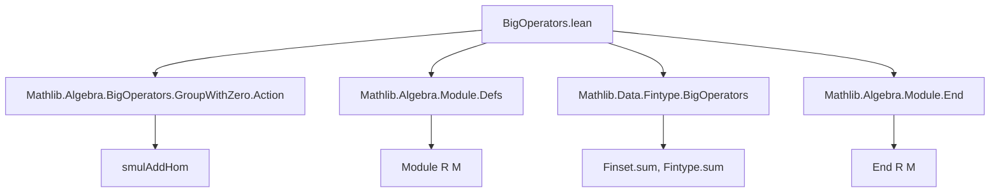
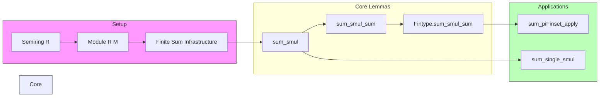

**Technical Brief: `BigOperators.lean` (Module Summation over Rings)**  
*Based on the provided Lean 4 source file from Mathlib*

---

### 1. **Key Definitions & Theorems**

| Name | Type / Signature | Purpose |
|------|------------------|---------|
| `List.sum_smul` | `l.sum • x = (l.map (r ↦ r • x)).sum` | Distributes scalar multiplication over list sum. |
| `Multiset.sum_smul` | `l.sum • x = (l.map (r ↦ r • x)).sum` | Same as above for multisets. |
| `Multiset.sum_smul_sum` | `s.sum • t.sum = (∑ p ∈ s ×ˢ t, p.fst • p.snd)` | Distributes scalar multiplication over product of multisets’ sums. |
| `Finset.sum_smul` | `(∑ i ∈ s, f i) • x = ∑ i ∈ s, f i • x` | Distributes scalar multiplication over finite sums (key for module-valued sums). |
| `Finset.sum_smul_sum` | `(∑ i ∈ s, f i) • ∑ j ∈ t, g j = ∑ i ∈ s, ∑ j ∈ t, f i • g j` | Bilinear expansion of scalar multiplication over two finite sums. |
| `Fintype.sum_smul_sum` | `(∑ i, f i) • ∑ j, g j = ∑ i, ∑ j, f i • g j` | Global version of bilinearity for finite types. |
| `Finset.cast_card` | `(#s : R) = ∑ _ ∈ s, 1` | Relates cardinality cast to sum of `1`s. |
| `Fintype.sum_piFinset_apply` | `∑ g ∈ piFinset _, f (g i) = #s^(card ι - 1) • ∑ b ∈ s, f b` | Computes sum over product space of functions; key combinatorial identity. |
| `Fintype.sum_single_smul` | `∑ i, (Pi.single i₀ r i) • f i = r • f i₀` | Evaluates sum involving `Pi.single`; isolates single-coordinate action. |

---

### 2. **Naming Conventions**

- **Prefixes**:
  - `sum_`: for theorems about sums over `List`, `Multiset`, `Finset`, or `Fintype`.
  - `smul_`: for scalar multiplication interactions.
  - `cast_`: for coercion-related identities (e.g., `cast_card`).
- **Suffixes**:
  - `_smul`: indicates scalar multiplication distributes over sum.
  - `_sum`: indicates sum over product or nested sum.
  - `_apply`: for evaluation of sums over function spaces (e.g., `sum_piFinset_apply`).
- **Structure**:
  - `X_Y_Z`: often means “X over Y involving Z” or “X applied to Y with Z”.

---

### 3. **Tactic Stack**

Frequently used tactics in proofs:

| Tactic | Role |
|--------|------|
| `simp` / `simp_rw` | Simplification using lemmas like `smul_sum`, `sum_const`, `Finset.sum_ite_mem`. |
| `induction` | Structural induction on `Multiset` (with `Multiset.induction`). |
| `aesop` | Automated reasoning for simple algebraic goals (e.g., `sum_single_smul`). |
| `rw` | Rewriting using previously proven lemmas (e.g., `sum_smul`, `map_sum`). |
| `cases` | Implicit in `induction` branches; used for case analysis on `s = ∅` or `a :: s`. |
| `itertools` (via `×ˢ`, `piFinset`) | Implicit use of product/dependent product constructions. |

---

### 4. **Proof Logic**

- **General Pattern**:
  1. **Base case** (`empty` / `∅`) → `simp`.
  2. **Inductive step** (`cons` / `a :: s`) → expand using `add_smul`, apply induction hypothesis (`ih`), and reassociate.
- **Key Logical Steps**:
  - Use of `map_sum`, `map_multiset_sum`, and `smulAddHom` to lift scalar multiplication into sums.
  - For bilinear expansions (`sum_smul_sum`), combine `sum_smul` with `smul_sum`.
  - For `sum_single_smul`, isolate the unique index where `Pi.single` is nonzero via `sum_eq_single`.
  - For `sum_piFinset_apply`, reduce to counting functions with fixed value at a point → combinatorial factor `#s^(card ι - 1)`.

---

### 5. **Imports & Dependencies**

| Import | Purpose |
|--------|---------|
| `Mathlib.Algebra.BigOperators.GroupWithZero.Action` | Scalar action theory (e.g., `smulAddHom`). |
| `Mathlib.Algebra.Module.Defs` | Module structure (`Module R M`). |
| `Mathlib.Data.Fintype.BigOperators` | Finite sum infrastructure (`Finset.sum`, `Fintype.sum`). |
| `Mathlib.Algebra.Module.End` | Endomorphism ring (`End R M`) — used implicitly via `smulAddHom`. |

**Core Algebraic Prerequisites**:
- `Semiring R`, `AddCommMonoid M`, `Module R M` — foundational for scalar multiplication and additive structure.
- `DecidableEq ι`, `Fintype ι` — for finite indexing sets and cardinal arithmetic.

---

### 6. **Mermaid Diagrams**

#### **Dependency Graph (Module-Level)**

#### **Overview of Theoretical Flow**

---

### 7. **Domain-Specific AI Agent Guidance**

- **Focus Areas**:
  - Recognize patterns like `∑ f • g` → rewrite using `sum_smul_sum`.
  - Detect `Pi.single` → apply `sum_single_smul`.
  - Identify cardinality casts → use `cast_card`.
- **Common Pitfalls**:
  - Forgetting `AddCommMonoid` or `Module` assumptions.
  - Misapplying `sum_smul` when scalar and module types are swapped.
- **Suggested Tactics**:
  - `simp only [sum_smul, smul_sum]` for distributive simplifications.
  - `induction s using Multiset.induction` for multiset sums.
  - `aesop` for trivial index-selection goals.

--- 

Let me know if you'd like a formalized tactic guide or a proof assistant plugin suggestion based on this analysis.
