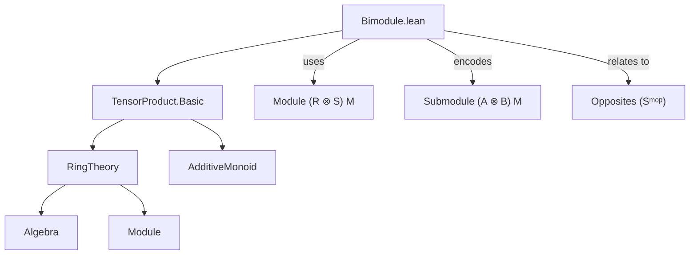

**Technical Brief: `Bimodule.lean`**

---

### 1. KEY DEFINITIONS & THEOREMS

| Name | Type / Signature | Purpose |
|------|------------------|---------|
| `TensorProduct.Algebra.module` | `Module (R ⊗[ℕ] Sᵐᵒᵖ) M` | Shows that a bimodule over rings `R`, `S` is naturally a module over the tensor product ring `R ⊗[ℕ] Sᵐᵒᵖ`. This is the foundational embedding of bimodules into module theory. |
| `Subbimodule.mk` | `AddSubmonoid M → (∀ a, m ∈ p → a • m ∈ p) → (∀ b, m ∈ p → b • m ∈ p) → Submodule (A ⊗[R] B) M` | Constructs a sub-bimodule by verifying closure under each scalar action separately (rather than via the tensor product). |
| `Subbimodule.smul_mem` | `p : Submodule (A ⊗[R] B) M → a : A → m ∈ p ⇒ a • m ∈ p` | Proves that a sub-bimodule is closed under left `A`-action. |
| `Subbimodule.smul_mem'` | `p : Submodule (A ⊗[R] B) M → b : B → m ∈ p ⇒ b • m ∈ p` | Proves closure under right `B`-action. |
| `Subbimodule.baseChange` | `Submodule (A ⊗[R] B) M → Submodule (A ⊗[S] B) M` (under scalar tower assumptions) | Changes the base of scalars from `R` to `S`, preserving bimodule structure. |
| `Subbimodule.toSubmodule` | `Submodule (A ⊗[R] B) M → Submodule A M` | Forgets the `B`-action, viewing a bimodule submodule as an `A`-submodule. |
| `Subbimodule.toSubmodule'` | `Submodule (A ⊗[R] B) M → Submodule B M` | Forgets the `A`-action, viewing a bimodule submodule as a `B`-submodule. |
| `Subbimodule.toSubbimoduleInt` | `Submodule (R ⊗[ℕ] S) M → Submodule (R ⊗[ℤ] S) M` | Converts between tensor products over `ℕ` and `ℤ`, using base change. |
| `Subbimodule.toSubbimoduleNat` | `Submodule (R ⊗[ℤ] S) M → Submodule (R ⊗[ℕ] S) M` | Reverse direction of the above. |

---

### 2. NAMING CONVENTIONS

- **Prefixes**:
  - `mk`: constructor for inductive definitions.
  - `smul_mem`, `smul_mem'`: closure under scalar multiplication (left/right).
  - `toSubmodule`, `toSubmodule'`: forgetful functors (to left/right module structure).
  - `baseChange`: change of base ring.
  - `toSubbimoduleInt`, `toSubbimoduleNat`: conversion between `ℕ`- and `ℤ`-tensor products.

- **Suffixes**:
  - `'` (prime): variant of a definition/lemma, often dual or symmetric (e.g., `smul_mem` vs `smul_mem'`).
  - `Int`/`Nat`: indicates use of `ℤ` or `ℕ` as base semiring.

- **General pattern**: `Subbimodule.{verb}_{noun}` — verbs like `mk`, `to`, `baseChange`; nouns like `submodule`, `bimodule`.

---

### 3. TACTIC STACK

Frequently used tactics in proofs:

| Tactic | Usage |
|--------|-------|
| `simp` / `simp only` | Simplify goals using definitional equalities, especially `TensorProduct.Algebra.smul_def`, `zero_smul`, `add_smul`. |
| `induction_on` | `TensorProduct.induction_on` for proving properties over all tensors by checking generators. |
| `simpa` | Simplify and discharge using a hypothesis or lemma (e.g., `simpa using hA a (hB b hm)`). |
| `symm ▸` | Rewrite using symmetry of equality (e.g., to replace `a • m = ...` with `... = a • m`). |
| `add_mem` | Used to show closure under addition in additive submonoids/submodules. |
| `zero_mem` | To show zero is in the subobject. |

---

### 4. PROOF LOGIC

- **Structure**: Most proofs follow a *decomposition* strategy:
  1. **Reduce to generators** using `TensorProduct.induction_on`.
  2. **Verify on simple tensors** `a ⊗ b`.
  3. **Apply assumed closure** under individual actions (`hA`, `hB`) and combine via module axioms (`add_smul`, `zero_smul`).
  4. **Rewrite using `TensorProduct.Algebra.smul_def`** to relate tensor action to nested scalar actions.

- **Induction pattern**:
  - For `mk`: induction on tensor `ab` → base case `0`, generator case `a ⊗ b`, and additivity case.
  - For `smul_mem`/`smul_mem'`: rewrite `a • m` as `(a ⊗ 1) • m` (or `(1 ⊗ b) • m`) and apply module action closure.

- **Base change proofs** rely on `smul_mem`/`smul_mem'` to reprove closure under the new scalars.

---

### 5. IMPORTS

- `Mathlib.RingTheory.TensorProduct.Basic`: Provides tensor product of semirings/rings and its universal algebra structure.

This import is essential: it supplies:
- `TensorProduct.Algebra.module`
- `TensorProduct.Algebra.smul_def`
- `TensorProduct.induction_on`

---

### 6. DEPENDENCY & THEORY OVERVIEW

#### Mermaid Diagram: Module Dependencies



#### Mermaid Diagram: Theory Flow

```mermaid
graph LR
  A[Semirings R, A, B] --> B[Algebra structures]
  B --> C[SMulCommClass A B M]
  C --> D[Module (A ⊗[R] B) M]
  D --> E[Submodule (A ⊗[R] B) M]
  E --> F[Subbimodule definitions]
  F --> G[Forgetful maps to A/B-modules]
  F --> H[Base change across R → S]
  H --> I[ℤ/ℕ interchange]
```

---

### 7. KEY OBSERVATIONS

- **No opposites needed**: The file prefers `[Module A M] [Module B M] [SMulCommClass A B M]` over using `Sᵐᵒᵖ`, simplifying definitions and proofs. Opposite-based versions follow automatically.
- **Tensor over `ℕ` preferred**: For rings (with additive inverses), `R ⊗[ℕ] S` and `R ⊗[ℤ] S` are canonically isomorphic, but `ℕ`-tensor works more generally (e.g., for semirings without subtraction).
- **Two-sided ideals**: The TODO notes that two-sided ideals of `R` are `Submodule (R ⊗[ℕ] Rᵐᵒᵖ) R`, indicating future extension.

---

### 8. SUMMARY

This file formalizes the theory of bimodules *via* their embedding into module theory over tensor products. It provides a clean interface for working with sub-bimodules, including forgetful functors, base change, and conversion between `ℕ`- and `ℤ`-tensor products. The design prioritizes generality and reuse of existing `Module` theory, while keeping proofs constructive and tactic-friendly.
