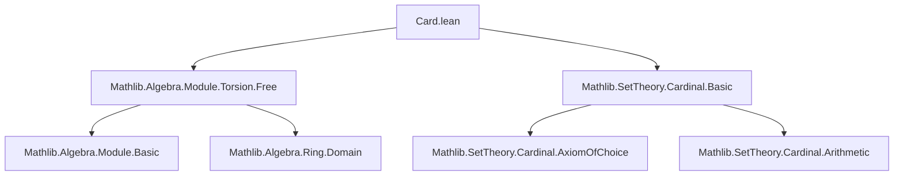

**Technical Brief: `Card.lean` — Cardinality of a Module over a Domain**

---

### 1. **Key Definitions & Theorems**

| Name | Type / Signature | Purpose |
|------|------------------|---------|
| `mk_le_of_module` | `∀ (R : Type u) (E : Type v), [AddCommGroup E] [Ring R] [IsDomain R] [Module R E] [Nontrivial E] [Module.IsTorsionFree R E] → Cardinal.lift.{v} (#R) ≤ Cardinal.lift.{u} (#E)` | Proves that for a nontrivial torsion-free module $E$ over a domain $R$, the cardinality of $R$ (lifted to the universe of $E$) is ≤ the cardinality of $E$. |
| `smul_left_injective` | `∀ (r₀ : R) (x : E), x ≠ 0 → Injective (fun r ↦ r • x)` | Used internally: left-multiplication by a nonzero vector in a torsion-free module is injective. |
| `lift_mk_le_lift_mk_of_injective` | `∀ {α : Type u} {β : Type v} (f : α → β), Injective f → Cardinal.lift.{v} (#α) ≤ Cardinal.lift.{u} (#β)` | General cardinal inequality from an injective map between types. |

---

### 2. **Naming Conventions**

- **Prefixes**:
  - `mk_`: relates to cardinality (`#α` is `mk α`, though modern Mathlib uses `#α` notation).
  - `lift_`: indicates lifting cardinals across universes.
- **Suffixes**:
  - `_le_of_`: indicates a ≤ inequality derived from structural properties (e.g., module-theoretic).
- **Functional style**:
  - `smul_left_injective`: emphasizes the function `r ↦ r • x` and its injectivity.

---

### 3. **Tactic Stack**

- `obtain ⟨x, hx⟩ : ∃ (x : E), x ≠ 0 := exists_ne 0`  
  → Uses `exists_ne` to extract a nonzero element from `Nontrivial E`.
- `have : Injective (fun k ↦ k • x) := smul_left_injective R hx`  
  → Applies a known lemma about torsion-freeness.
- `exact lift_mk_le_lift_mk_of_injective this`  
  → Concludes using a cardinality lemma for injective maps.

No heavy automation (`aesop`, `ring`, `simp`) is used — the proof is *declarative* and relies on pre-proved lemmas.

---

### 4. **Proof Logic**

1. **Existence of nonzero vector**: From `Nontrivial E`, pick $x \ne 0$.
2. **Injectivity of scalar multiplication**: Use `IsTorsionFree` + `x ≠ 0` to show $r \mapsto r • x$ is injective.
3. **Cardinal inequality**: Apply general result `lift_mk_le_lift_mk_of_injective` to lift the injection into a cardinal inequality.

*No induction or case analysis beyond the initial existential witness.*

---

### 5. **Imports**

| Import | Role |
|--------|------|
| `Mathlib.Algebra.Module.Torsion.Free` | Provides `Module.IsTorsionFree`, `smul_left_injective`, and related lemmas. |
| `Mathlib.SetTheory.Cardinal.Basic` | Provides `#α`, `lift`, `lift_mk_le_lift_mk_of_injective`, and basic cardinal arithmetic. |

---

### 6. **Mermaid Diagrams**

#### **Dependency Graph (File-Level)**



#### **Theoretical Overview (Module Cardinality)**

```mermaid
flowchart LR
  subgraph Assumptions
    R[Ring R] --> IsDomain[IsDomain R]
    R --> Module[Module R E]
    E[AddCommGroup E] --> Module
    E --> Nontrivial[Nontrivial E]
    E --> TorsionFree[Module.IsTorsionFree R E]
  end

  subgraph Core Argument
    Nontrivial --> PickX[Pick x ≠ 0]
    TorsionFree + PickX --> InjectiveMap[r ↦ r • x is injective]
    InjectiveMap --> CardinalIneq[Cardinal inequality]
  end

  CardinalIneq --> Conclusion[|#R| ≤ |E| (lifted)]
```

---

### 7. **Mathematical Summary**

Let $R$ be a domain and $E$ a nontrivial torsion-free $R$-module. Then the map  
$$
\varphi_x : R \to E,\quad r \mapsto r \cdot x
$$  
is injective for any nonzero $x \in E$, and hence $|R| \le |E|$ (after universe lifting). This formalizes the intuition that a torsion-free module over a domain must be at least as large as the ring itself.

--- 

Let me know if you'd like a formalization-level dependency graph or a comparison with related files (e.g., `Module.Finite.lean`, `Cardinal.ord.lean`).
