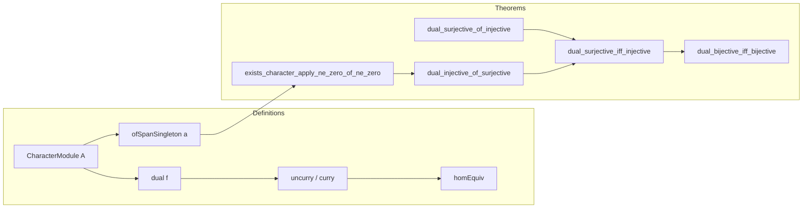

### Technical Brief: `CharacterModule.lean`

---

#### **1. Key Definitions & Theorems**

| Name | Type / Signature | Purpose |
|------|------------------|---------|
| `CharacterModule A` | `Type uA` | The **character module** of an additive commutative group `A`, defined as `A →+ AddCircle (1 : ℚ)` — i.e., additive group homomorphisms from `A` to the unit circle in ℚ/ℤ. |
| `dual (f : A →ₗ[R] B)` | `CharacterModule B →ₗ[R] CharacterModule A` | The **dual map** induced by `f`, defined by precomposition: `L ↦ L ∘ f`. |
| `uncurry` | `(A →ₗ[R] CharacterModule B) →ₗ[R] CharacterModule (A ⊗[R] B)` | Currying isomorphism: maps a linear family of characters to a character on the tensor product. |
| `curry` | `CharacterModule (A ⊗[R] B) →ₗ[R] (A →ₗ[R] CharacterModule B)` | Uncurrying isomorphism: maps a character on the tensor product to a linear family of characters. |
| `homEquiv` | `(A →ₗ[R] CharacterModule B) ≃ₗ[R] CharacterModule (A ⊗[R] B)` | **Tensor-hom adjunction** for character modules: linear maps into a character module ↔ characters on tensor product. |
| `dual_surjective_of_injective` | `Function.Injective f → Function.Surjective (dual f)` | Dual of an injective linear map is surjective (i.e., `dual` sends monos to epis). |
| `dual_injective_of_surjective` | `Function.Surjective f → Function.Injective (dual f)` | Dual of a surjective linear map is injective. |
| `ofSpanSingleton a` | `CharacterModule (ℤ ∙ a)` | A canonical character on the cyclic submodule generated by `a`, defined using additive order of `a`. |
| `exists_character_apply_ne_zero_of_ne_zero` | `a ≠ 0 → ∃ c, c a ≠ 0` | **Separation property**: nonzero elements are detected by some character. |
| `int.divByNat n` | `CharacterModule.int` | Character sending `m ↦ m / n mod 1`. |
| `intSpanEquivQuotAddOrderOf a` | `(ℤ ∙ a) ≃ₗ[ℤ] ℤ ⧸ Ideal.span {[addOrderOf a]}` | Isomorphism between cyclic submodule and quotient by additive order ideal. |

---

#### **2. Naming Conventions**

- **Prefixes**:
  - `dual_`: operations involving dual maps (`dual`, `dual_zero`, `dual_comp`, `dual_surjective_of_injective`, etc.)
  - `ofSpanSingleton`, `intSpanEquivQuotAddOrderOf`: constructions on cyclic submodules.
  - `uncurry`, `curry`: tensor-hom adjunction components.
- **Suffixes**:
  - `_equiv`, `_linear`: for equivalences and linear maps.
  - `_apply`: lemmas about evaluation of maps at elements.
  - `_self`: lemmas about behavior on generators (e.g., `divByNat_self`, `intSpanEquivQuotAddOrderOf_apply_self`).
- **General**:
  - `congr` used for congruence reasoning (e.g., `congr(c $h)`).
  - `rfl`-based proofs for definitional equalities.

---

#### **3. Tactic Stack**

| Tactic | Usage Frequency | Purpose |
|--------|-----------------|---------|
| `aesop` | High | Automated simplification and proof search for algebraic equalities. |
| `ext` | High | Extensionality for functions, linear maps, and additive homomorphisms. |
| `rw` / `erw` | High | Rewriting using lemmas and definitions. |
| `simp_rw` | Medium | Simplified rewriting with definitional unfolding. |
| `induction_on` | Medium | Structural induction on tensor product elements or submodules. |
| `congr` | Medium | Congruence closure for equality reasoning. |
| `grind` | Low | Custom tactic (likely from mathlib’s `grind` module) for automated simplification. |
| `obtain ⟨b, rfl⟩ := ...` | Medium | Existential elimination and substitution. |
| `split_ifs` | Medium | Case analysis on `if ... then ... else ...`. |

---

#### **4. Proof Logic**

- **Inductive structure**: Proofs often proceed by:
  1. **Extensionality** (`ext`) to reduce to pointwise equality.
  2. **Tensor induction** (`z.induction_on`) for tensor product elements.
  3. **Case analysis** on additive order (`split_ifs`, `eq_or_ne`).
  4. **Lifting along quotients** (e.g., `Submodule.liftQSpanSingleton`, `intSpanEquivQuotAddOrderOf`).
- **Key logical flow**:
  - To prove injectivity/surjectivity of `dual f`, reduce to properties of `f` via separation (`exists_character_apply_ne_zero_of_ne_zero`) and Baer’s extension property (`Module.Baer.of_divisible`).
  - Tensor-hom equivalence (`homEquiv`) is established via mutual `uncurry`/`curry` definitions and verified using tensor induction.
  - Separation of points by characters (`eq_zero_of_character_apply`) is used to lift properties from dual side back to original module.

---

#### **5. Imports**

| Import | Role |
|--------|------|
| `Mathlib.Algebra.Category.ModuleCat.Basic` | Module category basics, linear maps, tensor products. |
| `Mathlib.Algebra.Category.Grp.Injective` | Injective objects in abelian groups (used for Baer’s criterion). |
| `Mathlib.Topology.Instances.AddCircle.Defs` | Definition of `AddCircle (1 : ℚ)` ≅ ℚ/ℤ. |
| `Mathlib.LinearAlgebra.Isomorphisms` | Linear equivalences, quotients, spans. |

---

#### **6. Theory Scope**

- **Context**: Commutative ring `R`, modules over `R`, and additive groups.
- **Core idea**: Character modules `M⋆ = Hom_ℤ(M, ℚ/ℤ)` serve as a duality tool for modules, especially in torsion theory and Pontryagin duality.
- **Main results**:
  - `dual` defines a contravariant endofunctor on `R`-Mod.
  - `dual` preserves monos ↔ epis (injective ↔ surjective).
  - Tensor-hom adjunction for character modules.
  - Separation of points by characters (nondegeneracy).
  - Explicit construction of characters on cyclic submodules via additive order.

---

#### **7. Mermaid Diagrams**

##### **Dependency Graph (High-Level)**

```mermaid
graph TD
  A[Additive Groups] --> B[AddCircle ≅ ℚ/ℤ]
  A --> C[Linear Maps]
  C --> D[Module Category]
  D --> E[Tensor Product]
  D --> F[Quotient Modules]
  B --> G[Character Module M⋆ = Hom(M, ℚ/ℤ)]
  G --> H[Dual Functor dual]
  H --> I[Tensor-Hom Adjunction (homEquiv)]
  H --> J[Injective/Surjective Duality]
  G --> K[Cyclic Submodule Characters]
  K --> L[Additive Order & Quotients]
```

##### **File Overview**



---

#### **8. Summary**

This file formalizes the **character module** construction in Lean, establishing foundational properties for duality in module theory over commutative rings. It leverages the injectivity of ℚ/ℤ in Ab to prove key homological properties (e.g., dual of mono is epi), and connects linear maps into character modules with characters on tensor products via an explicit equivalence. The theory supports applications in Pontryagin duality, torsion theory, and homological algebra over general rings.
