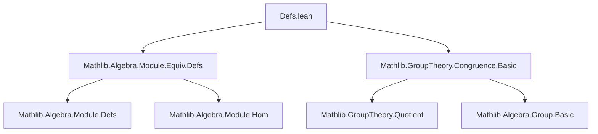

**Technical Brief: `Defs.lean` — Congruence Relations Respecting Scalar Multiplication**

---

### 1. **Key Definitions & Theorems**

| Name | Type / Structure | Purpose |
|------|------------------|---------|
| `VAddCon` | `structure [VAdd S M] extends Setoid M` | Congruence relation closed under additive action (`vadd`). |
| `SMulCon` | `structure [SMul S M] extends Setoid M` | Congruence relation closed under scalar multiplication (`smul`). |
| `ModuleCon` | `structure [Add M] [SMul S M] extends AddCon M, SMulCon S M` | Congruence respecting both addition and scalar multiplication; quotient inherits module structure. |
| `SMulCon.Quotient` | `def [SMul S M] (c : SMulCon S M) : Type _` | Quotient type under an `SMulCon`. |
| `ModuleCon.Quotient` | `def [Add M] [SMul S M] (c : ModuleCon S M) : Type _` | Quotient type under a `ModuleCon`. |
| `SMulCon.addConGen'` | `def [AddZeroClass M] [DistribSMul S M]` | Generates a `ModuleCon` from a relation stable under scalar multiplication. |
| `SMulCon.addConGen` | `abbrev [SMul S M] (c : SMulCon S M)` | Specialization of `addConGen'` to `SMulCon` itself. |
| `SMulCon.ker` | `def [SMul R M] [SMul S N] {φ : R → S} (f : M →ₑ[φ] N)` | Kernel of a semilinear map as an `SMulCon`. |
| `ModuleCon.ker` | `def [Monoid R] [Monoid S] ... (f : M →ₑ+[φ] N)` | Kernel of a distributive mul-action hom as a `ModuleCon`. |
| `ModuleCon.quotientKerEquivOfSurjective` | `noncomputable def [Semiring S] ... (f : M →ₗ[S] N) (hf : Surjective f)` | First isomorphism theorem: $M / \ker f \cong N$ when $f$ is surjective. |

---

### 2. **Naming Conventions**

- **Prefixes**:
  - `is_` absent.
  - `to_` for coercion/forgetful functors: `toSetoid`, `toSMulCon`, `toAddCon`.
  - `quotient_` for quotient constructions: `quotientKerEquivOfSurjective`.
  - `ker` for kernel constructions: `SMulCon.ker`, `ModuleCon.ker`.
- **Suffixes**:
  - `Con` for *congruence* structures: `VAddCon`, `SMulCon`, `ModuleCon`, `AddCon`.
  - `map` for induced maps on quotients: `Quotient.map`.
- **Notable patterns**:
  - `fast_instance%` used for efficient instance synthesis via surjectivity of `Quotient.mk''`.
  - `inferInstanceAs` used to reuse existing instances on quotients.

---

### 3. **Tactic Stack**

Frequently used tactics in proofs and instance synthesis:

| Tactic | Usage |
|--------|-------|
| `simp_rw` | Simplify with rewrite rules (e.g., `map_smulₛₗ`, `h`). |
| `rw` | Rewrite using definitions like `Setoid.ker_def`. |
| `congr_arg` | Prove equality of quotients by showing equality of representatives. |
| `intro` / `rintro` | Introduce hypotheses and variables. |
| `apply` / `exact` | Apply lemmas or hypotheses directly. |
| `fast_instance%` | Synthesize typeclass instances using surjectivity of quotient map. |
| `funext`, `ext` | Extensionality for functions/relations. |
| `aesop` | Not used in this file (no automation-heavy proofs). |
| `ring` | Not used (no polynomial/ring simplifications). |

---

### 4. **Proof Logic**

- **Structure of proofs**:
  - **Inductive/constructive**: Definitions are given explicitly (e.g., `quotientKerEquivOfSurjective` defines both underlying function and proof of linearity).
  - **Quotient-based reasoning**: Most proofs reduce to showing that operations descend to the quotient, using stability under the congruence (e.g., `smul` respects `r`).
  - **Instance synthesis**: Many instances are derived via `inferInstanceAs` or `fast_instance%`, avoiding manual verification.
  - **Leveraging existing theory**: Uses `Setoid.ker`, `AddCon.ker`, `Quotient.map`, and `MulAction`/`Module` infrastructure.

- **Typical proof pattern**:
  ```lean
  -- Show operation respects congruence:
  smul s x y h := by
    -- Use definition of relation (e.g., kernel)
    rw [Setoid.ker_def] at h ⊢
    -- Simplify using homomorphism property
    simp_rw [map_smulₛₗ, h]
  ```

---

### 5. **Imports**

| Import | Role |
|--------|------|
| `Mathlib.Algebra.Module.Equiv.Defs` | Provides `SMulEquiv`, `LinearMap`, `MulActionEquiv`, etc. |
| `Mathlib.GroupTheory.Congruence.Basic` | Provides `Setoid`, `AddCon`, `Congruence`, `Quotient` infrastructure. |

> **Scope**: This module lies at the intersection of **module theory**, **universal algebra**, and **type theory**, formalizing congruences compatible with scalar multiplication and their quotients.

---

### 8. **Mermaid Diagrams**

#### **Dependency Graph (Top-Level)**



#### **Overview of Theory Flow**

```mermaid
flowchart LR
  A[Setoid M] --> B[SMulCon S M]
  A --> C[AddCon M]
  B --> D[ModuleCon S M]
  D --> E[Quotient M / c]
  E --> F[SMul S (M / c)]
  E --> G[Add (M / c)]
  E --> H[Module S (M / c)]
  I[Linear Map f : M →ₗ N] --> J[SMulCon.ker f]
  J --> K[ModuleCon.ker f]
  K --> L[M / ker f ≃ₗ N]  %% First iso thm
```

#### **Quotient Lifting Diagram**

```mermaid
flowchart LR
  M["M (module)"] -->|π| "M / c"
  S["S (semiring)"] -->|•| M
  S -->|•| "M / c"
  M -.->|respects r| M
  "M / c" <-->|induced action| "M / c"
```

> **Key Insight**: The theory ensures that algebraic structures (addition, scalar multiplication, zero, etc.) lift uniquely to the quotient when the congruence is compatible — a categorical reflection of *algebraic congruences* in universal algebra.

--- 

Let me know if you'd like a formalization roadmap or a comparison with `Mathlib.Algebra.Module.Quotient`.
