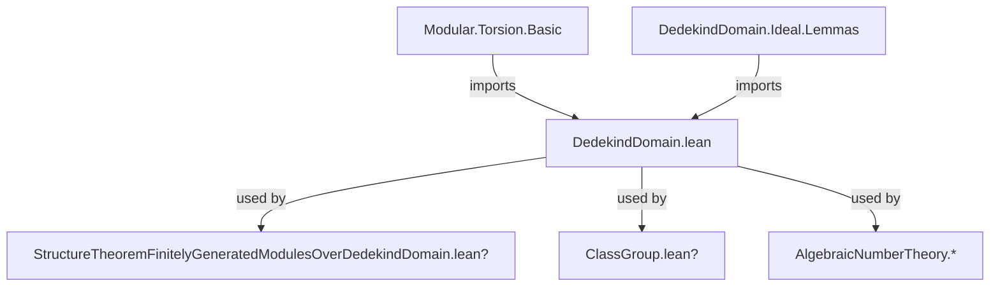
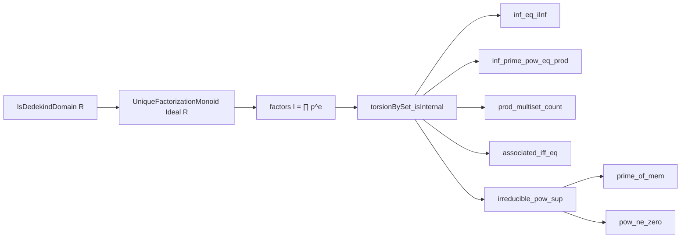

**Technical Brief: `DedekindDomain.lean` Module — Modules over a Dedekind Domain**

---

### 1. **Key Definitions & Theorems**

| Name | Type / Signature | Purpose |
|------|------------------|---------|
| `torsionBySet R M I` | `Submodule R M` | The *$I$-torsion submodule* of $M$: elements annihilated by some power of $I$ (or more precisely, by an element of $I$). |
| `Module.IsTorsionBySet R M I` | `Prop` | $M$ is *$I$-torsion* if every element is annihilated by some element of $I$. |
| `Module.IsTorsion R M` | `Prop` | $M$ is a *torsion module*: every element is annihilated by some nonzero element of $R$. |
| `Submodule.annihilator_top R M` | `Ideal R` | The annihilator ideal of $M$ as a submodule of itself (i.e., $\mathrm{Ann}_R(M)$). |
| `factors I` | `Multiset (Ideal R)` | The multiset of prime ideal factors in the unique factorization of a nonzero ideal $I$ in a Dedekind domain. |
| `isInternal_prime_power_torsion_of_is_torsion_by_ideal` | `theorem` | If $M$ is $I$-torsion and $I = \prod_i \mathfrak{p}_i^{e_i}$, then $M$ is the internal direct sum of its $\mathfrak{p}_i^{e_i}$-torsion submodules. |
| `isInternal_prime_power_torsion` | `theorem` | If $M$ is finitely generated and torsion, then $M$ is the internal direct sum of its $\mathfrak{p}_i^{e_i}$-torsion submodules, where $\mathfrak{p}_i^{e_i}$ are the prime-power factors of $\mathrm{Ann}(M)$. |
| `exists_isInternal_prime_power_torsion` | `theorem` | Existential version: any f.g. torsion module over a Dedekind domain decomposes as an internal direct sum over a finite set of prime ideals with multiplicities. |

---

### 2. **Naming Conventions**

- **Prefixes**:
  - `isInternal_...`: asserts that a family of submodules forms an internal direct sum.
  - `torsionBySet`: refers to torsion with respect to an ideal (or set).
  - `prime_power_...`: indicates decomposition into prime-power torsion parts.
  - `is_torsion_by_...`: predicate for modules where every element is killed by some element of a set/ideal.

- **Suffixes**:
  - `_of_is_torsion_by_ideal`: conditional version based on $I$-torsion.
  - `_torsion`: generic suffix for torsion-related submodules or properties.

- **Variables**:
  - `p`, `q`: typically range over prime ideals.
  - `e`, `e i`: exponents in prime-power decomposition.
  - `P`: finite set of prime ideals (often `factors I).toFinset`).

---

### 3. **Tactic Stack**

- `aesop`: used for automated reasoning about algebraic structures and simplifications.
- `ring`: for commutative ring identities (e.g., ideal arithmetic).
- `simp_rw`: rewriting with simplification lemmas (especially for `Multiset`, `Finset`, and `Ideal` operations).
- `rw [← ...]`: for rewriting using algebraic equivalences (e.g., `factors_prod`, `associated_iff_eq`).
- `dsimp`, `convert`, `refine`: for structured proof construction.
- `obtain ⟨x, H, hx⟩`: destructuring existential hypotheses.
- `exact`, `intro`, `apply`: standard proof steps.

---

### 4. **Proof Logic**

- **Structure**:
  1. **Setup**: Assume $R$ is a Dedekind domain, $M$ a torsion module (often f.g.).
  2. **Factorization**: Use unique factorization of ideals: $I = \prod \mathfrak{p}_i^{e_i}$.
  3. **Apply `torsionBySet_isInternal`**: Reduce to verifying:
     - The product of the annihilating ideals equals $I$ (via `inf_eq_iInf`, `inf_prime_pow_eq_prod`, etc.).
     - Pairwise comaxiality: $\mathfrak{p}_i^{e_i} + \mathfrak{p}_j^{e_j} = \top$ for $i \ne j$ (via `irreducible_pow_sup`).
  4. **Prime power comaxiality**: Proven using:
     - `normalizedFactors_of_irreducible_pow`
     - `Multiset.count_eq_zero`
     - `pow_ne_zero` (since primes are nonzero in domains).
  5. **Finitely generated case**: Use `Module.isTorsionBySet_annihilator_top` and `Submodule.annihilator_top_inter_nonZeroDivisors` to reduce to the $I$-torsion case.

- **Key logical flow**:
  > *Induction-free*; relies on ideal-theoretic properties of Dedekind domains (Noetherian, integrally closed, dim ≤ 1, unique factorization of ideals). Decomposition is *constructive* via prime factorization of the annihilator.

---

### 5. **Imports**

| Import | Purpose |
|--------|---------|
| `Mathlib.Algebra.Module.Torsion.Basic` | Defines torsion modules, torsion submodules, `IsTorsionBySet`, `torsionBySet`. |
| `Mathlib.RingTheory.DedekindDomain.Ideal.Lemmas` | Provides key ideal-theoretic lemmas: `inf_prime_pow_eq_prod`, `factors_prod`, `prime_of_factor`, etc. |

---

### 6. **Mermaid Diagrams**

#### **Dependency Graph (Module-Level)**



#### **Overview of Theoretical Flow**

```mermaid
flowchart LR
  A[CommRing R, IsDomain R] --> B[IsDedekindDomain R]
  B --> C[UniqueFactorizationMonoid Ideal R]
  C --> D[Factors I = ∏ p^e]
  D --> E[torsionBySet R M (p^e)]
  E --> F[DirectSum.IsInternal]
  F --> G[Decomposition of M]
  G --> H[Structure thm for f.g. modules]
```

#### **Proof Dependency Chain (for `isInternal_prime_power_torsion_of_is_torsion_by_ideal`)**



---

### 7. **Domain-Specific AI Agent Notes**

- **Core Theory**: This module formalizes the *primary decomposition* of torsion modules over Dedekind domains — a stepping stone to the structure theorem for finitely generated modules over PID/Dedekind domains.
- **AI Use Cases**:
  - Automating decomposition of torsion modules.
  - Guiding proofs about module structure (e.g., classification of finite abelian groups, class groups).
  - Supporting algebraic number theory (e.g., decomposition of ideals in extensions).
- **Pattern Recognition**:
  - Look for `factors`, `torsionBySet`, `isInternal`, `annihilator` as key signals.
  - Expect `DecidableEq (Ideal R)` as a recurring assumption.

--- 

Let me know if you'd like the next-level theory (e.g., how this feeds into the full structure theorem), or formalization-level suggestions (e.g., lemmata to add for better automation).
