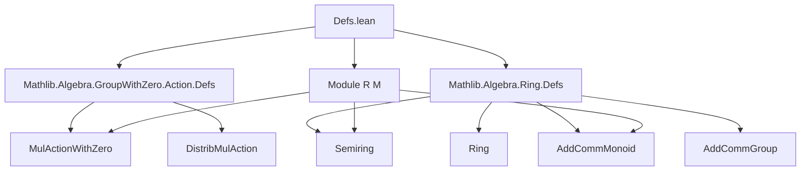
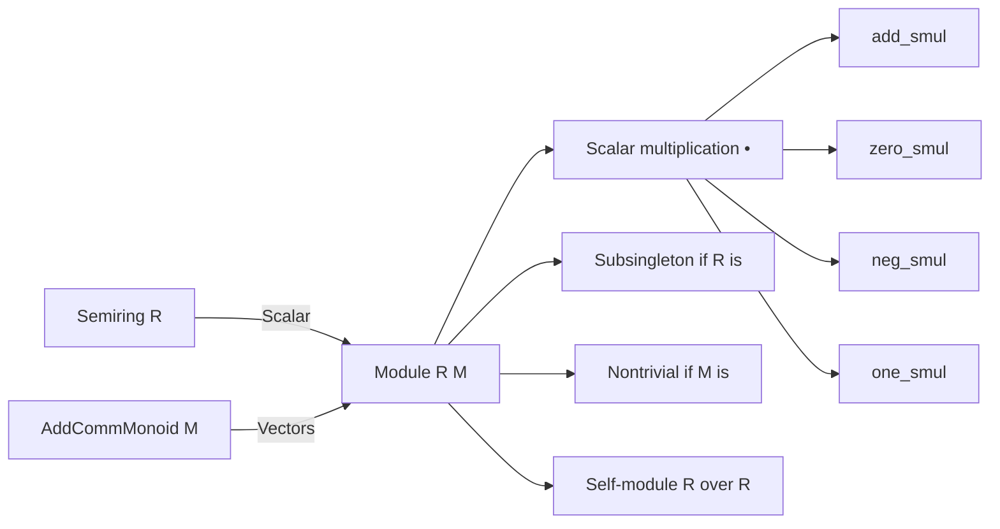

### Technical Brief: `Defs.lean` — Module Theory in Lean 4

---

#### **1. Key Definitions & Theorems**

| Name | Type / Signature | Purpose |
|------|------------------|---------|
| `Module R M` | `class Module (R : Type u) (M : Type v) [Semiring R] [AddCommMonoid M] extends DistribMulAction R M` | Defines a module (i.e., semimodule) over a semiring `R` on an additive commutative monoid `M`, via scalar multiplication `•` satisfying distributivity and zero axioms. |
| `Module.toMulActionWithZero` | `instance` | Derives a `MulActionWithZero R M` from `Module R M`, ensuring compatibility with zero. |
| `Module.add_smul` | `∀ r s : R, x : M, (r + s) • x = r • x + s • x` | Right distributivity of scalar multiplication over scalar addition. |
| `Module.zero_smul` | `∀ x : M, (0 : R) • x = 0` | Scalar multiplication by zero yields zero vector. |
| `Function.Injective.module` | `abbrev` | Pullback of a module structure along an injective additive monoid homomorphism. |
| `Function.Surjective.module` | `abbrev` | Pushforward of a module structure along a surjective additive monoid homomorphism. |
| `Module.ext'` | `theorem` | Extensionality for module structures: if scalar actions agree, modules are equal. |
| `Module.eq_zero_of_zero_eq_one` | `theorem` | If `0 = 1` in `R`, then all vectors are zero. |
| `neg_smul` | `theorem` | `(-r) • x = -(r • x)` for modules over rings. |
| `neg_one_smul` | `theorem` | `(-1) • x = -x` in a module over a ring. |
| `Semiring.toModule` | `instance` | Every semiring `R` is canonically a module over itself via multiplication. |
| `Convex.combo_self` | `theorem` | If `a + b = 1`, then `a • x + b • x = x`. |
| `Convex.combo_eq_smul_sub_add` | `theorem` | Expresses convex combinations in terms of subtraction: `a • x + b • y = b • (y - x) + x`. |

---

#### **2. Naming Conventions**

- **Prefixes**:
  - `Module.`: for module-specific theorems and instances.
  - `Function.Injective.module`, `Function.Surjective.module`: module constructions via maps.
  - `to*`: for derived instances (e.g., `toMulActionWithZero`).
- **Suffixes**:
  - `_smul`: for theorems about scalar multiplication (e.g., `add_smul`, `zero_smul`, `neg_smul`).
  - `ext'`: extensionality lemmas (prime indicates term-mode convenience).
- **General**:
  - `•` is used for scalar multiplication (infix notation for `smul`).
  - `smul` is the underlying function name.

---

#### **3. Tactic Stack**

Frequently used tactics in proofs:

- `rw`: rewriting using equalities (e.g., `add_smul`, `one_smul`, `neg_add_cancel`).
- `simp only [...]`: simplification with explicit lemmas, avoiding over-simplification.
- `calc`: stepwise equational reasoning (e.g., in `Convex.combo_eq_smul_sub_add`).
- `rcases`: destructing existential hypotheses (e.g., surjectivity).
- `ext`: extensionality for structures/classes.
- `haveI := P; ...`: typeclass inference in term mode.
- `by`: tactic block introductions.

---

#### **4. Proof Logic**

- **Inductive/structural reasoning**: Most proofs are direct algebraic manipulations using module axioms.
- **Case analysis**: Used in `Function.Surjective.module.zero_smul` and `add_smul`, where surjectivity yields a preimage.
- **Typeclass inference**: Leverages `MulActionWithZero`, `DistribMulAction`, and `AddCommMonoid` to derive structure.
- **Term-mode proofs**: `Module.ext'` and `Injective.module` use `haveI` and `hf` to guide typeclass resolution.
- **Subsingleton reasoning**: `Module.subsingleton` and `nontrivial` rely on `MulActionWithZero` lemmas.

---

#### **5. Imports**

- `Mathlib.Algebra.GroupWithZero.Action.Defs`: Provides `MulActionWithZero`, foundational for scalar actions with zero.
- `Mathlib.Algebra.Ring.Defs`: Supplies `Semiring`, `Ring`, `AddCommMonoid`, `AddCommGroup`, etc.

---

#### **6. Theory Overview & Dependencies**

##### **Mermaid: Dependency Graph**

##### **Mermaid: Module Theory Overview**

---

#### **7. Notes on Design Philosophy**

- **Unified `Module`**: Mathlib avoids separate `Semimodule`, `Module`, `VectorSpace` typeclasses; instead, typeclass constraints on `R` and `M` determine behavior (e.g., `Ring R` + `AddCommGroup M` gives “true” module).
- **Reversible constructions**: `Injective.module` and `Surjective.module` allow transport of module structure along maps.
- **Subsingleton & Nontriviality**: Derived from `MulActionWithZero`, enabling reasoning about size of modules and scalars.

---

#### **8. Tags**

`semimodule`, `module`, `vector space`, `scalar multiplication`, `distributive action`, `typeclass inference`, `extensionality`, `subsingleton`, `nontrivial`.

--- 

Let me know if you'd like a formalized dependency graph (e.g., for `leanproject`), or a summary of how this file fits into the broader `Mathlib.Algebra.Module` hierarchy.
