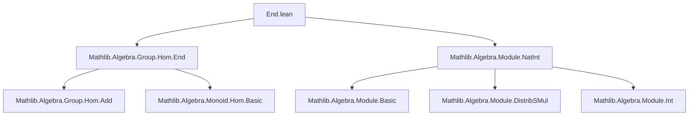

**Technical Brief: `End.lean` Module Analysis**

---

### 1. **Key Definitions & Theorems**

| Name | Type | Purpose |
|------|------|---------|
| `Module.toAddMonoidEnd` | `R →+* AddMonoid.End M` | Encodes scalar multiplication `(•)` as a **ring homomorphism** from `R` to endomorphisms of `M` (as an additive monoid). Generalizes `DistribMulAction.toAddMonoidEnd`. |
| `smulAddHom` | `R →+ M →+ M` | The underlying additive homomorphism version of `Module.toAddMonoidEnd`, used to apply `AddMonoidHom.flip`. |
| `AddMonoid.End.natCast_def` | `∀ n : ℕ, (↑n : AddMonoid.End M) = DistribMulAction.toAddMonoidEnd ℕ M n` | Identifies natural number coercion to endomorphisms with the action of `ℕ` via scalar multiplication. |
| `AddMonoid.End.intCast_def` | `∀ z : ℤ, (↑z : AddMonoid.End M) = DistribMulAction.toAddMonoidEnd ℤ M z` | Same as above, but for integers. |
| `IsAddUnit.smul_left` | `IsAddUnit x → IsAddUnit (s • x)` | Scalar multiplication by any `s : S` preserves additively invertible elements (under `DistribSMul`). |
| `IsAddUnit.smul_right` | `IsAddUnit r → IsAddUnit (r • x)` | Scalar multiplication by an additively invertible `r` preserves invertibility of `x`. |

---

### 2. **Naming Conventions**

- **Prefixes**:
  - `is_`: for properties (e.g., `IsAddUnit`).
  - `to_`: for coercion/construction morphisms (e.g., `toAddMonoidEnd`, `toAddMonoidHom`).
  - `smul_`: for scalar multiplication–related constructions (`smulAddHom`).
- **Suffixes**:
  - `_def`: definitions equating coercions or constructions.
  - `_apply`: for `apply`-style lemmas (e.g., `smulAddHom_apply`).
- **Structure**:
  - `→+*`: ring homomorphism.
  - `→+`: additive monoid homomorphism.

---

### 3. **Tactic Stack**

- `simp`: heavily used for simplification of `smul`, `AddMonoidHom`, and coercion.
- `aesop`: not present in this file.
- ` rfl`: used in definitions and proofs where equality is definitional.
- `AddMonoidHom.ext`: used to prove extensionality of additive homomorphisms.
- `by simp [(AddMonoidHom.add_apply), add_smul]`: tactic pattern for proving homomorphism properties.

---

### 4. **Proof Logic**

- **Structure**: Modular, with two main sections:
  1. `AddCommMonoid`: for semiring actions on additive commutative monoids.
  2. `AddCommGroup`: extends to additive commutative groups (i.e., ℤ-actions).
- **Typical proof pattern**:
  - Define morphism via `def`.
  - Prove homomorphism properties using `AddMonoidHom.ext`.
  - Use `simp` + known lemmas (`add_smul`, etc.) to discharge goals.
  - For `IsAddUnit.*` lemmas: apply `map` of appropriate homomorphism.

---

### 5. **Imports**

| Import | Role |
|--------|------|
| `Mathlib.Algebra.Group.Hom.End` | Provides `AddMonoid.End`, homomorphism machinery. |
| `Mathlib.Algebra.Module.NatInt` | Provides scalar multiplication by `ℕ` and `ℤ`, and related lemmas. |

---

### 8. **Mermaid Diagrams**

#### **Dependency Graph (File-Level)**



#### **Conceptual Overview (Theory Flow)**

```mermaid
flowchart LR
  R[Semiring R] -->|acts on| M[AddCommMonoid/Group M]
  M -->|induces| EndM[AddMonoid.End M]
  R -->|scalar mult •| M
  R -->|Module.toAddMonoidEnd| EndM
  EndM -->|AddMonoidHom.flip| R→M[M →+ M]
  ℤ -->|intCast_def| EndM
  ℕ -->|natCast_def| EndM
  IsAddUnit -->|smul_left/right| IsAddUnit
```

---

**Summary**: This file formalizes the foundational link between scalar multiplication and additive endomorphisms, enabling clean reasoning about integer and natural scalar actions via ring homomorphisms. It sets up infrastructure for `ℤ`- and `ℕ`-module theory, especially in the context of invertibility under addition.
