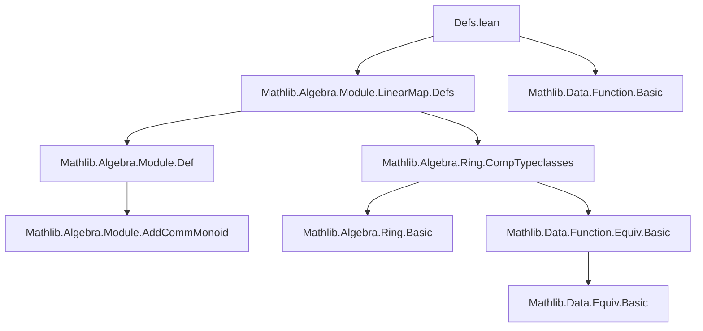
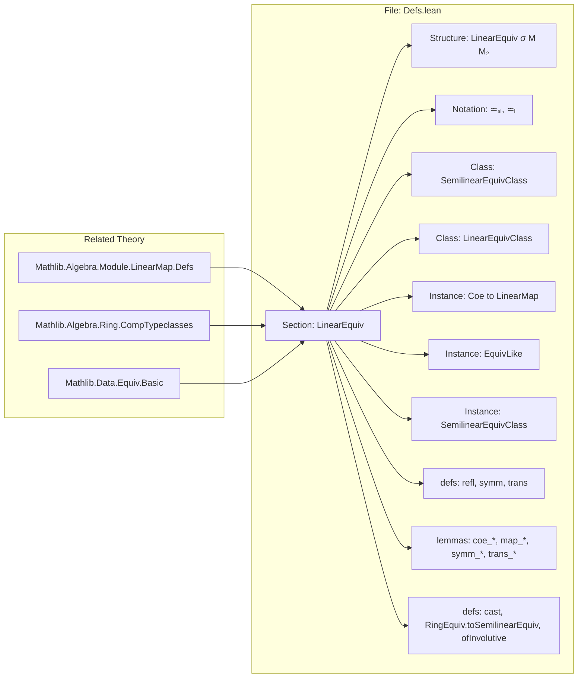

**Technical Brief: `Defs.lean` — (Semi)linear Equivalences in Lean 4 / Mathlib**

---

### 1. KEY DEFINITIONS & THEOREMS

| Name | Type / Signature | Purpose |
|------|------------------|---------|
| `LinearEquiv σ M M₂` | `structure` | Invertible `σ`-semilinear map `M → M₂`, where `σ : R →+* S`. Extends `LinearMap σ M M₂` and `M ≃+ M₂`. |
| `M ≃ₛₗ[σ] M₂` | `notation` | Shorthand for `LinearEquiv σ M M₂`. |
| `M ≃ₗ[R] M₂` | `notation` | Linear equivalences over identity ring homomorphism: `LinearEquiv (RingHom.id R) M M₂`. |
| `M ≃ₗ⋆[R] M₂` | *not yet defined in this file* | Star-linear equivalences (intended for `σ = starRingEnd R`). |
| `SemilinearEquivClass F σ M M₂` | `class` | Typeclass asserting `F` is a type of bundled `σ`-semilinear equivalences `M → M₂`. Extends `AddEquivClass` and enforces `map_smulₛₗ`. |
| `LinearEquivClass F R M M₂` | `abbrev` | Abbreviation for `SemilinearEquivClass F (RingHom.id R) M M₂`. |
| `semilinearEquiv` | `def` | Reinterpret an element of a `SemilinearEquivClass` type as a `LinearEquiv`. |
| `toEquiv` | `def` | Underlying equivalence of types `M ≃ M₂`. |
| `symm` | `def` | Inverse of a linear equivalence: `M₂ ≃ₛₗ[σ'] M`. |
| `trans` | `def` | Composition of linear equivalences: `M₁ ≃ₛₗ[σ₁₃] M₃`. Requires `RingHomCompTriple σ₁₂ σ₂₃ σ₁₃`. |
| `refl` | `def` | Identity equivalence: `M ≃ₗ[R] M`. |
| `symmEquiv` | `def` | Equivalence `(M ≃ₛₗ[σ] M₂) ≃ (M₂ ≃ₛₗ[σ'] M)`. |
| `cast` | `def` | Transport along path of indices: `M i ≃ₗ[R] M j`. |
| `RingEquiv.toSemilinearEquiv` | `def` | View a ring isomorphism `R ≃+* S` as an `f`-semilinear equivalence `R ≃ₛₗ[f] S`. |
| `ofInvolutive` | `def` | If `f : M →ₛₗ[σ] M` is involutive, then it is a linear equivalence `M ≃ₛₗ[σ] M`. |

**Key Theorems (selected):**

| Name | Statement | Purpose |
|------|-----------|---------|
| `toEquiv_injective` | `(toEquiv : M ≃ₛₗ[σ] M₂ → M ≃ M₂).Injective` | Ensures extensionality via underlying function. |
| `coe_toEquiv` | `⇑(e.toEquiv) = e` | Coercion to function matches underlying map. |
| `trans_apply` | `(e₁₂.trans e₂₃) c = e₂₃ (e₁₂ c)` | Composition acts pointwise. |
| `symm_apply_apply` / `apply_symm_apply` | `e.symm (e x) = x`, `e (e.symm x) = x` | Inverse laws. |
| `trans_symm` | `(e₁₂.trans e₂₃).symm = e₂₃.symm.trans e₁₂.symm` | Symmetry reverses order. |
| `self_trans_symm` / `symm_trans_self` | `f.trans f.symm = refl`, `f.symm.trans f = refl` | Cancellation laws. |
| `map_smulₛₗ` | `e (c • x) = σ c • e x` | Semilinearity condition. |
| `map_eq_zero_iff` | `e x = 0 ↔ x = 0` | Injectivity at zero. |
| `bijective` / `injective` / `surjective` | `Function.Bijective e`, etc. | Linear equivalences are bijections. |
| `comp_symm_cancel_left/right`, `symm_comp_cancel_left/right` | Various cancellation lemmas for compositions with inverses. | Simplify compositions involving inverses. |

---

### 2. NAMING CONVENTIONS

| Pattern | Examples | Meaning |
|---------|----------|---------|
| `map_*` | `map_add`, `map_zero`, `map_smulₛₗ` | Properties of the underlying map. |
| `coe_*` | `coe_toEquiv`, `coe_toLinearMap`, `coe_symm_mk` | Coercion lemmas (to functions, maps, etc.). |
| `symm_*` | `symm_apply`, `symm_trans`, `symm_symm` | Properties of the inverse. |
| `trans_*` | `trans_apply`, `trans_refl`, `trans_symm` | Properties of composition. |
| `refl_*` | `refl_apply`, `refl_symm` | Identity equivalence properties. |
| `cast` | `cast`, `Equiv.cast` | Transport along equality of indices. |
| `to*` | `toEquiv`, `toLinearMap`, `toAddEquiv` | Projection to underlying structure. |
| `ext` | `ext` | Extensionality principle. |
| `mk` | `mk`, `mk_coe`, `symm_mk` | Constructor and projection lemmas. |
| `aux` | `symm_mk.aux` | Auxiliary definition to avoid looping in simplification. |

**Suffixes:**
- `ₛₗ` → semilinear (e.g., `≃ₛₗ`, `→ₛₗ`, `map_smulₛₗ`)
- `ₗ` → linear (e.g., `≃ₗ`, `→ₗ`)
- `⋆` → star-linear (not yet implemented here)
- `Equiv` → underlying equivalence of types
- `AddEquiv` → underlying additive equivalence

---

### 3. TACTIC STACK

Frequent tactics used in proofs and definitions:

| Tactic | Usage |
|--------|-------|
| `ext` | Extensionality (for functions, equivalences, linear maps). |
| `simp` / `simp_rw` | Simplification using `@[simp]` lemmas (e.g., `trans_apply`, `symm_apply_apply`). |
| `rfl` | Reflexivity (used heavily in definitions and `@[simp]` lemmas). |
| `congr` / `congrArg` / `congrFun` | Congruence reasoning (e.g., `congrFun (congrArg ...)`). |
| `cases` | Case analysis on equalities (e.g., `cases h` in `cast`). |
| `intro` / `intro h` | Introduce hypotheses. |
| `rw` | Rewrite using lemmas or definitions. |
| `exact` / `assumption` | Solve goals directly. |
| `dsimp` | Simplify definitional equalities (avoided via `aux` definitions). |
| `ring` | Not used here (algebraic simplification not needed). |
| `aesop` | Not used (no automation needed for these proofs). |

Most proofs are *definitionally trivial* or rely on `@[simp]` lemmas and extensionality.

---

### 4. PROOF LOGIC

**Recurring proof pattern:**

1. **Extensionality**: Use `ext x` to reduce to pointwise equality.
2. **Simplification**: Apply `simp` with `@[simp]` lemmas (e.g., `trans_apply`, `symm_apply_apply`, `coe_*`).
3. **Rewrite using inverse laws**: Replace `e (e.symm x)` with `x`, or vice versa.
4. **Use `RingHomCompTriple` / `RingHomInvPair` instances** to discharge typeclass goals (often implicit).
5. **Case analysis** on equalities of indices (e.g., in `cast`, `cases h` where `h : i = j`).

**Example proof sketch (e.g., `self_trans_symm`):**
```lean
ext x
simp
```
→ reduces to `e.symm (e x) = x`, which is `left_inv`.

**Induction**: Not used (no inductive types involved).

**Case analysis**: Only on equalities (e.g., `i = j` in `cast`).

---

### 5. IMPORTS & DEPENDENCIES

**Primary imports:**
- `Mathlib.Algebra.Module.LinearMap.Defs` — core linear map definitions.

**Implicit dependencies (via typeclasses):**
- `Mathlib.Algebra.Module.Def` — modules, additive monoids.
- `Mathlib.Algebra.Ring.CompTypeclasses` — `RingHomCompTriple`, `RingHomInvPair`, `RingHomSurjective`.
- `Mathlib.Data.Equiv.Basic` — `Equiv`, `EquivLike`.
- `Mathlib.Data.Function.Basic` — `Function`, `Function.Bijective`, etc.

**Key typeclasses used:**
- `[Semiring R]`, `[Module R M]`
- `[RingHomInvPair σ σ']`, `[RingHomInvPair σ' σ]`
- `[RingHomCompTriple σ₁₂ σ₂₃ σ₁₃]`
- `[EquivLike F M M₂]`, `[AddEquivClass F M M₂]`, `[SemilinearMapClass F σ M M₂]`

---

### 6. MERMAID DIAGRAMS

#### **Dependency Graph (Top-Level)**



#### **Overview of File Structure**



#### **Type Hierarchy**

```mermaid
graph TD
  LinearEquiv σ M M₂ --> LinearMap σ M M₂
  LinearEquiv σ M M₂ --> AddEquiv M M₂
  LinearEquiv σ M M₂ --> Equiv M M₂
  LinearEquiv σ M M₂ --> SemilinearMap σ M M₂
  LinearEquiv σ M M₂ --> AddMonoidHom M M₂

  SemilinearEquivClass F σ M M₂ --> SemilinearMapClass F σ M M₂
  SemilinearEquivClass F σ M M₂ --> AddEquivClass F M M₂
  LinearEquivClass F R M M₂ --> SemilinearEquivClass F (RingHom.id R) M M₂
```

---

### 7. SUMMARY

This file formalizes the foundational theory of **(semi)linear equivalences** in Mathlib, generalizing linear isomorphisms to arbitrary ring homomorphisms `σ : R →+* S`. It introduces:

- The core type `LinearEquiv σ M M₂`,
- Typeclasses for bundled semilinear equivalences (`SemilinearEquivClass`),
- A robust infrastructure for composition (`trans`), inversion (`symm`), and identity (`refl`),
- Extensive `@[simp]` lemmas for coercion and cancellation,
- Tools for reasoning about equivalences (e.g., `cast`, `RingEquiv.toSemilinearEquiv`).

The design prioritizes **smooth composition** via `RingHomCompTriple` and `RingHomInvPair`, and ensures **extensionality** and **coherence** with underlying additive and linear structure.

The file is a prerequisite for higher-level developments (e.g., dual modules, tensor products, group representations), and sets the stage for future generalizations (e.g., `≃ₗ⋆[R]` for star-linear maps).
