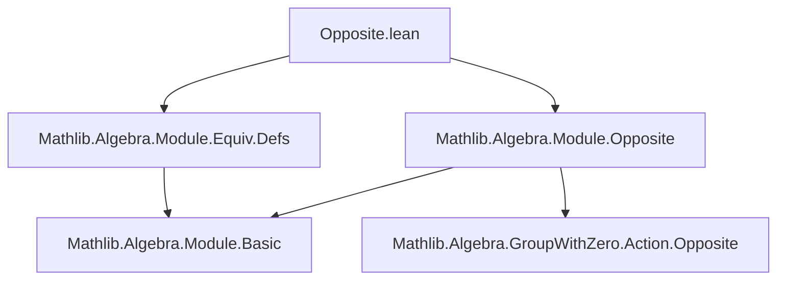

**Technical Brief: `Opposite.lean` (Module Operations on `Mᵐᵒᵖ`)**

---

### 1. **Key Definitions & Theorems**

| Name | Type / Signature | Purpose |
|------|------------------|---------|
| `LinearMap.ext_ring_op` | `{σ : Rᵐᵒᵖ →+* S} {f g : R →ₛₗ[σ] M} → (f 1 = g 1) → f = g` | Extensionality for linear maps over the opposite ring: a `σ`-linear map `R →ₛₗ[σ] M` is determined by its value at `1`. |
| `opLinearEquiv` | `M ≃ₗ[R] Mᵐᵒᵖ` | The `op` function is a linear equivalence between `M` and its opposite module `Mᵐᵒᵖ`. |
| `coe_opLinearEquiv` | `(opLinearEquiv R : M → Mᵐᵒᵖ) = op` | The underlying function of `opLinearEquiv` is `op`. |
| `coe_opLinearEquiv_symm` | `((opLinearEquiv R).symm : Mᵐᵒᵖ → M) = unop` | The inverse of `opLinearEquiv` is `unop`. |
| `opLinearEquiv_toAddEquiv` | `(opLinearEquiv R).toAddEquiv = opAddEquiv` | The additive equivalence underlying `opLinearEquiv` is the one from `opAddEquiv`. |
| `coe_opLinearEquiv_addEquiv` | `(opLinearEquiv R : M ≃+ Mᵐᵒᵖ) = opAddEquiv` | Coercion of `opLinearEquiv` to an additive equivalence is `opAddEquiv`. |
| `opLinearEquiv_symm_toAddEquiv` | `(opLinearEquiv R).symm.toAddEquiv = opAddEquiv.symm` | The inverse additive equivalence is `opAddEquiv.symm`. |
| `coe_opLinearEquiv_symm_addEquiv` | `((opLinearEquiv R).symm : Mᵐᵒᵖ ≃+ M) = opAddEquiv.symm` | Coercion of the inverse is `opAddEquiv.symm`. |

---

### 2. **Naming Conventions**

- **Prefixes**:
  - `op_`: for constructions involving the `op` embedding (e.g., `opLinearEquiv`, `opAddEquiv`).
  - `coe_`: for coercion lemmas (e.g., `coe_opLinearEquiv`, `coe_opLinearEquiv_symm`).
- **Suffixes**:
  - `_toAddEquiv`: for lemmas about the underlying additive equivalence.
  - `_symm`: for statements involving the inverse (e.g., `opLinearEquiv_symm_toAddEquiv`).
- **Type parameters**:
  - `R`, `S`, `M` used consistently for semirings and modules.
  - `σ` used for ring homomorphisms `Rᵐᵒᵖ →+* S`, typical in twisted linear maps.

---

### 3. **Tactic Stack**

- `ext`: used for extensionality proofs (e.g., `LinearMap.ext_ring_op`).
- `rw`: rewriting using lemmas like `one_mul`, `op_smul_eq_mul`, `map_smulₛₗ`.
- `rfl`: for definitional equalities (e.g., coercion lemmas).
- Implicit use of `simp`-friendly lemmas (all `@[simp]` lemmas are proven via `rfl` or `ext` + `rw`).

No heavy automation (e.g., `aesop`, `ring`, `linarith`) is used—proofs are mostly definitional or rely on algebraic simplifications.

---

### 4. **Proof Logic**

- **`LinearMap.ext_ring_op`**:
  - Uses `ext` to reduce to proving equality at arbitrary `x : R`.
  - Rewrites `x` as `1 * x`, applies `map_smulₛₗ`, and substitutes using `h : f 1 = g 1`.
  - Crucially relies on `op_smul_eq_mul`, which connects the opposite ring action to the original module action.

- **`opLinearEquiv` & companions**:
  - Constructed as `opAddEquiv` extended with `map_smul' := MulOpposite.op_smul`.
  - All coercion lemmas are proven by `rfl`, indicating definitional equality of underlying functions.
  - Additive equivalence lemmas are also `rfl`, confirming compatibility of the linear equivalence with its additive structure.

No induction or case analysis is used—proofs are structural and definitional.

---

### 5. **Imports**

- `Mathlib.Algebra.Module.Equiv.Defs`: Provides `≃ₗ`, linear equivalences, and coercion infrastructure.
- `Mathlib.Algebra.Module.Opposite`: Defines `Mᵐᵒᵖ`, `op`, `unop`, and basic module structure on the opposite module.

> **Note**: The file builds on `Mathlib/Algebra/GroupWithZero/Action/Opposite.lean` (mentioned in docstring), though not directly imported here—its results (e.g., `op_smul_eq_mul`, `opAddEquiv`) are assumed available.

---

### 6. **Mermaid Diagrams**

#### **Dependency Graph (File-Level)**



#### **Conceptual Overview (Module-Level)**

```mermaid
flowchart LR
  A[Module M] -->|op : M → Mᵐᵒᵖ| B[Opposite Module Mᵐᵒᵖ]
  B -->|unop : Mᵐᵒᵖ → M| A
  A <-->|≃ₗ[R]| B
  subgraph Equiv
    opLinearEquiv
  end
  subgraph Structure
    opAddEquiv
    op_smul_eq_mul
  end
  opLinearEquiv -.->|underlying| opAddEquiv
  opLinearEquiv -.->|smul compatibility| op_smul_eq_mul
```

---

### 7. **Summary**

This file establishes that the `op` map is not just an additive equivalence, but a **linear equivalence** between a module `M` and its opposite `Mᵐᵒᵖ`. It leverages the opposite ring action (`op_smul_eq_mul`) to upgrade `opAddEquiv` to `opLinearEquiv`. All properties are definitional, reflecting the symmetry of the opposite construction in module theory. The `LinearMap.ext_ring_op` lemma is a key tool for reasoning about twisted linear maps over `Rᵐᵒᵖ`.
