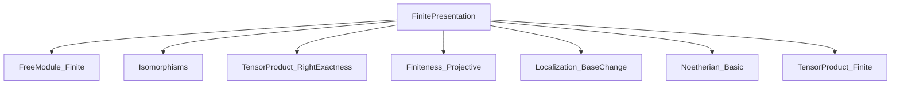

Here is the structured technical brief extracted from `FinitePresentation.lean`:

---

### **1. KEY DEFINITIONS & THEOREMS**

#### **Definitions**
- **`Module.FinitePresentation R M`**  
  *Type:* `Prop`  
  *Purpose:* A module $M$ over a semiring/ring $R$ is *finitely presented* if it is finitely generated and the kernel of any (hence every) surjection $R^{(s)} \twoheadrightarrow M$ from a finite free module is finitely generated.

#### **Main Theorems & Lemmas**
- **`Module.finitePresentation_iff_finite`**  
  *Type:* `Module.FinitePresentation R M ↔ Module.Finite R M`  
  *Purpose:* Over a Noetherian ring, finite presentation coincides with finite generation.

- **`Module.finitePresentation_of_surjective`**  
  *Type:* `[fp : Module.FinitePresentation R M] → (l : M →ₗ[R] N) → Function.Surjective l → (ker l).FG → Module.FinitePresentation R N`  
  *Purpose:* Quotients of f.p. modules by f.g. kernels are f.p.

- **`Module.FinitePresentation.fg_ker`**  
  *Type:* `[fg : Module.Finite R M] [fp : Module.FinitePresentation R N] → (l : M →ₗ[R] N) → Function.Surjective l → (ker l).FG`  
  *Purpose:* In a surjection $M \twoheadrightarrow N$ with $M$ f.g. and $N$ f.p., the kernel is f.g.

- **`Module.finitePresentation_of_ker`**  
  *Type:* `[fpN : Module.FinitePresentation R N] → (l : M →ₗ[R] N) → Function.Surjective l → [fpK : Module.FinitePresentation R (ker l)] → Module.FinitePresentation R M`  
  *Purpose:* In a surjection $M \twoheadrightarrow N$, if $N$ and $\ker l$ are f.p., then $M$ is f.p.

- **`Module.FinitePresentation.isLocalizedModule_map`**  
  *Type:* `[fp : Module.FinitePresentation R M] → IsLocalizedModule S (IsLocalizedModule.map S f g)`  
  *Purpose:* Localization commutes with $\mathrm{Hom}$ for f.p. modules: $\mathrm{Hom}_R(M, N)_S \cong \mathrm{Hom}_{R_S}(M_S, N_S)$.

- **`Module.FinitePresentation.exists_lift_equiv_of_isLocalizedModule`**  
  *Type:* `[fpM : Module.FinitePresentation R M] [fpN : Module.FinitePresentation R N] → (l : M_S ≃ₗ[R] N_S) → ∃ r ∈ S, M_{1/r} ≃ₗ[R_{1/r}] N_{1/r}`  
  *Purpose:* Local isomorphisms between f.p. modules descend to isomorphisms after localizing at a single element.

- **`Module.FinitePresentation.exists_notMem_bijective`**  
  *Type:* `[fg : Module.Finite R M] [fp : Module.FinitePresentation R N] → (f : M →ₗ[R] N) → (p : Ideal R) [p.IsPrime] → (f_p : M_p ≃ₗ[R_p] N_p) → ∃ g ∉ p, f_{1/g} \text{ is bijective}`  
  *Purpose:* Bijectivity at a prime implies bijectivity after inverting some element outside the prime.

- **`Module.FinitePresentation.trans`**  
  *Type:* `[fpRS : Module.FinitePresentation R S] [fpSM : Module.FinitePresentation S M] → Module.FinitePresentation R M`  
  *Purpose:* Transitivity of finite presentation along scalar restriction: if $S$ is f.p. over $R$ and $M$ is f.p. over $S$, then $M$ is f.p. over $R$.

- **`Module.FinitePresentation.of_isBaseChange`**  
  *Type:* `(f : M →ₗ[R] N) → IsBaseChange A f → [fpM : Module.FinitePresentation R M] → Module.FinitePresentation A N`  
  *Purpose:* Base change preserves finite presentation when the source is f.p.

- **`Module.FinitePresentation.isLocalizedModule_mapExtendScalars`**  
  *Type:* `[fpM : Module.FinitePresentation R M] → IsLocalizedModule S (IsLocalizedModule.mapExtendScalars S f g Rₛ)`  
  *Purpose:* Extension of scalars along localization is a localization map.

---

### **2. NAMING CONVENTIONS**

- **Prefixes:**
  - `finitePresentation_of_`: constructing finite presentation from other properties (e.g., `of_surjective`, `of_ker`, `of_free_of_surjective`, `of_projective`).
  - `fg_`: properties about finitely generated kernels (e.g., `fg_ker`, `fg_ker_iff`).
  - `exists_`: existence lemmas (e.g., `exists_lift`, `exists_bijective_map_powers`, `exists_notMem_bijective`).
  - `of_`: lifting structure along equivalences or maps (e.g., `of_equiv`, `of_isBaseChange`).

- **Suffixes:**
  - `_iff_finite`: equivalence with finite generation under Noetherian hypothesis.
  - `_map`: maps induced by localization or base change.
  - `_powers`: statements about localization at powers of a single element.

- **Other:**
  - `trans`: transitivity of finite presentation across ring extensions.
  - `isLocalizedModule_`: showing a map is a localization map.

---

### **3. TACTIC STACK**

- **Core tactics:** `obtain`, `choose`, `rw`, `simp`, `ext`, `convert`, `refine`, `apply`, `exact`, `intro`, `cases`.
- **Ring/module-specific:**
  - `LinearMap.ext`, `Submodule.ext`, `Submodule.mem_ker`, `Submodule.span_le`, `Submodule.map_span`, `Submodule.comap_map_eq`, `LinearMap.range_eq_top`, `LinearMap.ker_comp`, `LinearMap.smul_comp`, `LinearMap.comp_assoc`, `LinearMap.comp_smul`.
  - `Module.Finite.iff_fg`, `Module.FinitePresentation.fg_ker_iff`, `Module.End.isUnit_iff`.
- **Localization-specific:**
  - `IsLocalizedModule.ext`, `IsLocalizedModule.map_units`, `LocalizedModule.mk'_surjective`, `LocalizedModule.smul'_mk`, `IsLocalization.map_units`.
- **Set/finset:**
  - `Finset.prod_erase_mul`, `Finset.mem_univ`, `Set.image_image`, `Set.range_comp`, `Set.image_id'`.
- **Equivalence/quotient:**
  - `LinearEquiv.coe_toLinearMap`, `Submodule.Quotient.equiv`, `LinearMap.quotKerEquivOfSurjective`, `Submodule.liftQ_mkQ`.

---

### **4. PROOF LOGIC**

- **Inductive/constructive style:** Proofs often construct explicit presentations or lifts using finite generation and surjectivity.
- **Common pattern:**
  1. Use finite generation to get a surjection $R^{(s)} \twoheadrightarrow M$.
  2. Use finite generation of kernel to reduce to finite free quotients.
  3. Use localization properties (e.g., `IsLocalizedModule.ext`, `exists_of_eq`) to descend global properties from localized ones.
  4. Use exact sequences and lifting properties (e.g., projectivity, split exactness) to propagate finite presentation.
- **Localization descent:** Many proofs use the technique of:
  - Lift a localized map to a global map up to multiplication by $s \in S$,
  - Show bijectivity or injectivity/surjectivity after multiplying by a product of such $s$'s,
  - Conclude existence of $r \in S$ such that the localized map at $r$ has the desired property.

---

### **5. IMPORTS**

- `Mathlib.LinearAlgebra.FreeModule.Finite.Basic`
- `Mathlib.LinearAlgebra.Isomorphisms`
- `Mathlib.LinearAlgebra.TensorProduct.RightExactness`
- `Mathlib.RingTheory.Finiteness.Projective`
- `Mathlib.RingTheory.Localization.BaseChange`
- `Mathlib.RingTheory.Noetherian.Basic`
- `Mathlib.RingTheory.TensorProduct.Finite`

These imports indicate the module sits at the intersection of:
- Linear algebra over rings (free modules, tensor products),
- Module finiteness conditions (fg, fp, projective),
- Localization theory (base change, localized modules),
- Noetherian ring theory.

---

### **6. DEPENDENCY & THEORY OVERVIEW**

#### **Mermaid Diagrams**

##### **Dependency Graph (Top-Level Imports)**

##### **Theory Overview**

```mermaid
graph TD
  A[FinitePresentation] --> B[Module.FinitePresentation]
  A --> C[Module.FinitePresentation.fg_ker]
  A --> D[Module.finitePresentation_of_surjective]
  A --> E[Module.finitePresentation_of_ker]
  A --> F[Module.FinitePresentation.isLocalizedModule_map]
  A --> G[Module.FinitePresentation.trans]
  A --> H[Module.FinitePresentation.of_isBaseChange]
  A --> I[Module.FinitePresentation.exists_lift_equiv_of_isLocalizedModule]
  A --> J[Module.FinitePresentation.exists_notMem_bijective]

  B --> K[Module.FinitePresentation.fg_ker_iff]
  B --> L[Module.finitePresentation_iff_finite]
  B --> M[Module.finitePresentation_of_free_of_surjective]
  B --> N[Module.finitePresentation_of_projective]

  F --> O[Module.FinitePresentation.isLocalizedModule_mapExtendScalars]
  F --> P[IsLocalizedModule.exists_isLocalizedModule_powers_of_finitePresentation]
```

##### **Relationship to Other Theories**
- **`Algebra.FinitePresentation`** (in `Mathlib/RingTheory/FinitePresentation.lean`): Handles *finitely presented algebras*; this file focuses on *finitely presented modules*.
- **`RingTheory.Noetherian`**: Provides the equivalence `f.p. ↔ f.g.` over Noetherian rings.
- **`RingTheory.Localization`**: Provides tools for localization and base change; used heavily in descent lemmas.
- **`LinearAlgebra.TensorProduct`**: Used for base change and flatness arguments (e.g., `lTensor_exact`).
- **`RingTheory.Finiteness.Projective`**: Used to show projective + f.g. ⇒ f.p.

---

### **7. SUMMARY**

This file formalizes the foundational theory of *finitely presented modules* in Lean 4, emphasizing:
- Equivalence with finite generation over Noetherian rings,
- Stability under exact sequences, quotients, extensions, and localizations,
- Descent properties: local isomorphisms/bijectivity lift to global ones after inverting a single element,
- Compatibility with base change and localization.

It serves as a cornerstone for homological algebra and descent theory in the Mathlib ecosystem.

---
