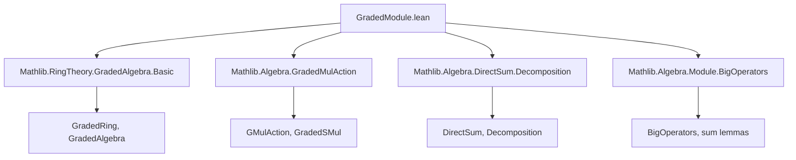

**Technical Brief: `GradedModule.lean`**

---

### 1. **Key Definitions & Theorems**

| Name | Type / Signature | Purpose |
|------|------------------|---------|
| `GdistribMulAction` | `class` | Graded version of `DistribMulAction`: ensures scalar multiplication distributes over addition and preserves zero in each graded component. |
| `Gmodule` | `class` | Graded version of `Module`: extends `GdistribMulAction` with compatibility of addition in scalars and zero scalar action. |
| `GSemiring.toGmodule` | `instance` | Every `GSemiring` is a graded module over itself. |
| `gsmulHom` | `def` | Bundled homomorphism `A i →+ M j →+ M (i +ᵥ j)` induced by graded scalar multiplication. |
| `smulAddMonoidHom` | `def` | Bundled additive homomorphism `(⨁ i, A i) →+ (⨁ i, M i) →+ ⨁ i, M i`, defining scalar multiplication on the direct sum. |
| `SMul` instance | `instance` | Defines `• : (⨁ i, A i) → (⨁ i, M i) → (⨁ i, M i)` via `smulAddMonoidHom`. |
| `of_smul_of` | `@[simp]` theorem | Simplifies scalar multiplication of homogeneous elements: `of A i x • of M j y = of M (i +ᵥ j) (x • y)`. |
| `one_smul'` | `private theorem` | Proves identity scalar acts as identity on direct sum modules (requires `GMonoid`). |
| `mul_smul'` | `private theorem` | Proves associativity of scalar multiplication (requires `GSemiring`). |
| `Module` instance | `instance` | Constructs a full `Module (⨁ i, A i) (⨁ i, M i)` from `Gmodule`. |
| `SetLike.gmulAction`, `SetLike.gdistribMulAction`, `SetLike.gmodule` | `instance`s | Lifts internal graded structures (via `SetLike.GradedMonoid`, `SetLike.GradedSMul`) to external graded actions and modules. |
| `isModule` | `def` | Constructs a module structure on `⨁ i, 𝓜 i` from an internal graded module (via decomposition isomorphism). |
| `linearEquiv` | `def` | Proves `M ≃ₗ[A] ⨁ i, 𝓜 i`, i.e., internal and external graded module descriptions are isomorphic as `A`-modules. |

---

### 2. **Naming Conventions**

- **Prefixes**:
  - `G*`: Graded analogues (e.g., `Gmodule`, `GdistribMulAction`, `GSemiring`).
  - `g*`: Graded homomorphisms or operations (e.g., `gsmulHom`, `gmulAction`).
  - `smul*`: Scalar multiplication-related definitions (`smulAddMonoidHom`, `smul_def`, `of_smul_of`).
- **Suffixes**:
  - `Hom`: Bundled homomorphisms (`gsmulHom`, `smulAddMonoidHom`).
  - `of_of`: Homogeneous inputs (`smulAddMonoidHom_apply_of_of`, `of_smul_of`).
  - `'`: Used for internal versions or variants of standard lemmas (`one_smul'`, `mul_smul'`).
- **`SetLike.*` namespace**: Internal graded structures (`GradedMonoid`, `GradedSMul`), often prefixed with `g*` when lifted to external graded versions.

---

### 3. **Tactic Stack**

- **Core simplification & algebra**:
  - `simp` / `simp only` — heavily used for homogeneous component simplifications.
  - `rw` — rewriting using lemmas like `smul_def`, `one_smul'`, `mul_smul'`.
  - `exact`, `convert`, ` rfl` — for equality proofs, especially with `DirectSum.of_eq_of_gradedMonoid_eq`.
- **Homomorphism reasoning**:
  - `apply DirectSum.addHom_ext`, `ext ... : 6` — extensionality for direct sum homs.
  - `Funext`, `DFunLike.congr_fun` — functional extensionality for homs.
- **Decomposition & equivalence**:
  - `rw [DirectSum.decomposeRingEquiv]`, `rw [DirectSum.decomposeAddEquiv]`, `rw [map_sum]`, `rw [Finset.sum_congr]` — for module isomorphism proofs.
- **Algebraic simplifications**:
  - `ring`, `aesop` — not heavily used; lean on `simp` + manual homomorphism reasoning.
- **Class inference**:
  - `letI`, `infer_instance`, `haveI` — to introduce module/graded structures.

---

### 4. **Proof Logic**

- **Structure**:
  1. **Graded scalar multiplication** (`Gmodule`) is defined abstractly on direct sums.
  2. **Homogeneous behavior** is verified via `of_smul_of`, `smulAddMonoidHom_apply_of_of`.
  3. **Module axioms** (`one_smul`, `mul_smul`, etc.) are proven for the direct sum using:
     - `DirectSum.addHom_ext` / `ext` for homomorphism equality.
     - Reduction to homogeneous components (`of`), then applying graded monoid/module axioms (`one_smul`, `mul_smul` in `GradedMonoid`).
  4. **Internal → external translation**:
     - `SetLike.gmodule` lifts internal graded module (via `SetLike.GradedSMul`) to external `Gmodule`.
     - `isModule` and `linearEquiv` show that internal graded modules (as subobjects of `M`) are isomorphic to external direct sums of components.

- **Common proof pattern**:
  - Reduce to homogeneous elements using `Finset.sum_congr`, `map_sum`, `smul_sum`.
  - Use `DirectSum.of_eq_of_gradedMonoid_eq` to equate outputs when graded actions match.
  - Leverage decomposition isomorphisms (`decomposeRingEquiv`, `decomposeAddEquiv`) for module isomorphism proofs.

---

### 5. **Imports**

| Import | Purpose |
|--------|---------|
| `Mathlib.RingTheory.GradedAlgebra.Basic` | Provides `GradedRing`, `GradedAlgebra`, `GradedMonoid`, decomposition theory. |
| `Mathlib.Algebra.GradedMulAction` | Defines `GMulAction`, `GSMul`, `GradedSMul`, foundational graded actions. |
| `Mathlib.Algebra.DirectSum.Decomposition` | Provides `DirectSum.Decomposition`, `decompose`, `decomposeAddEquiv`, etc. |
| `Mathlib.Algebra.Module.BigOperators` | Needed for `Finset.sum_smul`, `map_sum`, etc., used in module action proofs. |

---

### 6. **Mermaid Diagrams**

#### **Dependency Graph (Top-Level)**



#### **Conceptual Overview of Graded Module Theory**

```mermaid
graph LR
  subgraph Internal[Internal Graded Module]
    A1[SetLike.GradedMonoid 𝓐] --> A2[SetLike.GradedSMul 𝓐 𝓜]
    A2 --> A3[SetLike.gmodule]
  end

  subgraph External[External Graded Module]
    B1[GMonoid A] --> B2[Gmodule A M]
    B2 --> B3[Module (⨁ A) (⨁ M)]
  end

  A3 -->|lift| B2
  B3 -->|decompose| M
  M -->|decomposeAddEquiv| ⨁ M
  B3 -->|linearEquiv| M
```

#### **Proof Flow for `linearEquiv`**

```mermaid
graph TD
  Start[Given: Internal graded module M] --> Step1[Define Module structure on ⨁ 𝓜 i via isModule]
  Step1 --> Step2[Use decomposition isomorphism: M ≃ ⨁ 𝓜 i as additive groups]
  Step2 --> Step3[Show scalar multiplication commutes with decomposition]
  Step3 --> Step4[Conclude linear equivalence M ≃ₗ[A] ⨁ 𝓜 i]
```

---

### 7. **Domain-Specific AI Agent Insights**

- **Key abstractions**: `Gmodule`, `gsmulHom`, `smulAddMonoidHom`, `linearEquiv`.
- **Critical lemmas**: `of_smul_of`, `one_smul'`, `mul_smul'`, `linearEquiv`.
- **Pattern to recognize**: “Internal graded module” ↔ “External direct sum module” via decomposition.
- **Common proof strategy**: Reduce to homogeneous components, use graded monoid/module axioms, lift via `DirectSum` extensionality.

--- 

Let me know if you'd like a formalized summary in Lean or a theory graph for downstream reasoning.
