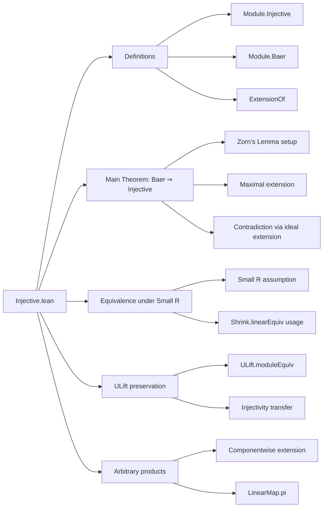

### Technical Brief: `Injective.lean`

---

#### **1. Key Definitions & Theorems**

| Name | Type / Signature | Purpose |
|------|------------------|---------|
| `Module.Injective R Q` | `Prop` | $Q$ is *injective* if every injective linear map $f : X \to Y$ allows lifting of any $g : X \to Q$ through $f$, i.e., $\exists h : Y \to Q$ s.t. $h \circ f = g$. |
| `Module.Baer R Q` | `Prop` | $Q$ satisfies *Baer’s criterion*: every $R$-linear map $I \to Q$ from an ideal $I \le R$ extends to $R \to Q$. |
| `Module.Baer.injective` | `Module.Baer R Q → Module.Injective R Q` | Main theorem: Baer’s criterion implies injectivity. |
| `Module.Baer.of_injective` | `[Small R] → Module.Injective R Q → Module.Baer R Q` | Converse: injectivity implies Baer’s criterion (requires smallness of $R$). |
| `Module.Baer.iff_injective` | `[Small R] → Module.Baer R Q ↔ Module.Injective R Q` | Equivalence under smallness. |
| `ExtensionOf i f` | `Structure` | Pairs $(N', f')$ where $M \le N' \le N$ and $f' : N' \to Q$ extends $f : M \to Q$. Used in Zorn’s lemma argument. |
| `extensionOfMax i f` | `ExtensionOf i f` | Maximal extension obtained via Zorn’s lemma (requires `Fact (Function.Injective i)`). |
| `ExtensionOfMaxAdjoin.extensionToFun` | `supExtensionOfMaxSingleton i f y → Q` | Constructs extension to $M \oplus \langle y \rangle$ using Baer extension of a constructed ideal map. |
| `Module.ulift_injective_of_injective` | `[Small R] → Module.Injective R M → Module.Injective R (ULift M)` | Injectivity preserved under `ULift`. |
| `Module.Injective.pi` | `[∀ i, Module.Injective R (M i)] → Module.Injective R (∀ i, M i)` | Arbitrary products of injective modules are injective. |

---

#### **2. Naming Conventions**

- **Prefixes**:
  - `Module.Injective.*`, `Module.Baer.*`: module-theoretic properties.
  - `ExtensionOf.*`, `ExtensionOfMaxAdjoin.*`: auxiliary constructions for Zorn’s lemma proof.
- **Suffixes**:
  - `_to_`: maps defined via construction (e.g., `idealTo`, `extendIdealTo`).
  - `_wd`: well-definedness lemmas (e.g., `extendIdealTo_wd`, `extensionToFun_wd`).
  - `_aux1`, `_aux2`: internal auxiliary lemmas (often hidden or private).
- **`of_`, `to_`**: conversion lemmas (e.g., `of_equiv`, `of_injective`).
- **`_iff_`**: equivalence statements (e.g., `iff_injective`, `injective_iff_ulift_injective`).

---

#### **3. Tactic Stack**

| Tactic | Usage Frequency | Purpose |
|--------|-----------------|---------|
| `simp_rw` | High | Simplify with rewrite rules (especially for `LinearMap`/`AddHom` coercions). |
| `rw` | Very High | Rewriting hypotheses/conclusions using equalities, definitions. |
| `congr` | High | Prove equality of functions/maps by congruence. |
| `abel` | Medium | Solve additive commutative group identities. |
| `ext` | High | Extensionality for functions, linear maps, submodules. |
| `dsimp` | Medium | Simplify definitional equalities (e.g., `LinearMap.coe_mk`). |
| `rcases`, `obtain`, `cases` | High | Decompose existential/universal hypotheses. |
| `exact`, `refine`, `apply` | High | Direct proof steps. |
| `zorn_le_nonempty` | Medium | Zorn’s lemma application for maximal extensions. |
| `aesop` | Low | Not used in this file (proofs are highly structured, not automated). |

---

#### **4. Proof Logic**

The core proof of `Module.Baer.injective` follows a **Zorn’s Lemma** strategy:

1. **Setup**: Fix injective $i : M \hookrightarrow N$ and $f : M \to Q$. Want $h : N \to Q$ extending $f$.
2. **Extension poset**: Define `ExtensionOf i f` as pairs $(N', f')$ with $M \le N' \le N$, $f'|_{N'}$ extending $f$.
3. **Chain condition**: Show every chain has an upper bound (via `sSup` of linear maps).
4. **Maximal element**: Apply Zorn’s lemma → get `extensionOfMax`.
5. **Maximality ⇒ domain = ⊤**:
   - Assume $y \notin \text{domain}(\text{extensionOfMax})$.
   - Construct a strictly larger extension `extensionOfMaxAdjoin i f h y`, contradicting maximality.
   - Key step: define ideal $I = \{ r \mid r \cdot y \in \text{domain} \}$, map $r \mapsto f'(r \cdot y)$, extend via Baer.
6. **Conclusion**: Domain is all of $N$, so extension exists.

Other proofs:
- `of_injective`: Reduce to Baer via `Shrink.linearEquiv` (uses `Small R`).
- `pi`: Use `choose` to pick extensions componentwise, then glue via `LinearMap.pi`.
- `ulift`: Transfer injectivity via `ULift.moduleEquiv`.

---

#### **5. Imports**

| Module | Purpose |
|--------|---------|
| `Mathlib.Algebra.Module.Shrink` | `Shrink.linearEquiv`, used to reduce universe levels. |
| `Mathlib.LinearAlgebra.LinearPMap` | Partial linear maps, domain/submodule operations, `le`, `sSup`. |
| `Mathlib.LinearAlgebra.Pi` | Product modules, projections, `LinearMap.pi`. |
| `Mathlib.Logic.Small.Basic` | `Small` typeclass for universe management. |
| `Mathlib.RingTheory.Ideal.Defs` | Ideals, `Submodule.span`, `comap`, etc. |

---

#### **6. Mermaid Diagrams**

##### **Dependency Graph (Core Theory)**

```mermaid
graph TD
  A[Ring R] --> B[Module R Q]
  B --> C[Module.Injective R Q]
  B --> D[Module.Baer R Q]
  D -->|Baer ⇒ Injective| C
  C -->|Injective ⇒ Baer| D
  D -->|Extension via Zorn| E[ExtensionOf i f]
  E -->|Maximal element| F[extensionOfMax]
  F -->|Contradiction| D
  C -->|Product| G[∀ i, Module.Injective R (M i)]
  C -->|ULift| H[ULift M]
```

##### **File Overview**



--- 

This file formalizes a foundational result in homological algebra: **Baer’s criterion**, establishing a practical test for injectivity of modules. The proof is highly structured, relying on Zorn’s lemma and careful manipulation of partial linear maps and submodules.
