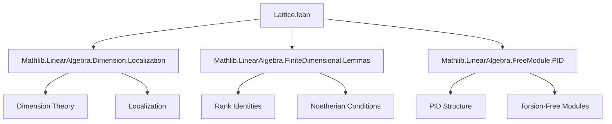

### Technical Brief: `Lattice.lean`

---

#### **1. Key Definitions & Theorems**

| Name | Type / Signature | Purpose |
|------|------------------|---------|
| `Submodule.IsLattice` | `class IsLattice (A : outParam Type*) [...] (M : Submodule R V) : Prop` | Defines when an $ R $-submodule $ M \subseteq V $ is a *lattice*: finitely generated over $ R $ and spans $ V $ over $ A $ (typically the fraction field of $ R $). |
| `IsLattice.fg` | `M.FG` | Hypothesis that $ M $ is finitely generated over $ R $. |
| `IsLattice.span_eq_top` | `Submodule.span A (M : Set V) = ⊤` | Hypothesis that the $ A $-span of $ M $ is all of $ V $. |
| `IsLattice.finite` | `instance [IsLattice A M] : Module.Finite R M` | Any lattice is finite as an $ R $-module. |
| `IsLattice.smul` | `instance [IsLattice A M] (a : Aˣ) : IsLattice A (a • M)` | Action of units in $ A $ preserves lattices (homothety invariance). |
| `IsLattice.of_le_of_isLattice_of_fg` | `{M N : Submodule R V} → M ≤ N → IsLattice A M → N.FG → IsLattice A N` | If $ M \subseteq N $, $ M $ is a lattice, and $ N $ is fg, then $ N $ is a lattice. |
| `IsLattice.sup` | `instance [IsLattice A M] [IsLattice A N] : IsLattice A (M ⊔ N)` | Supremum (sum) of two lattices is a lattice. |
| `Module.Basis.extendOfIsLattice` | `{b : Basis κ R M} → Basis κ K V` | Extends an $ R $-basis of a lattice $ M $ to a $ K $-basis of $ V $. |
| `Module.Basis.extendOfIsLattice_apply` | `b.extendOfIsLattice K k = (b k).val` | Action of extension on basis elements. |
| `IsLattice.of_rank_le` | `{M : Submodule R V} → M.FG → rank_K V ≤ rank_R M → IsLattice K M` | Criterion for lattices via rank inequality. |
| `IsLattice.free` | `instance [IsTorsionFree R K] [IsLattice K M] : Module.Free R M` | Over a PID with torsion-free extension, lattices are free. |
| `IsLattice.rank'` | `rank_R M = rank_K V` | Rank of a lattice equals dimension of ambient space over $ K $. |
| `IsLattice.rank_of_pi` | `rank_R M = Fintype.card ι` | For $ V = ι → K $, rank of lattice equals cardinality of indexing type. |
| `IsLattice.inf` | `instance [IsLattice K M] [IsLattice K N] : IsLattice K (M ⊓ N)` | Intersection of two lattices is a lattice (under finite-dimensionality and fraction ring assumptions). |

---

#### **2. Naming Conventions**

- **Prefixes**:
  - `isLattice_`: for lemmas about the `IsLattice` predicate.
  - `extendOfIsLattice`: for constructions extending bases from lattices.
  - `of_`: for introduction rules (e.g., `of_rank_le`, `of_le_of_isLattice_of_fg`).
- **Suffixes**:
  - `_apply`: for simplification lemmas about definitions (e.g., `extendOfIsLattice_apply`).
  - `_rank`: for rank-related lemmas (e.g., `rank'`, `rank_of_pi`, `finrank_of_pi`).
- **General**:
  - `smul`, `inf`, `sup`: standard lattice-theoretic operations.
  - `fg`, `span_eq_top`: components of the `IsLattice` class.

---

#### **3. Tactic Stack**

Frequently used tactics in this file:

| Tactic | Usage |
|--------|-------|
| `rw` | Rewriting definitions (`fg`, `span_eq_top`, `rank'`, etc.). |
| `simp` / `simp_rw` | Simplifying module actions, spans, and basis definitions. |
| `exact` / `infer_instance` | Proving instances (e.g., `fg`, `finite`, `free`). |
| `obtain ⟨s, rfl⟩` | Eliminating existential hypotheses (e.g., finite generation). |
| `rw [← ...]` | Switching between module-theoretic and set-theoretic formulations (e.g., spans, images). |
| `ext x` | Extensionality for submodules. |
| `have h := ...` | Intermediate lemmas (e.g., rank identities). |
| `apply Submodule.span_range_eq_top_of_injective_of_rank_le` | Key lemma for proving spanning. |
| `rw [Cardinal.eq_of_add_eq_add_left ...]` | Cardinal arithmetic tricks for rank equalities. |
| `rw [← Module.finrank_eq_rank]` | Connecting rank and finrank. |

---

#### **4. Proof Logic**

The logical flow in proofs follows a pattern:

1. **Introduction via rank or finite generation**:
   - Use `of_rank_le` or `of_le_of_isLattice_of_fg` to prove `IsLattice`.
2. **Basis extension**:
   - Prove linear independence over $ K $ using `LinearIndependent.iff_fractionRing`.
   - Prove spanning via `span_range_eq_top_of_injective_of_rank_le`.
3. **Rank computations**:
   - Use `rank_eq_card_basis` and `rank_eq_card_basis (b.extendOfIsLattice K)`.
   - For products $ ι → K $, simplify using `rank_of_pi`.
4. **Intersection**:
   - Use `rank_sup_add_rank_inf_eq` to relate ranks of sum and intersection.
   - Apply cardinal arithmetic to deduce equality of ranks.

Induction is not used here; proofs rely on module-theoretic properties (e.g., torsion-freeness, PID structure), rank inequalities, and basis extension.

---

#### **5. Imports**

| Import | Purpose |
|--------|---------|
| `Mathlib.LinearAlgebra.Dimension.Localization` | Localization, rank, dimension theory. |
| `Mathlib.LinearAlgebra.FiniteDimensional.Lemmas` | Finite-dimensionality lemmas, e.g., `rank_sup_add_rank_inf_eq`. |
| `Mathlib.LinearAlgebra.FreeModule.PID` | Free modules over PIDs, torsion-freeness, basis existence. |

---

#### **6. Theory Context & Applications**

- **Setting**: $ R $ is a commutative ring, often a PID or DVR; $ K $ is its fraction field; $ V $ is a $ K $-vector space with $ R $-module structure.
- **Main objects**: $ R $-submodules $ M \subseteq V $ that are lattices.
- **Applications**:
  - Homothety equivalence classes of lattices in $ ι → K $.
  - Construction of the **Bruhat–Tits tree** for $ \mathrm{GL}_2(K) $ when $ R $ is a DVR and $ ι = \text{Fin } 2 $.
  - Analogy with $ \mathbb{Z} $-lattices (`IsZLattice`) in complex tori.

---

#### **7. Mermaid Diagrams**

##### **Dependency Graph (Module-Level)**



##### **Overview of Theory Flow**

```mermaid
flowchart LR
  R[CommRing R] --> K[Fraction Field K]
  K --> V[Vector Space V]
  R -->|algebra| K
  K -->|scalar| V
  R -->|module| V

  M[Submodule R V] -->|IsLattice| fg[M.FG]
  M -->|IsLattice| span[span_K M = ⊤]

  M -->|basis b| bR[Basis κ R M]
  bR -->|extend| bK[Basis κ K V]

  M1[M] -->|sup| M1⊔M2
  M2[N] -->|sup| M1⊔M2
  M1 -->|inf| M1⊓M2
  M2 -->|inf| M1⊓M2

  A[Aˣ] -->|smul| M
  A -->|homothety| Eq[Equivalence Classes]
```

---

#### **8. Summary**

This file formalizes the theory of **lattices over commutative rings**, especially in the context of **fraction fields and PIDs**. It establishes foundational properties (freeness, rank equality, closure under sup/inf), constructs basis extensions, and sets up the framework for applications in **Bruhat–Tits theory** and **arithmetic geometry**. The formalization is clean, modular, and leverages Lean’s typeclass inference for algebraic structures.
