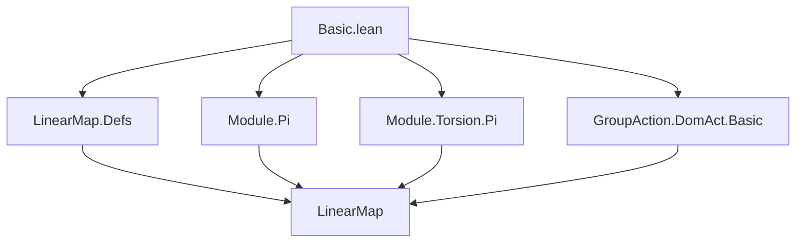

**Technical Brief: `Basic.lean` — Further Results on (Semi)linear Maps**

---

### 1. KEY DEFINITIONS & THEOREMS

| Name | Type / Signature | Purpose |
|------|------------------|---------|
| `ltoFun` | `(M →ₗ[R] N) →ₗ[A] (M → N)` | Coerces an $R$-linear map to a function, when $N$ has commuting $R$- and $A$-module structures. |
| `DomMulAct.smul_linearMap_apply` | `(a : S'ᵈᵐᵃ) (f : M →ₛₗ[σ₁₂] M') (x : M) ↦ (a • f) x = f (DomMulAct.mk.symm a • x)` | Describes the action of the opposite of a distributive multiplicative action on a semilinear map. |
| `DomMulAct.mk_smul_linearMap_apply` | `(a : S') (f : M →ₛₗ[σ₁₂] M') (x : M) ↦ (DomMulAct.mk a • f) x = f (a • x)` | Special case of the above for the original action (not opposite). |
| `DomMulAct.coe_smul_linearMap` | `(a : S'ᵈᵐᵃ) (f : M →ₛₗ[σ₁₂] M') ↦ (a • f : M →ₛₗ[σ₁₂] M') = a • (f : M → M')` | Shows that the semilinear structure is compatible with coercion to functions. |
| `mulLeft_mul` | `[SMulCommClass R A A] ⇒ mulLeft R (a * b) = (mulLeft R a).comp (mulLeft R b)` | `mulLeft` preserves multiplication (contravariantly in the second argument). |
| `mulRight_mul` | `[IsScalarTower R A A] ⇒ mulRight R (a * b) = (mulRight R b).comp (mulRight R a)` | `mulRight` reverses multiplication (covariant in the first argument). |
| `mulLeft_inj`, `mulRight_inj` | `[SMulCommClass R A A] ⇒ mulLeft R a = mulLeft R b ↔ a = b` | Injectivity of `mulLeft`/`mulRight` as linear maps. |
| `mulLeft_one`, `mulRight_one` | `[SMulCommClass R A A] ⇒ mulLeft R 1 = LinearMap.id`, `[IsScalarTower R A A] ⇒ mulRight R 1 = LinearMap.id` | Units act as identity maps. |
| `mulLeft_eq_zero_iff`, `mulRight_eq_zero_iff` | `[SMulCommClass R A A] ⇒ mulLeft R a = 0 ↔ a = 0` | Characterization of zero multiplication maps. |
| `Module.IsTorsionFree (M →ₛₗ[σ₁₂] M')` | `[Module.IsTorsionFree S M'] ⇒ Module.IsTorsionFree S (M →ₛₗ[σ₁₂] M')` | Torsion-freeness is preserved under semilinear function spaces. |
| `Module Sᵈᵐᵃ (M →ₛₗ[σ₁₂] M')` | `[Module S M] [Module S M'] [SMulCommClass R S M] ⇒ Module Sᵈᵐᵃ (M →ₛₗ[σ₁₂] M')` | Semilinear maps carry a module structure over the opposite of the scalar module. |

---

### 2. NAMING CONVENTIONS

- **Prefixes**:
  - `ltoFun`: Linear-to-function coercion.
  - `mulLeft`, `mulRight`: Left/right multiplication maps.
  - `DomMulAct.`: Domain of a multiplicative action (opposite action).
- **Suffixes**:
  - `_apply`: Application of an operation to an argument.
  - `_inj`: Injectivity lemmas.
  - `_eq_zero_iff`: Characterization of zero elements.
  - `_mul`: Behavior under multiplication.
- **Opposite constructions**:
  - `S'ᵈᵐᵃ`: Opposite of a `DistribMulAction` (denoted `ᵐᵒᵖ` in some contexts).
  - `Sᵈᵐᵃ`: Opposite module action.

---

### 3. TACTIC STACK

- `ext`: Extensionality for functions/linear maps.
- `simp only`, `simp_rw`: Simplification with precise control over rewrites.
- `congr_arg`: Congruence for function application.
- `rfl`: Reflexivity (used heavily for definitional equalities).
- `by` + `simp only [...]`, `by simp_rw [...]`, `by ext`, `by rfl`: Common proof patterns.
- `by simpa using ...`: Simplify using a hypothesis.

---

### 4. PROOF LOGIC

- **Structure**: Most proofs follow a *pointwise* strategy:
  - Use `ext` to reduce to equality on all inputs.
  - Apply `simp` or `simp_rw` to unfold definitions (`mulLeft_apply`, `DomMulAct.smul_linearMap_apply`, etc.).
  - Use algebraic identities (`mul_assoc`, `smul_comm`, `map_add`, `map_smulₛₗ`) to match terms.
- **Induction**: Not used here — all proofs are *direct* and *computational*.
- **Case analysis**: Minimal; mostly rely on `rfl` or `congr_arg`.
- **Module/torsion arguments**: Use `coe_injective.moduleIsTorsionFree` to lift torsion-freeness along injective coercion.

---

### 5. IMPORTS

| Import | Purpose |
|--------|---------|
| `Mathlib.Algebra.Module.LinearMap.Defs` | Core definitions of linear maps. |
| `Mathlib.Algebra.Module.Pi` | Product/module structures on function spaces. |
| `Mathlib.Algebra.Module.Torsion.Pi` | Torsion-freeness in product/module contexts. |
| `Mathlib.GroupTheory.GroupAction.DomAct.Basic` | Distributive multiplicative actions and their opposites (`DistribMulAction`, `DomMulAct`). |

---

### 8. MERMAID DIAGRAMS

#### Dependency Graph (Module-Level)



#### Overview of `Basic.lean`

```mermaid
flowchart LR
  A[Semiring R, R'] --> B[AddCommMonoid M, M']
  B --> C[Module R M, Module R' M']
  C --> D[Semilinear Maps M →ₛₗ[σ₁₂] M']
  D --> E[SMul Actions on Maps]
  D --> F[Module Structures on Maps]
  D --> G[mulLeft/mulRight Maps]
  E --> H[SMulCommClass, DistribMulAction]
  F --> I[TorsionFree, Module Sᵈᵐᵃ]
  G --> J[Algebraic Properties: inj, mul, one, zero]
```

#### Theory Context

- **Core domain**: Module theory over semirings, with emphasis on:
  - Semilinear maps (`→ₛₗ[σ₁₂]`)
  - Opposite actions (`ᵈᵐᵃ`)
  - Multiplication-induced linear maps (`mulLeft`, `mulRight`)
- **Key abstraction**: Viewing semilinear maps as modules over opposite actions, enabling transfer of module-theoretic properties (e.g., torsion-freeness).
- **Applications**: Likely used in:
  - Representation theory (group actions on modules)
  - Galois theory (semilinear automorphisms)
  - Tensor/hom constructions in noncommutative settings.

--- 

Let me know if you'd like a formalized dependency graph in Lean or a summary of how this file fits into the broader `Mathlib` module hierarchy.
