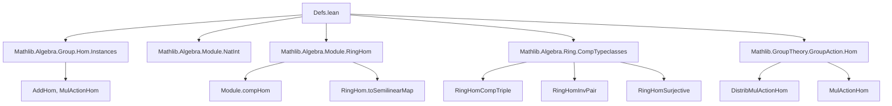
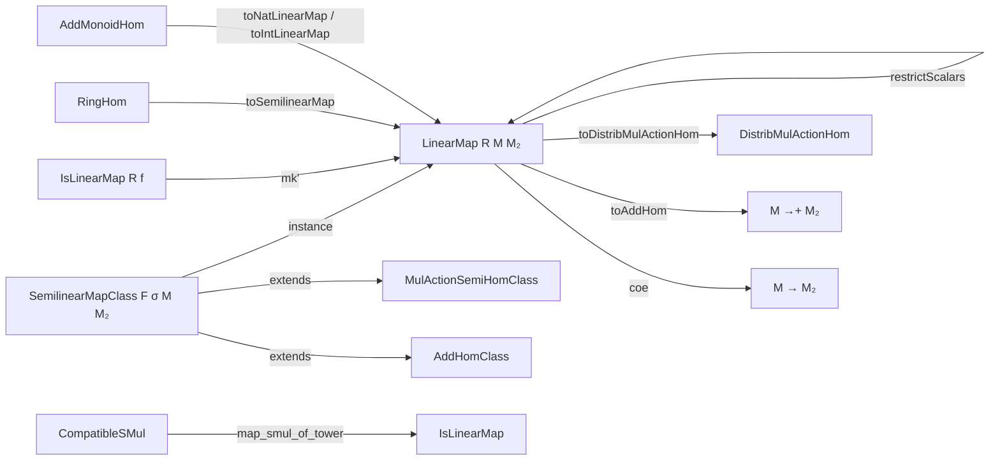

### Technical Brief: `Defs.lean` — Semilinear and Linear Maps in Lean 4

---

#### **1. Key Definitions & Theorems**

| Name | Type / Structure | Purpose |
|------|------------------|---------|
| `IsLinearMap R f` | `Prop` | Predicate asserting $f : M \to M_2$ satisfies $f(x+y)=f(x)+f(y)$ and $f(c\cdot x)=c\cdot f(x)$. Unbundled version; discouraged in favor of `LinearMap`. |
| `LinearMap σ M M₂` (notation: `M →ₛₗ[σ] M₂`) | `Structure` | Bundled $\sigma$-semilinear maps: $f(c\cdot x) = (\sigma\,c)\cdot f(x)$, where $\sigma : R \to S$ is a ring homomorphism. Extends `AddHom` and `MulActionHom`. |
| `M →ₗ[R] M₂` | Notation | Special case of `→ₛₗ` with $\sigma = \mathrm{id}_R$. Represents $R$-linear maps. |
| `M →ₗ⋆[R] M₂` | Notation | Star-linear maps (not defined in this file, but mentioned in docstring). |
| `SemilinearMapClass F σ M M₂` | `Class` | Typeclass asserting $F$ is a type of bundled $\sigma$-semilinear maps $M \to M_2$. Generalizes `LinearMapClass`. |
| `LinearMapClass F R M M₂` | Abbreviation | Special case of `SemilinearMapClass` for $\sigma = \mathrm{id}_R$. |
| `LinearMap.comp` | `def` | Composition of semilinear maps: requires `RingHomCompTriple σ₁₂ σ₂₃ σ₁₃`. |
| `LinearMap.id`, `LinearMap.id'` | `def` | Identity maps: `id` is $R$-linear; `id'` is $\sigma$-semilinear when $\sigma = \mathrm{id}$. |
| `LinearMap.toAddMonoidHom` | `def` | Forgets the scalar action, yielding an additive monoid homomorphism. |
| `LinearMap.restrictScalars` | `def` | If $M, M_2$ are both $R$- and $S$-modules with compatible actions (`CompatibleSMul`), then any $S$-linear map is $R$-linear. |
| `LinearMap.CompatibleSMul` | `Class` | Allows moving $R$-scalar multiplication through $S$-linear maps: $f(c \cdot x) = c \cdot f(x)$ for $c \in R$. |
| `RingHom.toSemilinearMap` | `def` | A ring homomorphism $f : R \to S$ is $f$-semilinear as a map $R \to S$. |
| `AddMonoidHom.toNatLinearMap`, `toIntLinearMap` | `def` | Embed additive monoid homs into $\mathbb{N}$- or $\mathbb{Z}$-linear maps. |
| `LinearMap.inverse` | `def` | If $g$ is a two-sided inverse of $f$, then $g$ is linear (with respect to a suitable $\sigma'$). |
| `LinearMap.toDistribMulActionHom` | `def` | Forgets `AddHom` structure to `DistribMulActionHom`. |

**Theorems (selected):**
- `map_add`, `map_zero`, `map_smulₛₗ`, `map_smul`: Basic properties of `LinearMap`.
- `ext`, `ext_ring`: Extensionality lemmas (e.g., maps from $R$ are determined by $f(1)$).
- `comp_assoc`, `comp_id`, `id_comp`: Composition laws.
- `cancel_left`, `cancel_right`: Cancellation under injectivity/surjectivity.
- `injective_of_comp_eq_id`, `surjective_of_comp_eq_id`: Invertibility implies injectivity/surjectivity.
- `map_neg`, `map_sub`: For additive groups.
- `map_smul_of_tower`, `isLinearMap_of_compatibleSMul`: Compatibility with scalar towers.

---

#### **2. Naming Conventions**

| Pattern | Meaning | Examples |
|--------|---------|----------|
| `map_*` | Action of a linear map on an operation | `map_add`, `map_zero`, `map_smulₛₗ`, `map_neg`, `map_sub` |
| `coe_*` | Coercion lemmas (to functions, additive homs, etc.) | `coe_comp`, `coe_toAddHom`, `coe_restrictScalars`, `coe_smul` |
| `_*_apply` | Application of bundled map | `zero_apply`, `add_apply`, `smul_apply`, `neg_apply` |
| `_*_inj*` | Injectivity/surjectivity lemmas for map constructions | `restrictScalars_injective`, `toAddMonoidHom_injective`, `comp_injective_left`, `comp_surjective_right` |
| `_*_of_*` | Constructions from unbundled or related structures | `isLinearMap_of_compatibleSMul`, `mk'` (from `IsLinearMap`), `toNatLinearMap`, `toIntLinearMap` |
| `_*_class` | Typeclass instances | `semilinearMapClass`, `LinearMapClass`, `distribMulActionSemiHomClass` |
| `inst*` | Instance declarations | `instFunLike`, `instAddMonoidHomClass`, `instCoeToLinearMap` |
| `*Class` suffix | Typeclasses for classes of maps | `SemilinearMapClass`, `LinearMapClass`, `AddMonoidHomClass`, `DistribMulActionHomClass` |

---

#### **3. Tactic Stack**

Frequent tactics used in proofs:
- `simp` / `simp only` — Simplification of `map_*`, `coe_*`, and `smul_*` lemmas.
- `rw` — Rewriting using `map_*`, `coe_*`, `ext`, `comp_apply`.
- `ext` — Extensionality (especially `LinearMap.ext`, `ext_ring`).
- `congr` — Congruence for definitional equality.
- `induction` — For $\mathbb{N}$, $\mathbb{Z}$-linearity (e.g., `map_zsmul`).
- `dsimp`, `subst`, `have :=`, `exact` — Structural reasoning, especially with `RingHomCompTriple`, `RingHomInvPair`.
- `aesop` — Not used in this file (lean4-specific automation not yet applied here).
- `ring` — Not used (no polynomial/ring simplification needed beyond `smul` algebra).

---

#### **4. Proof Logic**

**Typical proof structure:**
1. **Unbundling**: Work with `f : M → M₂` via coercion (`⇑f`).
2. **Extensionality**: Prove equality by showing $f(x) = g(x)$ for all $x$ (`ext`).
3. **Case analysis on structure**: For maps from $R$, use `ext_ring` (determined by $f(1)$).
4. **Use typeclass instances**: `RingHomCompTriple`, `RingHomInvPair`, `CompatibleSMul`, `IsScalarTower`.
5. **Induction on scalars**: For $\mathbb{N}$, $\mathbb{Z}$, $\mathbb{Z}^\times$ actions.
6. **Cancel/transport along inverses**: Use `comp_eq_id` to deduce injectivity/surjectivity.
7. **Simplify using `@[simp]` lemmas**: Especially `map_*`, `coe_*`, `comp_*`.

**Example flow (proof of `map_smulₛₗ`):**
```lean
map_smulₛₗ r x :=
  map_smulₛₗ f r x  -- from `MulActionSemiHomClass`
```
This relies on the `SemilinearMapClass` instance for `LinearMap`.

---

#### **5. Imports**

Primary dependencies (define scope and theory):
- `Mathlib.Algebra.Group.Hom.Instances`
- `Mathlib.Algebra.Module.NatInt`
- `Mathlib.Algebra.Module.RingHom`
- `Mathlib.Algebra.Ring.CompTypeclasses` — **critical** for composition of semilinear maps (`RingHomCompTriple`, etc.)
- `Mathlib.GroupTheory.GroupAction.Hom` — for `DistribMulActionHom`, `MulActionHom`

These imports provide:
- Homomorphism structures (`AddHom`, `MulActionHom`, `DistribMulActionHom`)
- Module theory (scalar multiplication, compatibility)
- Ring homomorphism composition lemmas
- Action homomorphism class hierarchy

---

#### **6. Mermaid Diagrams**

##### **Dependency Graph (Module Scope)**



##### **Overview of Theory Flow**



---

#### **7. Summary**

This file formalizes the foundational theory of **semilinear and linear maps** between modules over semirings/rings, with careful attention to:
- Bundled vs. unbundled representations (`LinearMap` vs. `IsLinearMap`)
- Compatibility of scalar actions via `CompatibleSMul`, `IsScalarTower`
- Composition via `RingHomCompTriple`
- Structural instances (`AddCommMonoid`, `Module`, `SMul`) on hom-spaces

It serves as the core module for all subsequent linear algebra in Mathlib, enabling:
- Hom-spaces with pointwise algebraic structure
- Change-of-scalars (`restrictScalars`)
- Embedding of ring homomorphisms and additive homomorphisms
- Generalization of linear algebra to noncommutative and non-unital settings (semirings)

The design prioritizes **typeclass inference** and **coercion smoothness**, using `FunLike`, `DistribMulActionHom`, and `MulActionHom` as intermediate abstractions.

--- 

*End of Technical Brief.*
