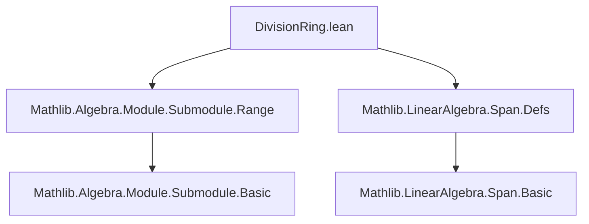

**Technical Brief: `DivisionRing.lean` (Linear Functionals on Division Semirings)**

---

### 1. Key Definitions & Theorems

| Name | Type | Purpose |
|------|------|---------|
| `LinearMap.surjective_iff_ne_zero` | `{f : M →ₗ[R] R} → (Function.Surjective f ↔ f ≠ 0)` | Characterizes surjectivity of linear functionals over division semirings: a linear functional is surjective iff it is nonzero. |
| `LinearMap.range_smulRight_apply_of_surjective` | `{f : M →ₗ[R] R} → Function.Surjective f → (x : M₁) → range (f.smulRight x) = Submodule.span R {x}` | Computes the range of `f.smulRight x` when `f` is surjective: it is the cyclic submodule generated by `x`. |
| `LinearMap.range_smulRight_apply` | `{f : M →ₗ[R] R} → f ≠ 0 → (x : M₁) → range (f.smulRight x) = Submodule.span R {x}` | Same as above, but uses `f ≠ 0` and deduces surjectivity via `surjective_iff_ne_zero`. |
| `LinearMap.surjective` | `alias` | Convenience alias: `f.surjective hf` rewrites `hf : f ≠ 0` to `Function.Surjective f`. |

---

### 2. Naming Conventions

- **Prefixes**:
  - `range_`: for theorems about the range of a linear map.
  - `surjective_iff_`: for biconditional characterizations of surjectivity.
- **Suffixes**:
  - `_apply`: for theorems that compute the image/range *applied* to a specific element or construction (`smulRight x`).
  - `_of_surjective`: for lemmas assuming surjectivity explicitly (used as intermediate step).
- **Aliases**:
  - `⟨_, surjective⟩`: provides a named projection `f.surjective` for `f ≠ 0`.

---

### 3. Tactic Stack

- `refine`: to construct proofs with holes (`?_`).
- `obtain ⟨y, hy⟩ : ∃ y, f y ≠ 0`: existential destructuring via `simpa`.
- `simp [hy]`, `simp_rw [...]`: simplification using definitions (`smulRight_apply`, `mem_range`, `mem_span_singleton`).
- `exact ⟨..., by ...⟩`: constructing witnesses for existential goals.
- `Submodule.ext`: extensionality for submodules (equality via membership equivalence).
- `simpa [Ne, LinearMap.ext_iff]`: to derive existence of a nonzero image from `f ≠ 0`.

---

### 4. Proof Logic

- **Main proof pattern**:
  1. **Biconditional split** (`↔`):
     - `→`: Show `f` surjective ⇒ `f ≠ 0` (trivial: zero map has range `{0}`).
     - `←`: Assume `f ≠ 0`, then:
       - Use `LinearMap.ext_iff` + `simpa` to get `∃ y, f y ≠ 0`.
       - For arbitrary `z ∈ R`, construct preimage `(z * (f y)⁻¹) • y`, using division (invertibility of `f y`).
  2. **Range computation**:
     - Use `Submodule.ext` to reduce to membership equivalence.
     - Unfold `mem_range`, `smulRight_apply`, `mem_span_singleton`.
     - Use surjectivity (or `f ≠ 0` + alias) to lift arbitrary `w` to `f y = w`.
     - Construct witness equivalences in both directions.

- **Induction**: Not used.
- **Case analysis**: Implicit via `obtain ⟨y, hy⟩` and `obtain ⟨y, rfl⟩`.

---

### 5. Imports

- `Mathlib.Algebra.Module.Submodule.Range`: for `range` and submodule operations.
- `Mathlib.LinearAlgebra.Span.Defs`: for `Submodule.span`, singleton span definitions.

> **Note**: Despite the module name `DivisionRing.lean`, the file works over `DivisionSemiring` (not necessarily rings), and uses `Semiring` where inverses aren’t needed (e.g., for `range_smulRight_apply_of_surjective`).

---

### 6. Mermaid Diagrams

#### Dependency Graph (File-Level)



#### Theoretical Flow (Conceptual)

```mermaid
graph LR
  A[DivisionSemiring R] --> B[Module R M]
  B --> C[LinearMap R M R]
  C --> D[f ≠ 0]
  D --> E[Function.Surjective f] 
  E --> F[range f = R]
  C --> G[f.smulRight x]
  E --> H[range (f.smulRight x) = span{x}]
```

#### Overview of File Structure

```mermaid
flowchart LR
  A[Start: variable declarations] --> B[Theorem: surjective_iff_ne_zero]
  B --> C[Alias: surjective]
  B --> D[Proof: → (zero map not surj), ← (construct preimage)]
  C --> E[Theorem: range_smulRight_apply_of_surjective]
  E --> F[Theorem: range_smulRight_apply (via alias)]
  F --> G[Proof: reduce to surjective case, use span singleton]
```

--- 

This file is a concise but foundational piece in the theory of linear functionals over division semirings, emphasizing the special behavior of nonzero linear functionals (surjectivity, cyclic ranges under `smulRight`).
