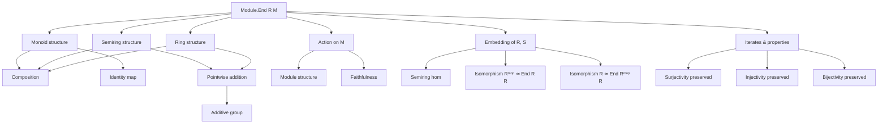
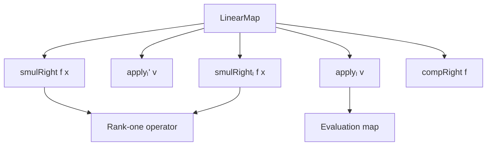

### Technical Brief: `End.lean` — Endomorphisms of a Module in Lean 4

---

#### **1. Key Definitions & Theorems**

| Name | Type / Signature | Purpose |
|------|------------------|---------|
| `Module.End R M` | `M →ₗ[R] M` | Type of $R$-linear endomorphisms of an $R$-module $M$. |
| `one_eq_id` | `(1 : Module.End R M) = .id` | Identifies multiplicative identity with identity map. |
| `mul_eq_comp` | `f * g = f.comp g` | Multiplication in `Module.End` is composition. |
| `instMonoid` | `Monoid (Module.End R M)` | Endomorphisms form a monoid under composition. |
| `instSemiring` | `Semiring (Module.End R M)` | Endomorphisms form a semiring: addition is pointwise, multiplication is composition. |
| `instRing` | `Ring (Module.End R N₁)` | If $M$ is an abelian group, `Module.End` is a ring. |
| `natCast_apply` | `(↑n : Module.End R M) m = n • m` | Natural number coercion acts as scalar multiplication. |
| `intCast_apply` | `(z : Module.End R N₁) m = z • m` | Integer coercion acts as scalar multiplication. |
| `applyModule` | `Module (Module.End R M) M` | Tautological action of endomorphisms on the module. |
| `DistribSMul.toLinearMap` | `s ↦ (x ↦ s • x)` | Monoid element defines linear map. |
| `DistribMulAction.toModuleEnd` | `s ↦ (x ↦ s • x)` as monoid homomorphism | Embeds monoid into endomorphism monoid. |
| `Module.toModuleEnd` | `s ↦ (x ↦ s • x)` as semiring homomorphism | Embeds semiring into endomorphism ring. |
| `RingEquiv.moduleEndSelf` | `Rᵐᵒᵖ ≃+* Module.End R R` | Right multiplication gives canonical isomorphism. |
| `RingEquiv.moduleEndSelfOp` | `R ≃+* Module.End Rᵐᵒᵖ R` | Left multiplication gives canonical isomorphism. |
| `smulLeft` | `α ∈ center(R) ↦ (x ↦ α • x)` | Central scalars act as endomorphisms. |
| `smulRight` | `f : M₁ →ₗ[R] S, x ↦ (b ↦ f b • x)` | Right smul construction for linear maps. |
| `applyₗ` | `v ↦ (f ↦ f v)` | Evaluation map as linear map. |
| `smulRightₗ` | `(f, x) ↦ (y ↦ f y • x)` | Rank-one operator: linear in both arguments. |
| `iterate_surjective/injective/bijective` | `fⁿ` preserves properties of `f` | Powers of surjective/injective/bijective maps retain those properties. |
| `commute_id_left/right` | `Commute id f` | Identity commutes with all endomorphisms. |

---

#### **2. Naming Conventions**

- **Prefixes**:
  - `coe_`: coercion to underlying function (e.g., `coe_one`, `coe_mul`, `coe_pow`)
  - `smulLeft`, `smulRight`, `smulRightₗ`: constructions involving scalar multiplication
  - `applyₗ`, `applyₗ'`: evaluation maps as linear maps
  - `iterate_`: powers of endomorphisms (e.g., `iterate_surjective`, `iterate_succ`)
  - `ofNat`, `natCast`, `intCast`: coercion from ℕ/ℤ

- **Suffixes**:
  - `_apply`: action on elements (e.g., `one_apply`, `mul_apply`, `natCast_apply`)
  - `_def`: definitional equalities (e.g., `natCast_def`, `intCast_def`)
  - `_eq`: equality lemmas (e.g., `one_eq_id`, `mul_eq_comp`)
  - `_left`, `_right`: directional variants (e.g., `smulLeft`, `smulRight`, `commute_id_left/right`)

---

#### **3. Tactic Stack**

Frequently used tactics in proofs:

| Tactic | Usage |
|--------|-------|
| `rfl` | Definitional equalities (e.g., `mul_eq_comp`, `coe_mul`) |
| `simp` | Simplification using `@[simp]` lemmas (e.g., `one_apply`, `mul_apply`, `coe_pow`) |
| `ext` | Extensionality for functions/maps (e.g., `LinearMap.ext`) |
| `rw` | Rewriting using equalities (e.g., `rw [pow_succ', mul_eq_comp, ih]`) |
| `induction` | Structural induction on `ℕ` (e.g., `induction k with | zero => ... | succ k ih => ...`) |
| `aesop` / `linarith` | Not explicitly used here, but `lia` appears in `injective_of_iterate_injective` |
| `exact`, `refine`, `apply` | Proof construction (e.g., `exact (iterate_surjective h n).comp h`) |
| `congr_fun`, `congr_arg` | Equality of functions/expressions |
| `ring` | Not used — arithmetic handled via `smul` lemmas and `natCast`/`intCast` |

---

#### **4. Proof Logic**

- **Structure**: Modular, with sections grouped by theory:
  - Monoid/ring structure on `Module.End`
  - Action of `Module.End` on $M$
  - Embedding of scalars (monoids/semirings) into endomorphisms
  - Linear map constructions (`smulRight`, `applyₗ`, `smulRightₗ`)
- **Common proof patterns**:
  - **Extensionality**: Prove equality of linear maps by evaluating at arbitrary points (`ext` + `simp`).
  - **Induction**: For properties of powers of endomorphisms (`iterate_*` lemmas).
  - **Composition-based reasoning**: Leverage `comp`, `comp_add`, `comp_smul`, etc.
  - **Definitional unfolding**: Many proofs are one-liners (`rfl`, `simp`) due to `@[simps]` attributes.
- **Key logical flow**:
  1. Define operations (`one`, `mul`) and prove basic properties (`one_eq_id`, `mul_eq_comp`).
  2. Lift to algebraic structures (`Monoid`, `Semiring`, `Ring`) via `instance`.
  3. Define actions (`applyModule`) and prove compatibility (`smul_add`, `add_smul`, etc.).
  4. Embed external structures (`DistribSMul`, `DistribMulAction`, `Module`) via canonical maps.
  5. Prove structural theorems (e.g., `moduleEndSelf` isomorphism) using `ext` and ring properties.

---

#### **5. Imports**

| Import | Purpose |
|--------|---------|
| `Mathlib.Algebra.Group.Center` | For `Set.center R`, used in `smulLeft`. |
| `Mathlib.Algebra.Module.Equiv.Opposite` | For `MulOpposite`, used in `moduleEndSelf`. |
| `Mathlib.Algebra.Module.Torsion.Free` | For `Module.IsTorsionFree`, used in `smulRight_apply_eq_zero_iff`. |

---

#### **6. Mermaid Diagrams**

##### **Dependency Graph (Top-Level)**

```mermaid
graph TD
  A[End.lean] --> B[Mathlib.Algebra.Group.Center]
  A --> C[Mathlib.Algebra.Module.Equiv.Opposite]
  A --> D[Mathlib.Algebra.Module.Torsion.Free]
  A --> E[Mathlib.Algebra.Module.Basic] % implicit via Module.End
  A --> F[Mathlib.Algebra.Module.LinearMap] % implicit via LinearMap
```

##### **Theory Overview (Module.End)**



##### **Linear Map Constructions**



---

#### **7. Summary**

This file formalizes the foundational theory of module endomorphisms in Lean 4. It establishes that `M →ₗ[R] M` carries a natural ring structure, defines its action on $M$, and connects scalar multiplication in $R$ (or another semiring $S$) to endomorphisms via canonical homomorphisms. Key results include:

- `Module.End R M` is a ring (semiring if $M$ is only a monoid).
- The tautological action makes $M$ a module over `Module.End R M`.
- Central scalars and monoid/semiring actions embed into endomorphisms.
- Powers of endomorphisms preserve injectivity/surjectivity/bijectivity.
- Rank-one operators and evaluation maps are linear.

The formalization is highly structured, leveraging `@[simps]`, `@[simp]`, and definitional equalities to minimize proof burden, while maintaining mathematical precision.
