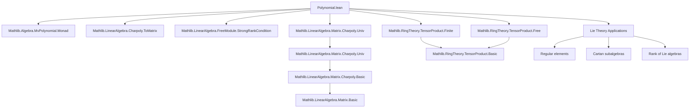
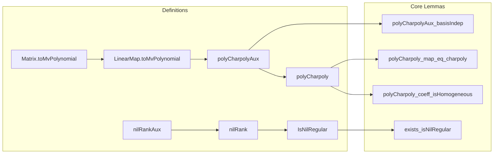

**Technical Brief: Polynomial.lean — Characteristic Polynomials of Linear Families of Endomorphisms**

---

### 1. KEY DEFINITIONS & THEOREMS

| Name | Type / Signature | Purpose |
|------|------------------|---------|
| `Matrix.toMvPolynomial M i` | `MvPolynomial n R` | Encodes the $i$-th row of matrix $M$ as a linear polynomial $\sum_j M_{ij} X_j$ |
| `LinearMap.toMvPolynomial b₁ b₂ f i` | `MvPolynomial ι₁ R` | Linear map version: evaluates basis coordinates of $f(x)$ as a linear polynomial in parameters of $x$ |
| `LinearMap.polyCharpolyAux φ b bₘ` | `Polynomial (MvPolynomial ι R)` | Auxiliary definition: characteristic polynomial of the *base-changed* map $\varphi$ over $MvPolynomial\ \iota\ R$, using bases $b, bₘ$ |
| `LinearMap.polyCharpoly φ b` | `Polynomial (MvPolynomial ι R)` | Main object: multivariate polynomial family whose evaluation at $x \in L$ gives $\chi_{\varphi x}(T)$ |
| `LinearMap.polyCharpoly_map_eq_charpoly` | `eval (b.repr x) (polyCharpoly φ b) = charpoly (φ x)` | Fundamental correctness: evaluation matches actual characteristic polynomial |
| `LinearMap.polyCharpoly_coeff_isHomogeneous` | `coeff i (polyCharpoly φ b).IsHomogeneous (finrank R M - i)` | Coefficients are *homogeneous* polynomials of degree $j = \text{finrank} - i$ |
| `LinearMap.nilRankAux φ b` | `ℕ` | Smallest index with nonzero coefficient in `polyCharpoly φ b` (i.e., `natTrailingDegree`) |
| `LinearMap.nilRank φ` | `ℕ` | Basis-independent nil-rank: minimal $n$ such that coefficient $n$ of $\chi_{\varphi x}$ may be nonzero for some $x$ |
| `LinearMap.IsNilRegular φ x` | `Prop` | $x$ is *nil-regular* iff coefficient $n = \text{nilRank}\ \varphi$ of $\chi_{\varphi x}$ is nonzero |
| `LinearMap.exists_isNilRegular` (under `IsDomain R`, `Infinite R`) | `∃ x, IsNilRegular φ x` | Existence of nil-regular elements — key for Lie-theoretic applications |

---

### 2. NAMING CONVENTIONS

- **Prefixes**:
  - `toMvPolynomial`: conversion from linear algebra object (matrix/map) to multivariate polynomial family.
  - `polyCharpoly`: main polynomial encoding characteristic polynomials of a linear family.
  - `nilRank`: nilpotency/rank-related invariant.
  - `isNilRegular`: property of elements.

- **Suffixes**:
  - `Aux`: auxiliary definition (e.g., `polyCharpolyAux`, `nilRankAux`).
  - `baseChange`: behavior under base change/algebra extension.
  - `eval`, `map`, `coeff`: evaluation, map, coefficient lemmas.

- **Consistent patterns**:
  - `b`, `bₘ`, `b'`: bases of domain $L$, codomain $M$, and alternate domain basis.
  - `ι`, `ιM`: index types for bases of $L$ and $M$.
  - `φ`: the linear family $L \to \mathrm{End}(M)$.

---

### 3. TACTIC STACK

| Tactic | Frequency | Role |
|--------|-----------|------|
| `simp` / `simp only` | Very high | Simplification using definitional equalities, `eval`, `map`, `coeff`, `toMvPolynomial`, `charpoly.univ` |
| `rw` | High | Rewriting using lemmas like `polyCharpolyAux_map_eq_charpoly`, `polyCharpoly_coeff_eval`, `toMvPolynomial_eval_eq_apply` |
| `congr` | Medium | Congruence reasoning for equality of polynomials/maps |
| `ext` | Medium | Extensionality for functions, matrices, polynomials |
| `apply` / `intro` | Medium | Goal-directed proof steps, especially in homogeneity and injectivity arguments |
| `nontriviality` | Low | To handle nontrivial ring assumptions (e.g., for `monic` ⇒ nonzero) |
| `grind` | Low | Automated simplification for index-level equalities (e.g., in `toMvPolynomial_one`) |
| `apply_fun` | Low | Applying functors (e.g., `MvPolynomial.bind₁`) to equalities |
| `let` / `set` | Medium | Introducing intermediate definitions (e.g., `B := ...`, `g := ...`) |
| `ring` / `linarith` | Rare | Not used — algebraic manipulations handled via `simp` and `rw` on polynomial structure |

---

### 4. PROOF LOGIC

**General proof strategy**:

1. **Base-change to polynomial ring**:
   - Lift $\varphi : L \to \mathrm{End}_R(M)$ to $\varphi^\# : L \otimes_R MvPolynomial\ \iota\ R \to \mathrm{End}_{MvPolynomial\ \iota\ R}(M \otimes_R MvPolynomial\ \iota\ R)$.
   - Show that `polyCharpolyAux φ b bₘ` equals the *ordinary* characteristic polynomial of $\varphi^\#$, viewed as a polynomial over $MvPolynomial\ \iota\ R$.

2. **Basis independence**:
   - Use that characteristic polynomials are basis-independent.
   - Prove `polyCharpolyAux_basisIndep` by showing both `polyCharpolyAux φ b bₘ` and `polyCharpolyAux φ b bₘ'` map to the same polynomial under `aeval X`, which is injective.

3. **Homogeneity of coefficients**:
   - Use `charpoly.univ_coeff_isHomogeneous` (from `Mathlib.LinearAlgebra.Matrix.Charpoly.Univ`) and the fact that `toMvPolynomial` produces degree-1 homogeneous polynomials.
   - Pull back via `map` and `eval₂` to conclude `coeff i (polyCharpoly φ b)` is homogeneous of degree $j = \text{finrank} - i$.

4. **Existence of nil-regular elements**:
   - Under `IsDomain R` and `#R ≥ finrank R M`, use that a nonzero homogeneous polynomial over an infinite domain has a point where it evaluates nonzero.
   - Apply `exists_isNilRegular_of_finrank_le_card` to get $x$ with nonzero coefficient at nil-rank.

**Induction / recursion**: Not used — proofs rely on structural properties of polynomial rings, base change, and module theory.

---

### 5. IMPORTS (Primary Dependencies)

| Module | Role |
|--------|------|
| `Mathlib.Algebra.MvPolynomial.Monad` | `MvPolynomial` monadic structure, `bind₁`, `aeval`, `eval₂Hom` |
| `Mathlib.LinearAlgebra.Charpoly.ToMatrix` | Characteristic polynomial via matrices (`charpoly`, `toMatrix`) |
| `Mathlib.LinearAlgebra.FreeModule.StrongRankCondition` | Ensures rank conditions for free modules (used in `nilRank` bounds) |
| `Mathlib.LinearAlgebra.Matrix.Charpoly.Univ` | `charpoly.univ`, `charpoly.univ_coeff_isHomogeneous`, `monic`, `natDegree` |
| `Mathlib.RingTheory.TensorProduct.Finite` | Finite module structure on tensor products (`Module.Finite.of_basis`) |
| `Mathlib.RingTheory.TensorProduct.Free` | Free module structure on tensor products (`basis A b`, `baseChange`) |

---

### 6. MERMAID DIAGRAMS

#### Dependency Graph (High-Level Theory)

#### Overview of `Polynomial.lean`

---

### 7. SUMMARY

This file formalizes a foundational result in commutative algebra and Lie theory: the coefficients of the characteristic polynomial of a linear family of endomorphisms are *homogeneous multivariate polynomials* in the parameters. It constructs a canonical polynomial `polyCharpoly φ b` independent of basis choices, proves its key properties (monic, nonzero, homogeneous coefficients), defines the nil-rank, and shows existence of nil-regular elements under mild hypotheses (e.g., infinite domain). The proof leverages base change to the multivariate polynomial ring and basis-independence of characteristic polynomials — a clean and elegant application of tensor products and `MvPolynomial` machinery.

This formalization is a prerequisite for deeper structural results in Lie algebra theory, notably the existence of Cartan subalgebras and a well-defined rank.
