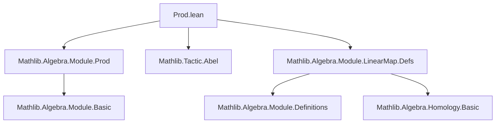

**Technical Brief: `Prod.lean` Module Analysis**

---

### 1. **Key Definitions & Theorems**

| Name | Type | Purpose |
|------|------|---------|
| `isLinearMap_add` | `IsLinearMap R (fun x : M × M => x.1 + x.2)` | Proves that addition $ (x, y) \mapsto x + y $ is an $ R $-linear map from $ M \times M $ to $ M $, under `AddCommMonoid M` and `Module R M`. |
| `isLinearMap_sub` | `IsLinearMap R (fun x : M × M => x.1 - x.2)` | Proves that subtraction $ (x, y) \mapsto x - y $ is $ R $-linear, under `AddCommGroup M` and `Module R M`. |

Both theorems establish linearity of binary operations on modules using the deprecated `IsLinearMap` predicate (as noted in the docstring).

---

### 2. **Naming Conventions**

- **Prefix**: `isLinearMap_` — indicates use of the `IsLinearMap` predicate (deprecated in favor of `LinearMap`).
- **Suffix**: None beyond descriptive operation names (`add`, `sub`).
- **Variable naming**: Standard Lean style: `{R : Type*}`, `{M : Type*}`, with typeclass constraints.

---

### 3. **Tactic Stack**

- `apply IsLinearMap.mk` — constructs a proof of `IsLinearMap` by verifying additivity and homogeneity.
- `simp only [...]` — simplifies using specific lemmas (e.g., `Prod.fst_add`, `Prod.snd_add`).
- `abel` — solves equalities in additive commutative monoids (used for additivity proof).
- `simp [...]` — simplifies using general lemmas (e.g., `smul_add`, `smul_sub`, `sub_eq_add_neg`, etc.).
- `simp [add_comm, add_assoc, add_left_comm]` — rewrites using abelian group properties for subtraction proof.

---

### 4. **Proof Logic**

- **Structure**: Both proofs follow a uniform pattern:
  1. Apply `IsLinearMap.mk` to reduce to proving:
     - Additivity: $ f(x + y) = f(x) + f(y) $
     - Homogeneity: $ f(r \cdot x) = r \cdot f(x) $
  2. For `add`:
     - Additivity: unfold `f = fun (x, y) => x.1 + x.2`, use `Prod.fst_add`, `Prod.snd_add`, then `abel`.
     - Homogeneity: simplify using `smul_add`.
  3. For `sub`:
     - Additivity: simplify using group properties (`sub_eq_add_neg`, `add_comm`, etc.).
     - Homogeneity: simplify using `smul_sub`.

- **Induction**: Not used.
- **Cases**: Not used.
- **Core reasoning**: Direct simplification + algebraic rewriting in modules.

---

### 5. **Imports**

| Import | Role |
|--------|------|
| `Mathlib.Algebra.Module.Prod` | Provides `Prod.fst_add`, `Prod.snd_add`, and other product module infrastructure. |
| `Mathlib.Tactic.Abel` | Supplies the `abel` tactic for abelian group/monoid reasoning. |
| `Mathlib.Algebra.Module.LinearMap.Defs` | Defines `IsLinearMap` and related predicates. |

> **Note**: These imports indicate the module sits at the interface between module theory, product structures, and linear map definitions.

---

### 6. **Mermaid Diagrams**

#### Dependency Graph (Module-Level)



#### Theoretical Overview (Conceptual Flow)

```mermaid
flowchart LR
  subgraph "Setup"
    R[Semiring R] & M[Module R M]
  end

  subgraph "Operations"
    add[Addition: M × M → M]
    sub[Subtraction: M × M → M]
  end

  subgraph "Linearity"
    lin_add[IsLinearMap R add]
    lin_sub[IsLinearMap R sub]
  end

  R & M --> add & sub
  add --> lin_add
  sub --> lin_sub

  lin_add & lin_sub --> deprecated[IsLinearMap predicate]
  deprecated --> linear_map_modern[LinearMap (modern replacement)]
```

> **Note**: The use of `IsLinearMap` is flagged as discouraged; modern Lean would use `LinearMap` with `LinearMap.add` and `LinearMap.sub` constructors.

--- 

Let me know if you'd like a modernized version using `LinearMap` instead of `IsLinearMap`.
