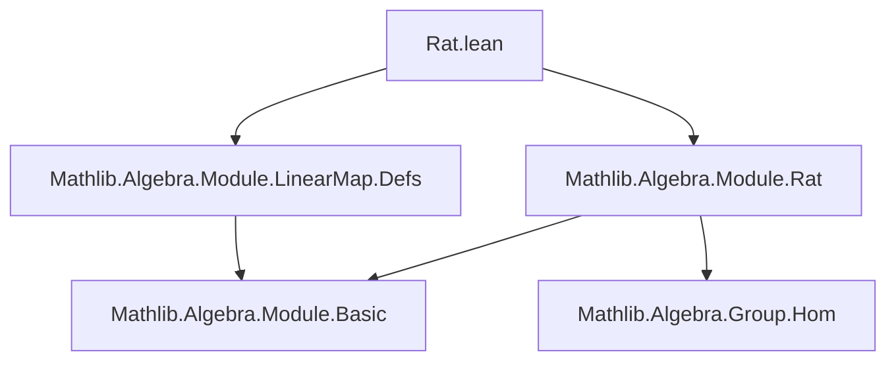

**Technical Brief: `Rat.lean` Module**

---

### 1. **Key Definitions & Theorems**

| Name | Type | Purpose |
|------|------|---------|
| `AddMonoidHom.toRatLinearMap` | `M →+ M₂ → M →ₗ[ℚ] M₂` | Reinterprets an additive monoid homomorphism between ℚ-modules as a ℚ-linear map. Uses `map_rat_smul` to supply the scalar multiplication preservation property. |
| `AddMonoidHom.toRatLinearMap_injective` | `Function.Injective (...)` | States that the map `toRatLinearMap` is injective: distinct additive homomorphisms yield distinct ℚ-linear maps. |
| `AddMonoidHom.coe_toRatLinearMap` | `⇑f.toRatLinearMap = f` | Shows that the coercion of `toRatLinearMap` back to a function coincides with the original additive homomorphism (i.e., underlying function is unchanged). |

---

### 2. **Naming Conventions**

- **Prefixes**:
  - `toRatLinearMap`: Indicates a *conversion* or *re-interpretation* of structure (from additive to linear).
- **Suffixes**:
  - `_injective`: Standard suffix for injectivity lemmas.
  - `coe_...`: For coercion lemmas (`⇑f = ...`).
- **General pattern**: `StructureA.toStructureB` for canonical embeddings/interpretations.

---

### 3. **Tactic Stack**

- `intro`, `ext`, `exact`: Basic proof scripting.
- `rfl`: Used in `simp`-friendly lemmas where equality is definitionally true.
- No heavy automation (`aesop`, `ring`, `linarith`) appears in this snippet — the proofs are mostly definitional or rely on `simp`-lemmas.

---

### 4. **Proof Logic**

- **`toRatLinearMap_injective`**:
  - Introduce `f`, `g`, and hypothesis `h : f.toRatLinearMap = g.toRatLinearMap`.
  - Extend equality pointwise using `ext x`.
  - Apply `LinearMap.congr_fun h x` to get `f x = g x`.
- **`coe_toRatLinearMap`**:
  - Immediate by `rfl`, since `toRatLinearMap` is defined as a structure extension `{ f with ... }`, and coercion to function is projection of the underlying function.

---

### 5. **Imports**

- `Mathlib.Algebra.Module.Rat`: Provides ℚ-module structure and related facts (e.g., `map_rat_smul`).
- `Mathlib.Algebra.Module.LinearMap.Defs`: Defines `→ₗ[ℚ]`, the type of ℚ-linear maps.

These imports indicate the module sits at the interface between additive group theory and ℚ-vector space (module) theory.

---

### 8. **Mermaid Diagrams**

#### Dependency Graph (Module-Level)



#### Overview of Theoretical Flow

```mermaid
graph LR
  Additive[Homomorphisms M →+ M₂] -- reinterpretation --> Linear[Linear Maps M →ₗ[ℚ] M₂]
  Additive -->|injective| Linear
  Linear -->|coerce| Additive
  Additive & Linear -->|share underlying function| Fun[M → M₂]
```

#### Structural Embedding

```mermaid
graph LR
  M →+ M₂ -- toRatLinearMap --> M →ₗ[ℚ] M₂
  M →ₗ[ℚ] M₂ -- ⇑ (coerce) --> M →+ M₂
  M →+ M₂ -- coe_toRatLinearMap --> id
```

> **Interpretation**: The construction shows that ℚ-linear maps are *exactly* the additive homomorphisms between ℚ-modules — i.e., the forgetful functor from ℚ-modules to abelian groups is *fully faithful* when restricted to ℚ-modules. This is a special feature of ℚ (and more generally, ℚ-algebras), due to divisibility.

--- 

Let me know if you'd like the `map_rat_smul` lemma or related lemmas (e.g., surjectivity under additional assumptions) formalized or analyzed.
