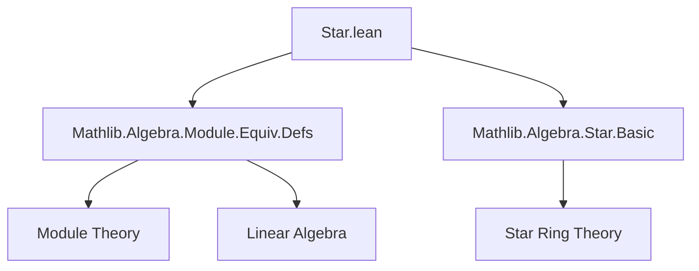

**Technical Brief: `Star.lean` Module**

---

### 1. **Key Definitions & Theorems**

| Name | Type / Signature | Purpose |
|------|------------------|---------|
| `→ₗ⋆[R]` | `M →ₗ⋆[R] N := LinearMap (starRingEnd R) M N` | Notation for *star-linear* (i.e., $R$-conjugate-linear) maps between modules over a starred ring `R`. |
| `≃ₗ⋆[R]` | `M ≃ₗ⋆[R] N := LinearEquiv (starRingEnd R) M N` | Notation for *star-linear equivalences* — invertible star-linear maps — over the star ring endomorphism of `R`. |

- **`starRingEnd R`**: The canonical star ring endomorphism $ R \to R $, used to twist the scalar action in the definition of star-linear maps.
- No theorems are stated in this file; it is purely notational.

---

### 2. **Naming Conventions**

- **Prefixes / Suffixes**:
  - `star_`: Indicates involvement of the star operation (e.g., `starRingEnd`).
  - `ₗ⋆`: Subscript `l` (for *linear*) + `⋆` (star) — used consistently in notations for star-linear maps (`→ₗ⋆`) and equivalences (`≃ₗ⋆`).
  - `[R]`: Parameter bracketing for the base ring, following Lean’s standard module/map notation (`→ₗ[R]`, `≃ₗ[R]`).

- **Notation syntax**:
  - `→ₗ⋆[R]` uses priority `25` for both arguments.
  - `≃ₗ⋆[R]` uses priority `50`, consistent with other equivalence notations.

---

### 3. **Tactic Stack**

- **No tactics used** in this file — it contains only *notation* and *import* declarations.
- The file is designed to avoid heavy automation; it is lightweight and foundational.

---

### 4. **Proof Logic**

- **No proofs** appear in this file.
- The logical content is purely *definition by notation*, relying on existing infrastructure:
  - `LinearMap` and `LinearEquiv` from `Mathlib.Algebra.Module.Equiv.Defs`.
  - `starRingEnd` from `Mathlib.Algebra.Star.Basic`.

---

### 5. **Imports**

| Import | Role |
|--------|------|
| `Mathlib.Algebra.Module.Equiv.Defs` | Provides `LinearMap`, `LinearEquiv`, and related infrastructure. |
| `Mathlib.Algebra.Star.Basic` | Provides `starRingEnd`, the canonical star endomorphism on a starred ring. |

> Note: The comment indicates this module is intentionally isolated to avoid early dependency on star-theory.

---

### 8. **Mermaid Diagrams**

#### **Dependency Graph**



#### **Overview of File & Theory Context**

```mermaid
flowchart LR
  subgraph "Core Theory"
    S[Star Ring R] --> starEnd[starRingEnd : R →+* R]
    M[Left R-Module M] --> action[Scalar action]
    N[Left R-Module N] --> action2
  end

  subgraph "Notation Layer (Star.lean)"
    starMap["M →ₗ⋆[R] N"] := LinearMap (starRingEnd R) M N
    starEquiv["M ≃ₗ⋆[R] N"] := LinearEquiv (starRingEnd R) M N
  end

  starEnd --> starMap
  starEnd --> starEquiv
  action --> starMap
  action2 --> starMap
```

- **Purpose**: This file provides the *syntactic sugar* for star-linear maps and equivalences, enabling later development (e.g., in Hilbert module or $C^*$-algebra theory) without cluttering early imports.

--- 

Let me know if you'd like the next module in the chain (e.g., where `→ₗ⋆` is actually used).
