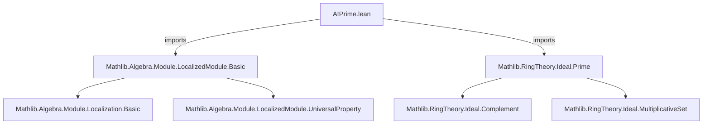
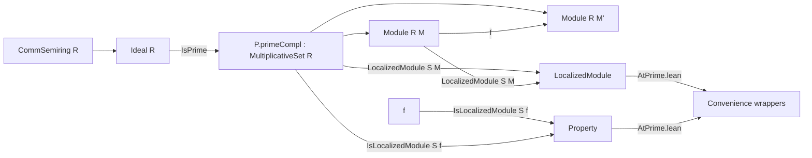

**Technical Brief: `AtPrime.lean`**

---

### 1. KEY DEFINITIONS & THEOREMS

| Name | Type / Signature | Purpose |
|------|------------------|---------|
| `IsLocalizedModule.AtPrime` | `{R M M' : Type*} [CommSemiring R] (P : Ideal R) [P.IsPrime] [AddCommMonoid M] [AddCommMonoid M'] [Module R M] [Module R M'] (f : M →ₗ[R] M') → Prop` | States that a linear map `f : M →ₗ[R] M'` exhibits `M'` as the localization of `M` at the complement of a prime ideal `P`. Defined as `IsLocalizedModule P.primeCompl f`. |
| `LocalizedModule.AtPrime` | `{R : Type*} [CommSemiring R] (P : Ideal R) [P.IsPrime] (M : Type*) [AddCommMonoid M] [Module R M] → Type*` | Constructs (a representative of) the localization of an `R`-module `M` at the multiplicative set `P.primeCompl` (i.e., `R \ P`). Defined as `LocalizedModule P.primeCompl M`. |

> **Note**: No theorems are stated in this file—only *abbreviations* (i.e., definitional aliases) that reuse existing infrastructure (`IsLocalizedModule`, `LocalizedModule`) from `Mathlib`.

---

### 2. NAMING CONVENTIONS

- **Prefix `AtPrime`**: Used to denote constructions *relative to a prime ideal* `P`.  
  - `IsLocalizedModule.AtPrime` — a *property* of a map relative to `P`.
  - `LocalizedModule.AtPrime` — a *construction* (object) relative to `P`.
- **Use of `P.primeCompl`**: Standard notation for the complement of a prime ideal `P` in `R`, which is a multiplicative set.
- **Suffix `_prime`**: Implied via `[P.IsPrime]` instance; no explicit `_prime` suffix in names, but contextually clear.

---

### 3. TACTIC STACK

- **No tactics appear** in this file.  
  - It is purely definitional: uses `abbrev` (definitional, not proof-producing).
  - No `by` blocks or tactic scripts.
  - Relies on Lean’s typeclass inference (`[P.IsPrime]`, `[Module R M]`, etc.) and imports.

---

### 4. PROOF LOGIC

- **Not applicable** — this file contains no proofs, only definitions.
- Logic is *deferred* to `Mathlib.RingTheory.LocalizedModule.Basic`, where `IsLocalizedModule` and `LocalizedModule` are defined and their universal properties proven.

---

### 5. IMPORTS

| Import | Role |
|--------|------|
| `Mathlib.Algebra.Module.LocalizedModule.Basic` | Provides the core theory of localized modules: `LocalizedModule S M`, `IsLocalizedModule S f`, and their universal properties. |
| `Mathlib.RingTheory.Ideal.Prime` | Supplies `Ideal.IsPrime`, `primeCompl`, and related facts (e.g., `primeCompl` is a multiplicative set iff `P` is prime). |

> These imports define the *underlying machinery*; `AtPrime.lean` is a thin convenience layer.

---

### 8. DEPENDENCY & THEORY OVERVIEW

#### Mermaid Diagrams

#### Overview

- **Goal**: Provide idiomatic, prime-ideal-specific access to module localization.
- **Design**: Leverages existing `LocalizedModule`/`IsLocalizedModule` infrastructure, parameterized by the multiplicative set `P.primeCompl`.
- **Theoretical Scope**: Situated in *commutative algebra*, specifically *localization of modules* at prime ideals — foundational for sheaf theory, stalks, and local properties in algebraic geometry.
- **Relation to broader theory**: This file is a *localization-at-prime* specialization of the general `LocalizedModule S M` construction (for arbitrary multiplicative sets `S`). It enables concise notation like `LocalizedModule.AtPrime P M` instead of `LocalizedModule P.primeCompl M`.

--- 

✅ **Summary**: A minimal, well-structured module defining *prime-localized modules* via reuse of existing localization infrastructure. No proofs, only definitional convenience — typical of Lean’s “library-first” design philosophy.
